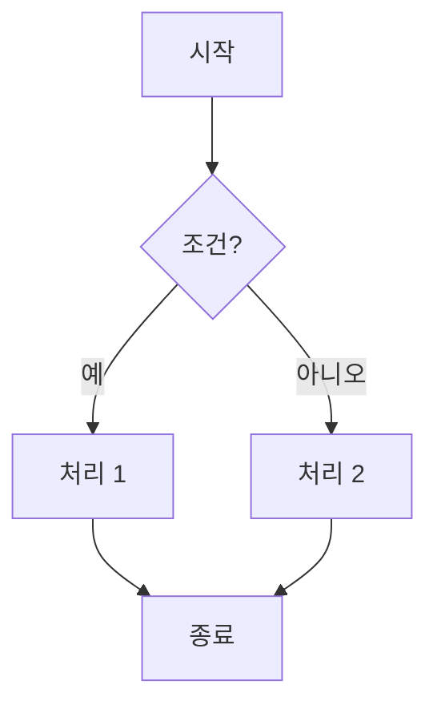

# CLAUDE.md

> **BlogAuto v2 - 멀티 에이전트 협업 지침**  
> **버전**: v3.0.0 | **날짜**: 2025-01-06  
> **대상**: Claude Code, Claude Chat, Gemini CLI, Multi-Agent System

## Communication Language
**IMPORTANT: Claude must communicate in Korean (한국어) when working with this project.**

- 작업 보고서: 한국어
- 확인 요청: 한국어  
- 커밋 메시지: 한국어
- 오류 설명: 한국어
- 에이전트 간 소통: 한국어

This file provides guidance to Claude Code and the Multi-Agent System when working with code in this repository.

---

## 🚨 CRITICAL INSTRUCTIONS - 절대 지침

**Please answer in Korean**

### ❌ NEVER - 절대 금지 사항

**1. NEVER START THE DEVELOPMENT SERVER**
- DO NOT use `python manage.py runserver` or any server startup commands
- DO NOT run servers in background mode (gunicorn, celery, etc.)
- User will handle ALL server operations manually

**2. NEVER MODIFY EXISTING CODE (blogauto_new/)**
- DO NOT edit files in `blogauto_new/` directory
- Reference only, never copy or modify
- This is frozen legacy code
- `@explorer-agent`만 읽기 전용으로 분석 가능

**3. NEVER VIOLATE SIZE LIMITS**
- Files > 500 lines: FORBIDDEN
- Functions > 50 lines: FORBIDDEN
- No exceptions

**4. NEVER START DEVELOPMENT WITHOUT FLOWCHART**
- Every feature MUST start with a Mermaid flowchart
- No flowchart = No coding

**5. NEVER USE `git add -A`**
- Add files individually
- Commit files separately
- Use feature branches only

---

## 🤖 MULTI-AGENT SYSTEM - 멀티 에이전트 시스템

### 시스템 개요

```
┌─────────────────────────────────────────────────────┐
│                   제이틴 (사용자)                     │
│                  "하나의 명령만 입력"                  │
│                                                     │
│   $ claude                                          │
│   > /multi-agent [작업 지시]                         │
└─────────────────────┬───────────────────────────────┘
                      │
                      ▼
┌─────────────────────────────────────────────────────┐
│           🎯 Claude Code (오케스트레이터)             │
│                                                     │
│   • 작업 분석 및 분배                                │
│   • 서브에이전트들 조율                              │
│   • 에이전트 간 대화 중재                            │
│   • 오류 발생 시 협의 진행                           │
│   • 결과 통합 및 보고                                │
└─────────────────────┬───────────────────────────────┘
                      │
        ┌─────────────┼─────────────┬─────────────┐
        ▼             ▼             ▼             ▼
┌───────────┐ ┌───────────┐ ┌───────────┐ ┌───────────┐
│ 🎨 Agent  │ │ ⚙️ Agent  │ │ 🔍 Agent  │ │ 📝 Agent  │
│ Frontend  │ │ Backend   │ │ Explorer  │ │ Reviewer  │
│           │ │           │ │           │ │           │
│ templates/│ │ api/      │ │ 레거시    │ │ 코드 리뷰 │
│ static/   │ │ models/   │ │ 분석     │ │ 테스트    │
│ Alpine.js │ │ services/ │ │ (Gemini) │ │ 문서화    │
└─────┬─────┘ └─────┬─────┘ └─────┬─────┘ └─────┬─────┘
      │             │             │             │
      └─────────────┴──────┬──────┴─────────────┘
                           │
                    ┌──────▼──────┐
                    │  💬 대화형   │
                    │    분업     │
                    │             │
                    │ • 에이전트 간│
                    │   실시간 소통│
                    │ • 오류 자체  │
                    │   수정 협의  │
                    └─────────────┘
```

### 에이전트 역할 정의

| 에이전트 | 역할 | 담당 영역 | 도구 |
|---------|------|----------|------|
| **@orchestrator** | 작업 분배, 결과 통합, 에이전트 간 조율 | 전체 프로젝트 | Claude Code 메인 |
| **@frontend-agent** | UI/템플릿 작업 | `app/templates/`, `app/static/` | Claude 서브에이전트 |
| **@backend-agent** | API/모델/서비스 작업 | `app/api/`, `app/models/`, `app/services/` | Claude 서브에이전트 |
| **@explorer-agent** | 레거시 코드 분석, 패턴 탐색 | `blogauto_new/` (읽기 전용) | Gemini CLI |
| **@reviewer-agent** | 코드 리뷰, 테스트, 문서화 | `tests/`, `docs/` | Claude 서브에이전트 |

### 에이전트 파일 위치

```
~/.claude/
├── agents/
│   ├── orchestrator.md      # 오케스트레이터 (메인)
│   ├── frontend-agent.md    # 프론트엔드 전문가
│   ├── backend-agent.md     # 백엔드 전문가
│   ├── explorer-agent.md    # 탐색/분석 전문가 (Gemini CLI)
│   └── reviewer-agent.md    # 리뷰/테스트 전문가
│
└── commands/
    └── multi-agent.md       # 멀티 에이전트 실행 커맨드
```

### 사용 방법

#### 기본 사용법
```bash
# Claude Code 실행
cd ~/blogauto_v2
claude

# 멀티 에이전트 모드로 작업 지시
/multi-agent Phase B-1 모듈 API를 구현해줘
```

#### 개별 에이전트 호출
```bash
# 특정 에이전트만 호출
@frontend-agent Flow 관리 페이지 UI를 개선해줘
@backend-agent Modules API 엔드포인트를 구현해줘
@explorer-agent blogauto_new에서 스케줄러 로직을 분석해줘
@reviewer-agent 방금 작성한 코드를 리뷰해줘
```

#### 복합 작업 지시
```bash
/multi-agent 다음 작업을 수행해줘:
1. 레거시 코드에서 모듈 관련 로직 분석
2. 분석 결과 바탕으로 새 API 구현
3. UI 페이지 생성
4. 테스트 코드 작성 및 리뷰
```

---

## 💬 에이전트 간 통신 프로토콜

### 통신 형식

에이전트 간 소통 시 다음 형식을 사용합니다:

```
[FROM: agent-name]
[TO: target-agent]
[TYPE: request/response/error/review/notify]
[CONTENT]: 작업 내용
[FILES]: 관련 파일 목록
[DEPENDENCY]: 의존성 있는 다른 에이전트 작업
```

### 통신 유형

| TYPE | 설명 | 예시 |
|------|------|------|
| `request` | 작업 요청 | Backend에서 Frontend에 API 정보 전달 요청 |
| `response` | 요청에 대한 응답 | 요청된 작업 완료 보고 |
| `error` | 오류 보고 | 구현 중 발생한 문제 보고 |
| `review` | 리뷰 결과 | 코드 리뷰 결과 및 수정 제안 |
| `notify` | 알림 | 작업 완료 알림, 파일 변경 알림 |

### 통신 예시

#### Backend → Frontend 작업 완료 알림
```
[FROM: backend-agent]
[TO: orchestrator]
[TYPE: notify]
[CONTENT]: Modules API 엔드포인트 생성 완료
[FILES]: app/api/modules.py, app/schemas/module.py
[ENDPOINT]: GET/POST /api/v1/modules
[FOR: frontend-agent]
```

#### Reviewer → Backend 수정 요청
```
[FROM: reviewer-agent]
[TO: orchestrator]
[TYPE: fix-request]
[TARGET-AGENT]: backend-agent
[FILE]: app/api/modules.py
[ISSUE]: 타입 힌트 누락
[LINE]: 45-50
[EXPECTED]: def get_module(module_id: int) -> Module:
[ACTUAL]: def get_module(module_id):
```

#### 오류 발생 시 협의
```
[FROM: frontend-agent]
[TO: orchestrator]
[TYPE: error]
[CONTENT]: API 엔드포인트 호출 시 404 오류
[FILE]: app/templates/flows/list.html
[SUGGESTION]: backend-agent에게 엔드포인트 확인 요청

---

[FROM: orchestrator]
[TO: backend-agent]
[TYPE: request]
[CONTENT]: /api/v1/flows 엔드포인트 존재 여부 확인
[RELATED-ERROR]: frontend-agent 404 오류

---

[FROM: backend-agent]
[TO: orchestrator]
[TYPE: response]
[CONTENT]: 엔드포인트 누락 확인, 즉시 생성하겠음
[ACTION]: app/api/flows.py 생성 예정
```

---

## 🔄 멀티 에이전트 워크플로우

### 일반적인 기능 개발 흐름

```mermaid
graph TD
    User[사용자: /multi-agent 작업지시] --> Orch[오케스트레이터: 작업 분석]
    
    Orch --> Explore{레거시 분석 필요?}
    Explore -->|Yes| Explorer[@explorer-agent<br/>Gemini CLI로 분석]
    Explore -->|No| Implement
    
    Explorer --> Analysis[분석 결과 공유]
    Analysis --> Implement
    
    Implement --> Parallel[병렬 실행]
    Parallel --> Backend[@backend-agent<br/>API/모델 구현]
    Parallel --> Frontend[@frontend-agent<br/>UI 구현]
    
    Backend --> Sync[결과 동기화]
    Frontend --> Sync
    
    Sync --> Review[@reviewer-agent<br/>코드 리뷰]
    
    Review --> Issues{문제 발견?}
    Issues -->|Yes| Fix[해당 에이전트에 수정 요청]
    Fix --> Review
    Issues -->|No| Report[최종 보고]
    
    Report --> User
```

### 오류 처리 흐름

```mermaid
graph TD
    Error[오류 발생] --> Report[오케스트레이터에 보고]
    Report --> Analyze[오류 분석]
    
    Analyze --> Consult[관련 에이전트들 협의]
    Consult --> Backend[@backend-agent 의견]
    Consult --> Frontend[@frontend-agent 의견]
    Consult --> Reviewer[@reviewer-agent 의견]
    
    Backend --> Consensus[합의된 해결책]
    Frontend --> Consensus
    Reviewer --> Consensus
    
    Consensus --> Apply[해당 에이전트가 수정]
    Apply --> Verify[@reviewer-agent 재검증]
    
    Verify --> Success{해결?}
    Success -->|Yes| Done[완료]
    Success -->|No| Escalate[사용자에게 보고]
```

---

## 📁 Project Structure

### 프로젝트 구조 및 에이전트 담당 영역

```
blogauto_new/                    # ❌ LEGACY - DO NOT MODIFY
├── core/                        # 🔍 @explorer-agent만 읽기 가능
├── static/
└── ...

---

blogauto_v2/                     # ✅ NEW PROJECT - WORK HERE
├── services/republish/          # 현재 작업 중인 서비스
│   ├── app/
│   │   ├── api/                 # ⚙️ @backend-agent 담당
│   │   │   ├── modules.py
│   │   │   ├── flows.py
│   │   │   └── ...
│   │   │
│   │   ├── models/              # ⚙️ @backend-agent 담당
│   │   │   ├── module.py
│   │   │   ├── flow.py
│   │   │   └── ...
│   │   │
│   │   ├── services/            # ⚙️ @backend-agent 담당
│   │   │   └── ...
│   │   │
│   │   ├── schemas/             # ⚙️ @backend-agent 담당
│   │   │   └── ...
│   │   │
│   │   ├── templates/           # 🎨 @frontend-agent 담당
│   │   │   ├── modules/
│   │   │   ├── flows/
│   │   │   └── ...
│   │   │
│   │   └── static/              # 🎨 @frontend-agent 담당
│   │       ├── js/
│   │       └── css/
│   │
│   ├── tests/                   # 📝 @reviewer-agent 담당
│   │   ├── unit/
│   │   └── integration/
│   │
│   └── docs/                    # 📝 @reviewer-agent 담당
│       └── ...
│
├── shared/                      # 공통 라이브러리
│   ├── database.py
│   ├── config.py
│   └── logger.py
│
├── docs/
│   ├── flowcharts/              # Mermaid 순서도
│   └── guides/
│
├── CLAUDE.md                    # 이 파일
└── README.md
```

---

## ✅ MUST DO - 필수 규칙

### 1. 멀티 에이전트 모드 우선

**복잡한 작업은 `/multi-agent` 커맨드 사용**

```bash
# 단순 작업: 직접 요청
"이 파일의 오타를 수정해줘"

# 복잡한 작업: 멀티 에이전트 사용
/multi-agent 새로운 모듈 관리 기능을 구현해줘
```

### 2. Flowchart-First Development

**Every feature starts with a Mermaid flowchart**



**Flowchart location:** `docs/flowcharts/[feature-name].mermaid`

### 3. File Size Limits

```
File: < 500 lines (Recommended: < 300 lines)
Function: < 50 lines (Recommended: < 20 lines)
```

**Check file size:**
```bash
wc -l filename.py
```

**If exceeds 500 lines → IMMEDIATELY SPLIT**

### 4. Git Workflow

```bash
# 1. Create feature branch
git checkout -b feature/[feature-name]

# 2. Individual file commits
git add services/republish/main.py
git commit -m "feat(republish): Add FastAPI endpoint"

# 3. Merge to develop
git checkout develop
git merge feature/[feature-name]

# 4. Deploy to master (with tag)
git checkout master
git merge develop
git tag -a v0.1.0 -m "Release: [feature-name]"
```

### 5. Commit Message Format (Conventional Commits)

```
<type>(<scope>): <subject>

<body>

<footer>
```

**Types:**
- `feat`: New feature
- `fix`: Bug fix
- `docs`: Documentation
- `test`: Tests
- `refactor`: Refactoring
- `chore`: Misc changes

### 6. Code Standards

```python
# ✅ REQUIRED
- Type hints: MANDATORY
- Docstrings: MANDATORY
- Error handling: MANDATORY
- Logging: MANDATORY

# Example
def publish(blog_id: int) -> bool:
    """
    Publish a blog post.
    
    Args:
        blog_id: Blog ID
    
    Returns:
        Success status
    
    Raises:
        ValueError: Invalid blog_id
    """
    logger.info(f"[PUBLISH] Starting: {blog_id}")
    try:
        # Publishing logic
        return True
    except Exception as e:
        logger.error(f"[PUBLISH] Failed: {e}")
        raise
```

---

## 🛠️ Technology Stack

### Backend

**Framework:**
- FastAPI (new microservices in blogauto_v2)
- Django 5.2.4 (legacy blogauto_new - 참조만)

**Database:**
- PostgreSQL (production)
- SQLite (development)

**ORM:**
- SQLAlchemy (new services)

**Caching & Queue:**
- Redis (caching)
- APScheduler (scheduling)

### Frontend

- Alpine.js (프론트엔드 프레임워크)
- Jinja2 (템플릿 엔진)
- Tailwind CSS (스타일링)

### Development Commands

**Docker:**
```bash
# 로컬 테스트
cd ~/blogauto_v2/services/republish
docker-compose down
docker-compose build --no-cache
docker-compose up -d
docker-compose logs app --tail 30

# 헬스체크
curl http://localhost:8001/health
```

**Database:**
```bash
# 테이블 확인
docker exec blogauto_db psql -U blogauto -d blogauto_v2 -c "\dt"
```

**Testing:**
```bash
# pytest
pytest tests/
```

---

## 📖 Context7 MCP 자동 사용 지침

**Context7은 라이브러리/프레임워크의 최신 문서를 실시간으로 가져오는 MCP입니다.**

### 자동 사용 트리거

| 우선순위 | 트리거 | 설명 |
|----------|--------|------|
| 🔴 **필수** | 프로젝트 핵심 라이브러리 | FastAPI, SQLAlchemy, Pydantic, APScheduler |
| 🔴 **필수** | 새로운 기능 구현 | 처음 사용하는 라이브러리 기능 |
| 🔴 **필수** | 에러 해결 실패 | 1회 시도 후 해결 안 될 때 |
| 🟡 **권장** | 버전별 차이 의심 | 특정 버전 문법이 필요할 때 |

### 프로젝트 핵심 라이브러리

```python
PRIORITY_LIBRARIES = {
    "fastapi": "라우터, 의존성 주입, 미들웨어",
    "sqlalchemy": "모델, 관계, 쿼리, 세션",
    "pydantic": "스키마, 검증, 설정",
    "apscheduler": "스케줄러, 트리거, 작업 저장소",
}
```

---

## 🔄 Development Process with Multi-Agent

### Phase 1: Planning (30 mins)

```markdown
- [ ] Feature requirements 정의
- [ ] Flowchart 작성
- [ ] 에이전트별 작업 범위 설계
- [ ] 예상 파일 목록 및 줄 수 추정
```

### Phase 2: Development (멀티 에이전트 활용)

```bash
# 멀티 에이전트로 개발 시작
/multi-agent [기능명]을 구현해줘

# 자동 실행 흐름:
# 1. @explorer-agent: 레거시 분석 (필요 시)
# 2. @backend-agent: API/모델 구현
# 3. @frontend-agent: UI 구현
# 4. @reviewer-agent: 리뷰 및 테스트
```

### Phase 3: Review & Testing

```markdown
- [ ] @reviewer-agent 코드 리뷰 완료
- [ ] 단위 테스트 작성
- [ ] 통합 테스트 통과
- [ ] 문서화 완료
```

### Phase 4: Deployment

```bash
# Git 커밋 (파일별 개별)
git add [파일]
git commit -m "[type]([scope]): [설명]"
git push origin main

# 로컬 Docker 테스트
docker-compose down && docker-compose build --no-cache && docker-compose up -d

# Oracle 서버 배포
ssh -i ~/.ssh/oci_blogauto.key ubuntu@158.180.66.204
cd ~/blogauto_v2/services/republish
git pull origin main
docker-compose down && docker-compose build --no-cache && docker-compose up -d
```

---

## ✅ Pre-Development Checklist

### 멀티 에이전트 작업 전

```markdown
- [ ] 작업 범위가 복잡한가? → /multi-agent 사용
- [ ] Flowchart 준비되었는가?
- [ ] 레거시 분석이 필요한가? → @explorer-agent 포함
- [ ] UI 작업이 포함되는가? → @frontend-agent 포함
- [ ] API 작업이 포함되는가? → @backend-agent 포함
```

### 작업 중

```markdown
- [ ] 에이전트 간 파일 영역이 겹치지 않는가?
- [ ] 오류 발생 시 협의가 진행되는가?
- [ ] 타입 힌트가 추가되었는가?
- [ ] Docstring이 작성되었는가?
```

### 배포 전

```markdown
- [ ] @reviewer-agent 리뷰 통과?
- [ ] 모든 파일 < 500줄?
- [ ] 모든 함수 < 50줄?
- [ ] 테스트 통과?
- [ ] 문서화 완료?
```

---

## 🐛 Debugging Tips

### Console Logging Prefixes

```python
# Python
logger.info("[REPUBLISH] Starting process")
logger.error("[REPUBLISH_ERROR] Failed to publish")
logger.debug("[DB_QUERY] Fetching blogs")

# 에이전트 로그
logger.info("[AGENT:backend] API 생성 완료")
logger.info("[AGENT:frontend] UI 렌더링 완료")
```

### 에이전트 디버깅

```bash
# 특정 에이전트만 테스트
@backend-agent 이 함수의 문제점을 분석해줘

# 리뷰어에게 검증 요청
@reviewer-agent 방금 수정한 코드를 검증해줘
```

---

## 📊 File Size Monitoring

### Check File Size

```bash
# All Python files
wc -l **/*.py

# Find files > 500 lines
find . -name "*.py" -exec wc -l {} + | awk '$1 > 500'
```

### If File Exceeds 500 Lines

```
IMMEDIATELY SPLIT!

Example:
main.py (600 lines) 
→ main.py (200) + handlers.py (200) + utils.py (200)
```

---

## 🚀 Quick Start

### 멀티 에이전트 시스템 사용

```bash
# 1. Claude Code 실행
cd ~/blogauto_v2
claude

# 2. 단순 작업: 직접 요청
"이 버그를 수정해줘"

# 3. 복잡한 작업: 멀티 에이전트 사용
/multi-agent 새로운 기능을 구현해줘

# 4. 특정 에이전트 호출
@explorer-agent 레거시 코드를 분석해줘
@backend-agent API를 구현해줘
@frontend-agent UI를 만들어줘
@reviewer-agent 코드를 리뷰해줘
```

### 에이전트 파일 확인

```bash
# 설치된 에이전트 확인
ls -la ~/.claude/agents/

# 커맨드 확인
ls -la ~/.claude/commands/
```

---

## 💡 Core Principles Summary

```
1. 복잡한 작업은 /multi-agent 사용
2. 에이전트별 파일 영역 명확히 분리
3. 오류 발생 시 에이전트 간 협의로 해결
4. Flowchart first, code later
5. Files < 500 lines, functions < 50 lines
6. Feature branches only
7. Individual file commits
8. NEVER modify blogauto_new/
9. NEVER start servers
10. ALWAYS use type hints and docstrings
```

**These rules are NON-NEGOTIABLE!**

---

## 📚 Reference Documentation

**Detailed Guides:**
- [DEVELOPMENT_GUIDE.md](DEVELOPMENT_GUIDE.md) - Full development guide
- [DEPLOYMENT_WORKFLOW.md](DEPLOYMENT_WORKFLOW.md) - Deployment workflow

**Agent Files:**
- `~/.claude/agents/orchestrator.md`
- `~/.claude/agents/frontend-agent.md`
- `~/.claude/agents/backend-agent.md`
- `~/.claude/agents/explorer-agent.md`
- `~/.claude/agents/reviewer-agent.md`

**External Resources:**
- [Conventional Commits](https://www.conventionalcommits.org/)
- [Mermaid Syntax](https://mermaid.js.org/syntax/flowchart.html)
- [FastAPI Documentation](https://fastapi.tiangolo.com/)

---

## 🎯 Remember

**Multi-Agent System = 효율적인 협업**

```
사용자 → 하나의 명령 → 오케스트레이터 → 에이전트들 자동 협업 → 결과
```

- **@orchestrator**: 작업 분배, 조율, 통합
- **@frontend-agent**: UI/템플릿 전문가
- **@backend-agent**: API/모델/서비스 전문가
- **@explorer-agent**: 레거시 분석 (Gemini CLI)
- **@reviewer-agent**: 코드 리뷰/테스트 전문가

**Let's build BlogAuto v2 with Multi-Agent System! 🚀**

---

**Last Updated**: 2025-01-06  
**Version**: v3.0.0  
**Contact**: GitHub Issues