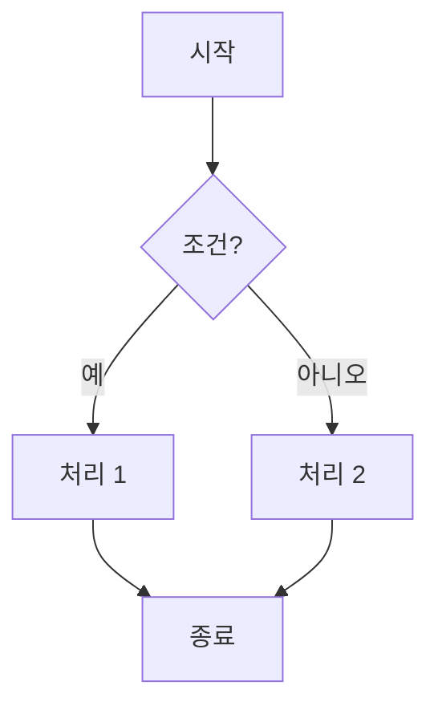
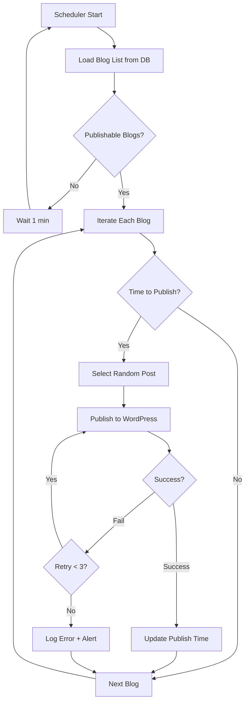

# CLAUDE.md

> **BlogAuto v2 - Claude & Gemini CLI 협업 지침**  
> **버전**: v2.0.0 | **날짜**: 2025-12-21  
> **대상**: Claude Code, Claude Chat, Gemini CLI

This file provides guidance to Claude Code, Claude Chat, and Gemini CLI when working with code in this repository.

---

## 🚨 CRITICAL INSTRUCTIONS - 절대 지침

### ❌ NEVER - 절대 금지 사항

**1. NEVER START THE DEVELOPMENT SERVER**
- DO NOT use `python manage.py runserver` or any server startup commands
- DO NOT run servers in background mode (gunicorn, celery, etc.)
- DO NOT attempt to test by starting the Django development server
- User will handle ALL server operations manually
- Focus ONLY on code analysis, file editing, and development without server execution

**2. NEVER MODIFY EXISTING CODE (blogauto_new/)**
- DO NOT edit files in `blogauto_new/` directory
- Reference only, never copy or modify
- This is frozen legacy code

**3. NEVER VIOLATE SIZE LIMITS**
- Files > 500 lines: FORBIDDEN
- Functions > 50 lines: FORBIDDEN
- No exceptions

**4. NEVER START DEVELOPMENT WITHOUT FLOWCHART**
- Every feature MUST start with a Mermaid flowchart
- No flowchart = No coding

**5. NEVER USE `git add -A`**
- Add files individually
- Commit files separately
- Use feature branches only

---

## 🤝 COLLABORATION WITH GEMINI CLI

**CRITICAL: All development tasks involve both Claude and Gemini CLI collaboration**

### Collaboration Principles

- Work collaboratively with Gemini CLI for all development tasks
- Coordinate task delegation and share context effectively
- Maintain consistent coding standards across both AI assistants
- Ensure seamless handoff of complex multi-step operations
- Document shared decisions and architectural choices for both assistants
- **ALL TASKS ARE COLLABORATIVE**: Every task instruction automatically involves Gemini CLI collaboration unless explicitly stated otherwise

### Visual Task Separation

**IMPORTANT: Clearly mark which parts are handled by whom**

- 🤖 **Claude Code/Chat**: Code writing, file editing, documentation
- 💎 **Gemini CLI**: File searching, pattern analysis, code exploration

### Color-Coded Operations

Use background colors to distinguish between Claude and Gemini CLI operations:

- 🟦 **Claude Code Operations**: 
  - <span style="background-color: #E3F2FD; padding: 2px 4px; border-radius: 3px;">Read</span>
  - <span style="background-color: #E3F2FD; padding: 2px 4px; border-radius: 3px;">Edit</span>
  - <span style="background-color: #E3F2FD; padding: 2px 4px; border-radius: 3px;">Write</span>
  - <span style="background-color: #E3F2FD; padding: 2px 4px; border-radius: 3px;">MultiEdit</span>

- 🟩 **Gemini CLI Operations**: 
  - <span style="background-color: #E8F5E8; padding: 2px 4px; border-radius: 3px;">Search</span>
  - <span style="background-color: #E8F5E8; padding: 2px 4px; border-radius: 3px;">Grep</span>
  - <span style="background-color: #E8F5E8; padding: 2px 4px; border-radius: 3px;">Glob</span>
  - <span style="background-color: #E8F5E8; padding: 2px 4px; border-radius: 3px;">Analysis</span>

- 🟨 **Shared Operations**: 
  - <span style="background-color: #FFF3E0; padding: 2px 4px; border-radius: 3px;">Debug</span>
  - <span style="background-color: #FFF3E0; padding: 2px 4px; border-radius: 3px;">Test</span>
  - <span style="background-color: #FFF3E0; padding: 2px 4px; border-radius: 3px;">Validate</span>

### Collaboration Workflow Example

```
1. 💎 Gemini CLI: Search for similar code patterns in blogauto_new/
   └─ Finds relevant implementation examples

2. 🤖 Claude Chat: Design flowchart based on findings
   └─ Creates Mermaid diagram

3. 🤖 Claude Code: Implement new feature in blogauto_v2/
   └─ Writes modular code (< 500 lines per file)

4. 🟨 Both: Review and validate implementation
   └─ Ensure quality and consistency
```

---

## 📁 Project Structure

### Two Separate Projects

```
blogauto_new/              # ❌ LEGACY - DO NOT MODIFY
├── core/
├── static/
└── ...
    (3000+ line files, reference only)

---

blogauto_v2/              # ✅ NEW PROJECT - WORK HERE
├── services/             # Microservices
│   ├── republish/       # Republishing service
│   ├── title_mgmt/      # Title management
│   └── content_gen/     # Content generation
│
├── shared/              # Common libraries
│   ├── database.py
│   ├── config.py
│   └── logger.py
│
├── docs/
│   ├── flowcharts/      # Mermaid flowcharts (.mermaid)
│   └── guides/          # Documentation
│
├── tests/               # Test code
│
├── CLAUDE.md           # This file
└── README.md
```

---

## ✅ MUST DO - 필수 규칙

### 1. Flowchart-First Development

**Every feature starts with a Mermaid flowchart**



**Flowchart location:** `docs/flowcharts/[feature-name].mermaid`

### 2. File Size Limits

```
File: < 500 lines (Recommended: < 300 lines)
Function: < 50 lines (Recommended: < 20 lines)
```

**Check file size:**
```bash
wc -l filename.py
```

**If exceeds 500 lines → IMMEDIATELY SPLIT**

### 3. Git Workflow

```bash
# 1. Create feature branch
git checkout -b feature/[feature-name]

# 2. Individual file commits
git add services/republish/main.py
git commit -m "feat(republish): Add FastAPI endpoint"

# 3. Merge to develop
git checkout develop
git merge feature/[feature-name]

# 4. Deploy to master (with tag)
git checkout master
git merge develop
git tag -a v0.1.0 -m "Release: [feature-name]"
```

### 4. Commit Message Format (Conventional Commits)

```
<type>(<scope>): <subject>

<body>

<footer>
```

**Types:**
- `feat`: New feature
- `fix`: Bug fix
- `docs`: Documentation
- `test`: Tests
- `refactor`: Refactoring
- `chore`: Misc changes

**Example:**
```bash
git commit -m "feat(republish): Add 24h auto-republish

- APScheduler integration
- Per-blog interval configuration
- Error handling with retry

Closes #1"
```

### 5. Code Standards

```python
# ✅ REQUIRED
- Type hints: MANDATORY
- Docstrings: MANDATORY
- Error handling: MANDATORY
- Logging: MANDATORY

# Example
def publish(blog_id: int) -> bool:
    """
    Publish a blog post.
    
    Args:
        blog_id: Blog ID
    
    Returns:
        Success status
    
    Raises:
        ValueError: Invalid blog_id
    """
    logger.info(f"[PUBLISH] Starting: {blog_id}")
    try:
        # Publishing logic
        return True
    except Exception as e:
        logger.error(f"[PUBLISH] Failed: {e}")
        raise
```

---

## 🛠️ Technology Stack

### Backend (Django-based)

**Framework:**
- Django 5.2.4 (legacy blogauto_new)
- FastAPI (new microservices in blogauto_v2)

**Database:**
- PostgreSQL (production)
- SQLite (development)

**Caching & Queue:**
- Redis (caching)
- Celery (async tasks) or APScheduler (simpler alternative)

**ORM:**
- SQLAlchemy (new services)
- Django ORM (legacy compatibility)

### Development Commands

**Database Management:**
```bash
# Create migrations
python manage.py makemigrations

# Apply migrations
python manage.py migrate

# Check for issues
python manage.py check
```

**Testing:**
```bash
# Run all tests
python manage.py test

# Run specific app tests
python manage.py test core

# With verbosity
python manage.py test --verbosity=2

# pytest (for v2 microservices)
pytest tests/
```

**Docker Deployment:**
```bash
# Build and push
make buildx

# Deploy
make pull
make up
make down
make logs
```

---

## 🔄 Development Process

### Phase 1: Planning (30 mins)

```markdown
- [ ] Feature requirements
- [ ] Flowchart design
- [ ] File structure design
- [ ] Estimate lines of code
```

### Phase 2: Development (2-3 days)

```bash
# Create feature branch
git checkout -b feature/[name]

# Write code (each file < 300 lines)
# Individual commits per file
```

### Phase 3: Testing (1 day)

```bash
# Unit tests
pytest tests/unit/

# Integration tests
pytest tests/integration/
```

### Phase 4: Documentation (2 hours)

```markdown
- [ ] README.md
- [ ] Docstrings
- [ ] Environment variables
- [ ] API documentation
```

### Phase 5: Deployment (0.5 day)

```bash
# Merge to develop
git checkout develop
git merge feature/[name]

# Deploy to master
git checkout master
git merge develop
git tag -a v0.1.0 -m "Release"
```

---

## 📐 Flowchart Guidelines

### Storage Location

```
docs/flowcharts/
├── republish.mermaid
├── title_collection.mermaid
├── ai_generation.mermaid
└── publishing.mermaid
```

### Example: Republish Service



### Passing Flowchart to Claude

```
Implement republish service.

📐 Flowchart:
[Paste Mermaid code here]

📋 Requirements:
- Files: main.py (< 100 lines), models.py (< 50 lines)
- Each function < 50 lines
- Type hints required
- Docstrings required

📚 Reference (DO NOT COPY):
- Legacy code: blogauto_new/core/republish_old.py
- Reference logic only, design from scratch

Start implementation!
```

---

## 🎯 Architecture Patterns

### Microservices (blogauto_v2)

Each service is independent and deployable:

```
services/republish/     → https://republish.domain.com
services/title_mgmt/    → https://titles.domain.com
services/content_gen/   → https://content.domain.com
```

### Soft Delete Pattern (Legacy Compatibility)

```python
# blogauto_new uses soft delete
class BlogManager(models.Manager):
    def get_queryset(self):
        return super().get_queryset().filter(is_deleted=False)

class AllBlogManager(models.Manager):
    def get_queryset(self):
        return super().get_queryset()

class Blog(models.Model):
    is_deleted = models.BooleanField(default=False)
    
    objects = BlogManager()      # Only non-deleted
    all_objects = AllBlogManager()  # All blogs
```

### Feature Flags (Legacy System)

Environment-based toggles in `.env`:
```
FEATURE_BLOG_DELETE_BUTTON=true
FEATURE_IMAGE_TEMPLATE_UPLOAD=true
FEATURE_IMAGE_OVERLAY_PREVIEW=true
```

---

## 🐛 Debugging Tips

### Console Logging Prefixes

Use consistent prefixes for filtering:

```python
# Python
logger.info("[REPUBLISH] Starting process")
logger.error("[REPUBLISH_ERROR] Failed to publish")
logger.debug("[DB_QUERY] Fetching blogs")

# JavaScript (legacy)
console.log("[CATEGORY] Loading categories");
console.log("[BLOG_SAVE] Saving blog data");
console.log("[DELETE] Deleting blog");
```

### Django Logging

```python
# Logs location
logs/blogauto.log
logs/celery_tasks.log

# Check logs
tail -f logs/blogauto.log
```

### Database Debugging

```bash
# Django admin
http://localhost:8000/admin/

# Check models
python manage.py shell
>>> from core.models import Blog
>>> Blog.objects.all()
```

### JavaScript Debugging (Legacy)

```javascript
// Check state
console.log(currentPageItems);

// Frontend state
// Browser console: Application > Local Storage
```

---

## ✅ Pre-Development Checklist

```markdown
### Before Starting New Feature

- [ ] Flowchart created?
- [ ] Feature branch created?
- [ ] File structure designed?
- [ ] Estimated lines < 500?

### During Development

- [ ] Type hints added?
- [ ] Docstrings written?
- [ ] Error handling added?
- [ ] Logging added?
- [ ] Individual file commits?

### Before Deployment

- [ ] All files < 500 lines?
- [ ] All functions < 50 lines?
- [ ] Tests passing?
- [ ] README written?
- [ ] Merged to develop?
- [ ] Tagged version?
```

---

## 📊 File Size Monitoring

### Check File Size

```bash
# All Python files
wc -l **/*.py

# Find files > 500 lines
find . -name "*.py" -exec wc -l {} + | awk '$1 > 500'

# Specific file
wc -l services/republish/main.py
```

### If File Exceeds 500 Lines

```
IMMEDIATELY SPLIT!

Example:
main.py (600 lines) 
→ main.py (200) + handlers.py (200) + utils.py (200)
```

---

## 🤝 Claude & Gemini CLI Collaboration Examples

### Example 1: Feature Development

```
1. 💎 Gemini CLI: "Search for WordPress API usage in blogauto_new/"
   → Finds patterns in core/views/publish_views.py

2. 🤖 Claude Chat: "Create flowchart for republish service"
   → Designs Mermaid diagram

3. 🤖 Claude Code: "Implement based on flowchart"
   → Creates services/republish/ files

4. 🟨 Both: "Review and test"
   → Validation and integration testing
```

### Example 2: Debugging

```
1. 💎 Gemini CLI: "Find all error handling patterns"
   → Analyzes try-except usage

2. 🤖 Claude Chat: "Suggest improved error handling"
   → Provides recommendations

3. 🤖 Claude Code: "Apply improvements"
   → Refactors code

4. 🟨 Both: "Verify error handling works"
   → Test error scenarios
```

### Example 3: Code Migration

```
1. 💎 Gemini CLI: "Extract title collection logic from blogauto_new/"
   → Locates relevant code sections

2. 🤖 Claude Chat: "Design v2 architecture"
   → Creates modular design

3. 🤖 Claude Code: "Rewrite as microservice"
   → Implements clean version in blogauto_v2/

4. 🟨 Both: "Compare and validate"
   → Ensure feature parity
```

---

## 🎯 3-Month Roadmap

### Week 1-2: Republish Service
- [ ] Flowchart design
- [ ] Development (< 400 total lines)
- [ ] Testing
- [ ] Deployment

### Week 5-6: Title Management v2
- [ ] Flowchart design
- [ ] Development
- [ ] Deployment

### Week 7-8: Content Generation v2
- [ ] Flowchart design
- [ ] Development
- [ ] Deployment

### Week 9-10: Publishing v2
- [ ] Flowchart design
- [ ] Development
- [ ] Deployment

### Week 11-12: Integration
- [ ] Service integration
- [ ] Optimization
- [ ] Legacy system retirement

---

## 📚 Reference Documentation

**Detailed Guides:**
- [DEVELOPMENT_GUIDE.md](DEVELOPMENT_GUIDE.md) - Full development guide

**External Resources:**
- [Conventional Commits](https://www.conventionalcommits.org/)
- [Mermaid Syntax](https://mermaid.js.org/syntax/flowchart.html)
- [Git Flow](https://nvie.com/posts/a-successful-git-branching-model/)
- [FastAPI Documentation](https://fastapi.tiangolo.com/)
- [Django Documentation](https://docs.djangoproject.com/)

---

## 💡 Core Principles Summary

```
1. Flowchart first, code later
2. Files < 500 lines, functions < 50 lines
3. Feature branches only
4. Individual file commits
5. NEVER modify blogauto_new/
6. NEVER start servers
7. ALWAYS collaborate with Gemini CLI
8. ALWAYS use type hints and docstrings
```

**These rules are NON-NEGOTIABLE!**

---

## 🚀 Quick Start

### For Claude Code

```bash
# Project root has CLAUDE.md
cd ~/blogauto_v2

# Claude Code auto-reads CLAUDE.md
# Start development following flowchart
```

### For Claude Chat

```
1. Start new chat
2. Attach CLAUDE.md file
3. Request flowchart or design
4. Collaborate with Gemini CLI as needed
```

### For Gemini CLI

```
1. Receive context from Claude
2. Perform search/analysis tasks
3. Share findings back to Claude
4. Coordinate on testing/validation
```

---

**Last Updated**: 2025-12-21  
**Version**: v2.0.0  
**Contact**: GitHub Issues

---

## 🎯 Remember

**Claude + Gemini CLI = Perfect Collaboration**

- Claude: Design, Implementation, Documentation
- Gemini CLI: Search, Analysis, Pattern Recognition
- Together: Quality Code, Efficient Development

**Let's build BlogAuto v2 the right way! 🚀**
