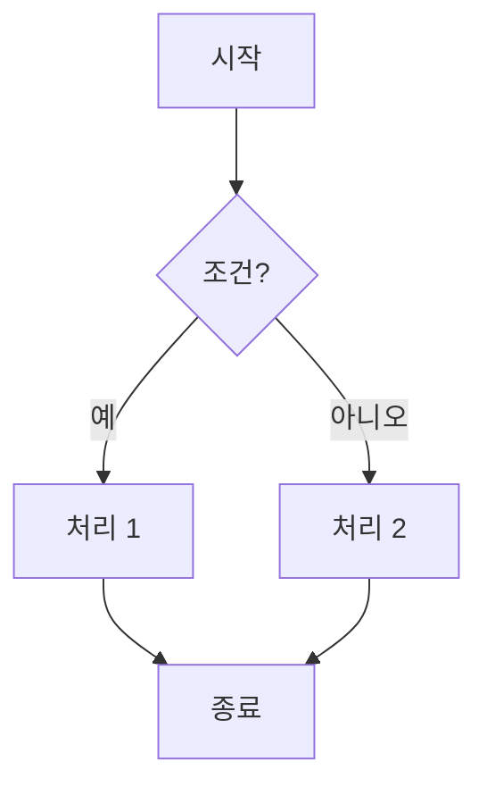
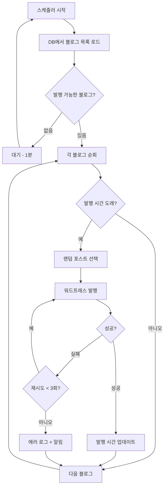

# BlogAuto v2 개발 지침서

> **버전**: v2.0.0  
> **최종 수정**: 2025-12-21  
> **대상**: Claude Code, Claude Chat, 개발자

---

## 📋 목차

1. [프로젝트 개요](#프로젝트-개요)
2. [핵심 원칙](#핵심-원칙)
3. [프로젝트 구조](#프로젝트-구조)
4. [Git 워크플로우](#git-워크플로우)
5. [순서도 기반 개발](#순서도-기반-개발)
6. [개발 프로세스](#개발-프로세스)
7. [코드 작성 규칙](#코드-작성-규칙)
8. [배포 전략](#배포-전략)
9. [체크리스트](#체크리스트)
10. [Claude 협업 가이드](#claude-협업-가이드)

---

## 🎯 프로젝트 개요

### 목표
모듈화되고 확장 가능한 블로그 자동화 시스템을 **점진적으로** 구축

### 전략
- ✅ 마이크로서비스 아키텍처
- ✅ 순서도 기반 설계
- ✅ 점진적 배포 (기능별 독립 배포)
- ✅ 테스트 주도 개발
- ✅ 문서화 우선

### 기존 시스템과의 관계
```
blogauto_new/          (기존, 절대 수정 금지)
  └── 참조만 가능, 복사 금지

blogauto_v2/           (새 프로젝트)
  └── 처음부터 체계적으로 구축
```

---

## 🚨 핵심 원칙

### 1. 절대 규칙 (NEVER)

❌ **절대 하지 말 것:**
1. 기존 `blogauto_new/` 코드 수정
2. 500줄 넘는 파일 생성
3. 50줄 넘는 함수 작성
4. 순서도 없이 개발 시작
5. 테스트 없이 배포
6. `git add -A` 사용 (파일별 개별 add)
7. master에 직접 커밋
8. 서버 명령어 실행 (runserver, gunicorn 등)

### 2. 필수 규칙 (MUST)

✅ **반드시 해야 할 것:**
1. 순서도 먼저, 코드는 나중
2. 파일 크기 < 500줄 (권장: < 300줄)
3. 함수 크기 < 50줄 (권장: < 20줄)
4. feature 브랜치에서 개발
5. Conventional Commits 형식
6. 파일별 개별 커밋
7. 테스트 코드 작성
8. README 문서화

### 3. 모듈화 원칙

```python
# ❌ 나쁜 예: 모든 것을 한 파일에
# blog_manager.py (3000줄)
class BlogManager:
    def collect_titles(): pass
    def generate_content(): pass
    def process_images(): pass
    def publish_wordpress(): pass
    def publish_blogger(): pass
    # ... 수백 개 함수

# ✅ 좋은 예: 독립적인 작은 파일들
# services/title_collector.py (150줄)
class TitleCollector:
    def collect(): pass

# services/content_generator.py (200줄)
class ContentGenerator:
    def generate(): pass

# services/image_processor.py (180줄)
class ImageProcessor:
    def process(): pass
```

**핵심:** 중복 허용 > 결합도 증가

---

## 📁 프로젝트 구조

```
blogauto_v2/
├── services/                    # 마이크로서비스들
│   ├── republish/              # 재발행 서비스 (Week 1-2)
│   │   ├── main.py            # FastAPI 엔드포인트 (< 100줄)
│   │   ├── models.py          # 데이터 모델 (< 50줄)
│   │   ├── scheduler.py       # 스케줄러 (< 80줄)
│   │   ├── publisher.py       # 발행 로직 (< 150줄)
│   │   ├── requirements.txt
│   │   ├── .env.example
│   │   └── README.md
│   │
│   ├── title_mgmt/            # 제목 관리 (Week 5-6)
│   ├── content_gen/           # 글 생성 (Week 7-8)
│   └── publisher/             # 발행 (Week 9-10)
│
├── shared/                     # 공통 라이브러리
│   ├── database.py            # DB 연결만 (< 100줄)
│   ├── config.py              # 설정 로더 (< 50줄)
│   └── logger.py              # 로깅 유틸 (< 80줄)
│
├── docs/                       # 문서
│   ├── flowcharts/            # 순서도들 (.mermaid)
│   │   ├── republish.mermaid
│   │   ├── title_mgmt.mermaid
│   │   └── content_gen.mermaid
│   │
│   ├── guides/                # 가이드 문서들
│   │   ├── DEVELOPMENT.md     # 이 파일
│   │   ├── DEPLOYMENT.md
│   │   └── GIT_WORKFLOW.md
│   │
│   └── ADR/                   # Architecture Decision Records
│       ├── 001-microservices.md
│       └── 002-tech-stack.md
│
├── tests/                      # 테스트 코드
│   ├── unit/
│   ├── integration/
│   └── e2e/
│
├── docker/                     # 배포 설정
│   └── republish/
│       └── Dockerfile
│
├── .github/
│   └── workflows/
│       └── deploy.yml
│
├── .gitignore
├── .env.example
├── CLAUDE.md                   # Claude용 요약 지침
└── README.md
```

---

## 🌳 Git 워크플로우

### 브랜치 전략 (Git Flow 간소화)

```
master (main)           # 프로덕션 배포용, 태그만
  │
  ├─── develop          # 개발 메인 브랜치
  │      │
  │      ├─── feature/republish-service
  │      ├─── feature/title-management
  │      └─── feature/content-generation
  │
  └─── hotfix/bug-xxx   # 긴급 버그 수정
```

### 워크플로우

#### 1. 새 기능 시작

```bash
# develop 최신화
git checkout develop
git pull origin develop

# feature 브랜치 생성
git checkout -b feature/republish-service
```

#### 2. 개발 중 커밋

```bash
# 파일별 개별 add
git add services/republish/main.py

# Conventional Commits 형식
git commit -m "feat(republish): FastAPI 엔드포인트 추가

- /republish POST 엔드포인트
- 헬스체크 엔드포인트 추가
- 환경변수 설정

관련 이슈: #1"

# 푸시
git push origin feature/republish-service
```

#### 3. 기능 완성 후 병합

```bash
# develop으로 병합
git checkout develop
git merge feature/republish-service
git push origin develop

# feature 브랜치 삭제
git branch -d feature/republish-service
git push origin --delete feature/republish-service
```

#### 4. 배포 (develop → master)

```bash
# master로 병합
git checkout master
git merge develop

# 버전 태그
git tag -a v0.1.0 -m "Release: 재발행 서비스 v0.1.0"

# 푸시
git push origin master
git push origin v0.1.0
```

### 커밋 메시지 규칙 (Conventional Commits)

#### 형식

```
<type>(<scope>): <subject>

<body>

<footer>
```

#### Type 종류

| Type | 설명 | 예시 |
|------|------|------|
| **feat** | 새 기능 | `feat(republish): 스케줄러 추가` |
| **fix** | 버그 수정 | `fix(republish): DB 잠금 오류 수정` |
| **docs** | 문서 | `docs(republish): README 추가` |
| **style** | 포맷팅 | `style: 코드 포맷 정리` |
| **refactor** | 리팩토링 | `refactor(republish): 함수 분리` |
| **test** | 테스트 | `test(republish): 단위 테스트 추가` |
| **chore** | 기타 | `chore: requirements.txt 업데이트` |

#### 좋은 커밋 예시

```bash
# ✅ 구체적이고 명확
git commit -m "feat(republish): 24시간 자동 재발행 추가

- APScheduler 통합
- 블로그별 간격 설정 (환경변수)
- 로깅 추가

Closes #1"

# ✅ 버그 수정
git commit -m "fix(republish): 동시 발행 시 DB 잠금 오류 수정

- SQLAlchemy session 관리 개선
- 트랜잭션 롤백 처리"

# ❌ 나쁜 예
git commit -m "수정"
git commit -m "버그픽스"
git commit -m "feat: 블로그오토 기능 추가_1221_01"
```

---

## 📐 순서도 기반 개발

### 필수 규칙

**모든 기능은 순서도부터 시작!**

```
순서도 작성 → Claude에게 전달 → 코드 생성 → 검증 → 배포
```

### Mermaid 문법



### 실전 예시: 재발행 서비스



### 순서도 저장 위치

```
docs/flowcharts/
├── republish.mermaid        # 재발행 서비스
├── title_collection.mermaid # 제목 수집
├── ai_generation.mermaid    # AI 글 생성
└── publishing.mermaid       # 발행
```

### Claude에게 전달하는 방법

```
재발행 서비스를 구현해주세요.

📐 순서도:
[docs/flowcharts/republish.mermaid 파일 첨부 또는 내용 붙여넣기]

📋 요구사항:
1. 파일 구조: main.py, models.py, scheduler.py, publisher.py
2. 각 파일 < 300줄
3. 각 함수 < 50줄
4. 타입 힌트 필수
5. docstring 필수
6. 에러 처리 필수

📚 참조 (복사 금지):
- 기존 코드: blogauto_new/core/republish_old.py
- 로직 참조만, 구조는 새로 설계

시작해주세요!
```

---

## 🔄 개발 프로세스

### 전체 프로세스 (6단계)

```
1. 계획 → 2. 설계 → 3. 개발 → 4. 테스트 → 5. 문서화 → 6. 배포
```

### Phase 1: 계획 (30분 - 2시간)

```markdown
## 기능: [기능명]

### 목적
- 무엇을 하는가?
- 왜 필요한가?

### 요구사항
- [ ] 필수 기능 1
- [ ] 필수 기능 2
- [ ] 선택 기능 1

### 제약사항
- 파일 < 300줄
- 함수 < 50줄
- 외부 의존성 최소화

### 예상 파일 구조
- main.py (100줄)
- models.py (50줄)
- ...

### 예상 일정
- 개발: 2일
- 테스트: 1일
- 배포: 0.5일
```

### Phase 2: 설계 (1-2시간)

1. **순서도 작성**
   ```
   docs/flowcharts/[feature-name].mermaid
   ```

2. **데이터 모델 설계**
   ```python
   # models.py 스케치
   class Blog:
       id: int
       url: str
       ...
   ```

3. **API 엔드포인트 설계** (있는 경우)
   ```
   POST /republish
   GET /status
   ```

### Phase 3: 개발 (2-3일)

1. **feature 브랜치 생성**
   ```bash
   git checkout -b feature/republish-service
   ```

2. **순서도 → Claude 프롬프트**
   ```
   [순서도 첨부]
   위 순서도대로 구현해주세요.
   ```

3. **파일별 개발 & 커밋**
   ```bash
   # 파일 하나 완성 → 커밋
   git add main.py
   git commit -m "feat(republish): FastAPI 엔드포인트"
   
   git add models.py
   git commit -m "feat(republish): 데이터 모델"
   ```

4. **줄 수 체크**
   ```bash
   wc -l *.py
   # 500줄 넘으면 즉시 분리!
   ```

### Phase 4: 테스트 (1일)

1. **단위 테스트 작성**
   ```python
   # tests/unit/test_republish.py
   def test_scheduler():
       assert scheduler.is_time_to_publish()
   ```

2. **통합 테스트**
   ```python
   # tests/integration/test_republish_flow.py
   def test_full_republish_flow():
       # 전체 플로우 테스트
   ```

3. **로컬 실행 테스트**
   ```bash
   python -m pytest tests/
   ```

### Phase 5: 문서화 (2시간)

1. **README.md**
   ```markdown
   # 재발행 서비스
   
   ## 설치
   ## 실행
   ## 환경변수
   ## API 문서
   ```

2. **코드 주석**
   ```python
   def publish(blog_id: int) -> bool:
       """
       블로그 포스트를 재발행합니다.
       
       Args:
           blog_id: 블로그 ID
       
       Returns:
           성공 여부
       
       Raises:
           ValueError: 잘못된 blog_id
       """
   ```

### Phase 6: 배포 (0.5-1일)

1. **develop 병합**
   ```bash
   git checkout develop
   git merge feature/republish-service
   ```

2. **로컬 최종 테스트**

3. **master 병합 & 태그**
   ```bash
   git checkout master
   git merge develop
   git tag -a v0.1.0 -m "Release: 재발행 서비스"
   ```

4. **Oracle Cloud 배포**
   ```bash
   # Docker 빌드
   docker build -t republish:v0.1.0 .
   
   # 배포
   docker-compose up -d
   ```

5. **모니터링 (1주)**
   - 메모리 사용량
   - 에러 로그
   - 성능

---

## 📝 코드 작성 규칙

### 파일 크기 제한

```python
# ❌ 나쁜 예: 큰 파일
# blog_manager.py (3000줄) ← 절대 금지!

# ✅ 좋은 예: 작은 파일들
# title_collector.py (150줄)
# content_generator.py (200줄)
# image_processor.py (180줄)
```

**규칙:**
- 파일 < 500줄 (절대 한계)
- 권장: < 300줄
- 측정: `wc -l filename.py`

### 함수 크기 제한

```python
# ❌ 나쁜 예: 긴 함수
def process_blog():  # 200줄
    # ... 너무 많은 일을 함

# ✅ 좋은 예: 작은 함수들
def collect_titles():  # 15줄
    pass

def validate_title():  # 10줄
    pass

def save_to_db():  # 12줄
    pass
```

**규칙:**
- 함수 < 50줄 (절대 한계)
- 권장: < 20줄
- 한 함수 = 한 가지 일만

### 타입 힌트 필수

```python
# ❌ 나쁜 예
def publish(blog_id):
    return True

# ✅ 좋은 예
def publish(blog_id: int) -> bool:
    """블로그 포스트를 발행합니다."""
    return True
```

### 에러 처리 필수

```python
# ❌ 나쁜 예
def get_blog(blog_id):
    return Blog.query.get(blog_id)  # None이면?

# ✅ 좋은 예
def get_blog(blog_id: int) -> Blog:
    """블로그를 조회합니다."""
    blog = Blog.query.get(blog_id)
    if not blog:
        raise ValueError(f"Blog {blog_id} not found")
    return blog
```

### 로깅 필수

```python
import logging

logger = logging.getLogger(__name__)

def publish(blog_id: int) -> bool:
    logger.info(f"[PUBLISH] Starting: blog_id={blog_id}")
    
    try:
        # 발행 로직
        logger.info(f"[PUBLISH] Success: blog_id={blog_id}")
        return True
    except Exception as e:
        logger.error(f"[PUBLISH] Failed: blog_id={blog_id}, error={e}")
        raise
```

### Docstring 필수

```python
def generate_content(title: str, template: str) -> str:
    """
    AI를 사용하여 블로그 콘텐츠를 생성합니다.
    
    Args:
        title: 블로그 제목
        template: 프롬프트 템플릿
    
    Returns:
        생성된 콘텐츠 (마크다운)
    
    Raises:
        ValueError: title이 비어있는 경우
        APIError: AI API 호출 실패
    
    Example:
        >>> content = generate_content("제목", "템플릿")
        >>> print(content)
        "# 제목\n\n본문..."
    """
```

---

## 🚀 배포 전략

### 마이크로서비스 독립 배포

```
각 서비스는 독립적으로 배포 가능:

services/republish/     → https://republish.domain.com
services/title_mgmt/    → https://titles.domain.com
services/content_gen/   → https://content.domain.com
```

### 배포 체크리스트

```markdown
## 배포 전 체크리스트

### 코드 품질
- [ ] 모든 파일 < 500줄
- [ ] 모든 함수 < 50줄
- [ ] 타입 힌트 완료
- [ ] Docstring 완료
- [ ] 에러 처리 완료

### 테스트
- [ ] 단위 테스트 통과
- [ ] 통합 테스트 통과
- [ ] 로컬 실행 테스트
- [ ] 커버리지 > 80%

### 문서화
- [ ] README.md 작성
- [ ] 환경변수 문서화
- [ ] API 문서 (있는 경우)
- [ ] 순서도 최신화

### Git
- [ ] develop 병합 완료
- [ ] 충돌 해결 완료
- [ ] master 병합 완료
- [ ] 태그 생성 (v0.1.0)

### 배포
- [ ] Docker 빌드 성공
- [ ] 환경변수 설정
- [ ] 배포 완료
- [ ] 헬스체크 통과

### 모니터링
- [ ] 로그 확인
- [ ] 메모리 사용량 확인
- [ ] 에러 없음 확인
- [ ] 성능 측정
```

### 롤백 계획

```bash
# 문제 발생 시 즉시 롤백
git checkout v0.0.9  # 이전 버전
docker-compose up -d

# 로그 확인
tail -f logs/error.log
```

---

## ✅ 체크리스트

### 새 기능 개발 체크리스트

```markdown
# 기능: [기능명]

## Phase 1: 계획
- [ ] 기능 요구사항 정리
- [ ] 순서도 작성
- [ ] 파일 구조 설계
- [ ] 예상 줄 수 계산

## Phase 2: 개발
- [ ] feature 브랜치 생성
- [ ] 파일 1 작성 (< 300줄)
- [ ] 파일 2 작성 (< 300줄)
- [ ] 각 파일 개별 커밋

## Phase 3: 테스트
- [ ] 단위 테스트 작성
- [ ] 통합 테스트 작성
- [ ] pytest 통과
- [ ] 커버리지 > 80%

## Phase 4: 문서화
- [ ] README.md
- [ ] Docstring
- [ ] 환경변수 문서
- [ ] API 문서

## Phase 5: 배포
- [ ] develop 병합
- [ ] 로컬 테스트
- [ ] master 병합
- [ ] 태그 생성
- [ ] 배포
- [ ] 모니터링

## 결과
- 총 줄 수: [줄 수]
- 파일 수: [개수]
- 테스트 커버리지: [%]
- 배포 URL: [URL]
```

---

## 🤝 Claude 협업 가이드

### Claude Code vs Claude Chat

| 작업 | Claude Code | Claude Chat |
|------|-------------|-------------|
| 코드 작성 | ✅ 주 담당 | 보조 |
| 파일 편집 | ✅ 주 담당 | 불가 |
| 설계/계획 | 보조 | ✅ 주 담당 |
| 순서도 작성 | 보조 | ✅ 주 담당 |
| 문서 작성 | ✅ 가능 | ✅ 가능 |
| 디버깅 | ✅ 가능 | ✅ 가능 |

### 협업 워크플로우

```
1. Claude Chat: 기획 & 순서도 작성
   └─ 순서도 + 요구사항 정리
   
2. Claude Code: 코드 구현
   └─ 순서도 기반 코드 생성
   
3. Claude Chat: 리뷰 & 개선안
   └─ 코드 리뷰 + 제안
   
4. Claude Code: 수정 반영
   └─ 피드백 반영
   
5. 반복
```

### Claude에게 프롬프트 전달하는 방법

#### Claude Chat (기획/설계)

```
새로운 기능을 기획하려고 합니다.

기능명: 재발행 서비스
목적: 등록된 블로그 포스트를 24시간 주기로 자동 재발행

요구사항:
1. 블로그별 발행 간격 설정 가능
2. 실패 시 3회 자동 재시도
3. 워드프레스만 지원

이 기능의 순서도를 Mermaid 형식으로 작성해주세요.
그리고 필요한 파일 구조와 각 파일의 역할을 제안해주세요.
```

#### Claude Code (구현)

```
재발행 서비스를 구현해주세요.

📐 순서도:
[Mermaid 코드 붙여넣기]

📋 요구사항:
1. 파일 구조:
   - main.py: FastAPI 엔드포인트 (< 100줄)
   - models.py: 데이터 모델 (< 50줄)
   - scheduler.py: APScheduler (< 80줄)
   - publisher.py: WordPress 발행 (< 150줄)

2. 기술 스택:
   - FastAPI
   - SQLAlchemy
   - APScheduler
   - requests

3. 제약사항:
   - 각 파일 < 300줄
   - 각 함수 < 50줄
   - 타입 힌트 필수
   - Docstring 필수

📚 참조 (복사 금지):
- 기존 코드: blogauto_new/core/republish_old.py
- 로직만 참조, 새로 작성

시작해주세요!
```

### 파일 전달 방법

1. **CLAUDE.md**: 모든 채팅 시작 시 첨부
2. **순서도**: 개발 시작 시 첨부
3. **기존 코드**: 참조 필요 시만 첨부

---

## 📚 참고 자료

### 추가 문서

- [Git 워크플로우](docs/guides/GIT_WORKFLOW.md)
- [배포 가이드](docs/guides/DEPLOYMENT.md)
- [순서도 템플릿](docs/flowcharts/template.mermaid)

### 외부 자료

- [Conventional Commits](https://www.conventionalcommits.org/)
- [Git Flow](https://nvie.com/posts/a-successful-git-branching-model/)
- [Mermaid 문법](https://mermaid.js.org/syntax/flowchart.html)
- [FastAPI 문서](https://fastapi.tiangolo.com/)

---

## 🎯 3개월 로드맵

### Week 1-2: 재발행 서비스
- [x] 프로젝트 설정
- [ ] 순서도 작성
- [ ] 개발
- [ ] 테스트
- [ ] 배포

### Week 3-4: 개발 프로세스 정립
- [ ] Git 워크플로우 문서
- [ ] 순서도 템플릿
- [ ] 체크리스트 템플릿

### Week 5-6: 제목 관리 v2
- [ ] 순서도
- [ ] 개발
- [ ] 배포

### Week 7-8: 글 생성 v2
- [ ] 순서도
- [ ] 개발
- [ ] 배포

### Week 9-10: 발행 v2
- [ ] 순서도
- [ ] 개발
- [ ] 배포

### Week 11-12: 통합 & 최적화
- [ ] 서비스 간 연동
- [ ] 성능 최적화
- [ ] 기존 시스템 폐기

---

## 📞 문의 & 개선

이 문서에 대한 질문이나 개선 제안은:
- GitHub Issues
- 또는 직접 수정 후 PR

**최종 수정**: 2025-12-21  
**버전**: v2.0.0
