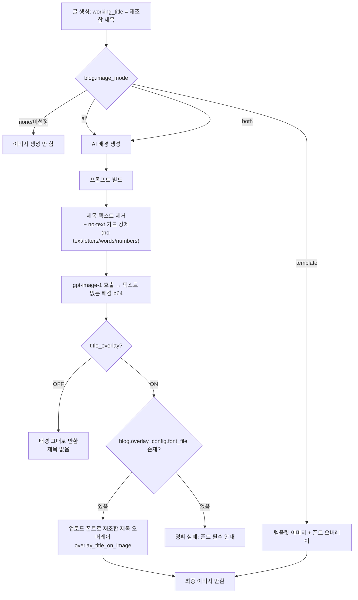
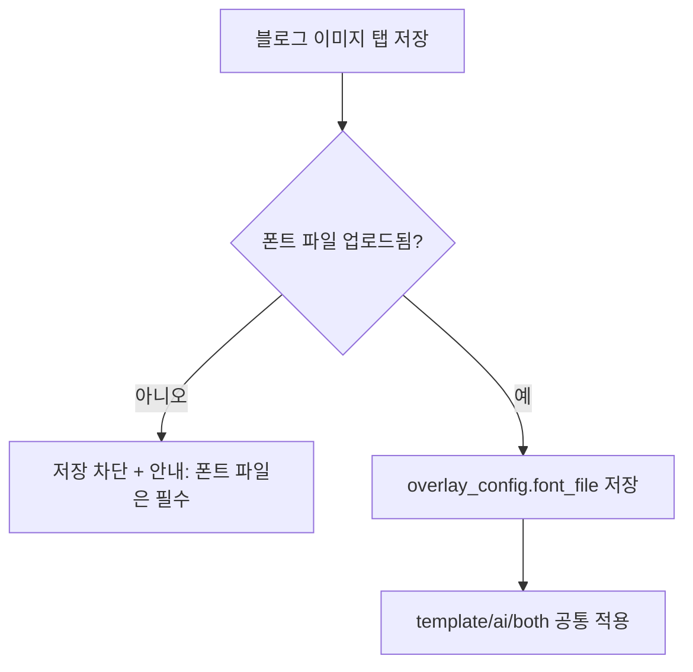

# AI 이미지 생성 + 폰트 오버레이 흐름 (2026-06-12 개편)

## 배경
- AI(gpt-image-1)가 프롬프트의 제목을 이미지에 직접 렌더 → 한글 깨짐·할루시네이션(가짜 전화번호 등).
- 오버레이 한글이 □(tofu): 시스템 한글 폰트 미설치 + 커스텀 폰트 미업로드.
- 모듈 "이미지 생성 활성화"를 꺼도 blog.image_mode가 설정돼 있으면 생성됨(혼란).

## 개편 원칙
1. AI는 **텍스트 없는 배경**만 생성한다.
2. 제목은 **블로그에 업로드한 폰트로 오버레이**한다(폰트 필수).
3. 이미지 생성 여부는 **blog.image_mode**가 결정(모듈 토글 제거 → 자동 활성).

## 생성 파이프라인

## 폰트 필수 검증 흐름

## 변경 요약
| 영역 | 변경 |
|------|------|
| ai_image_service | 프롬프트에 no-text 가드 강제, 제목 텍스트 미포함 |
| image_generator | title_overlay ON + 폰트 있을 때만 오버레이, 폰트 없으면 명확 실패 |
| 기본 프롬프트 | 텍스트 비유발형(배경 묘사)로 변경 |
| _tab_image.html | 폰트/오버레이 섹션 전 모드 공통, 폰트 필수, 모델 목록 정리 |
| blog_image_settings.js | 모델 목록(gpt-image), 폰트 필수 검증 |
| 모듈 폼 | 이미지 생성 "활성화" 토글 제거(자동), 오버레이 토글 유지 |
| _tab_ai.html | 이미지 모델 목록 정리 |
