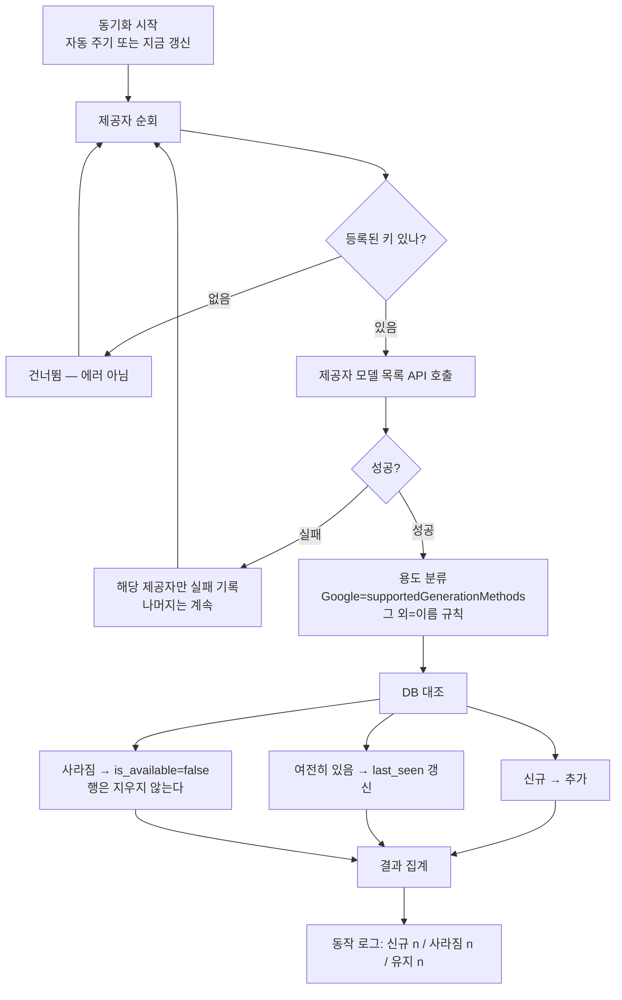
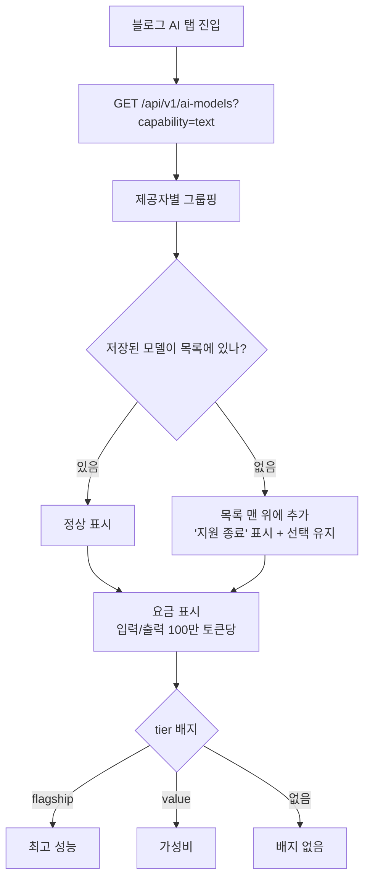
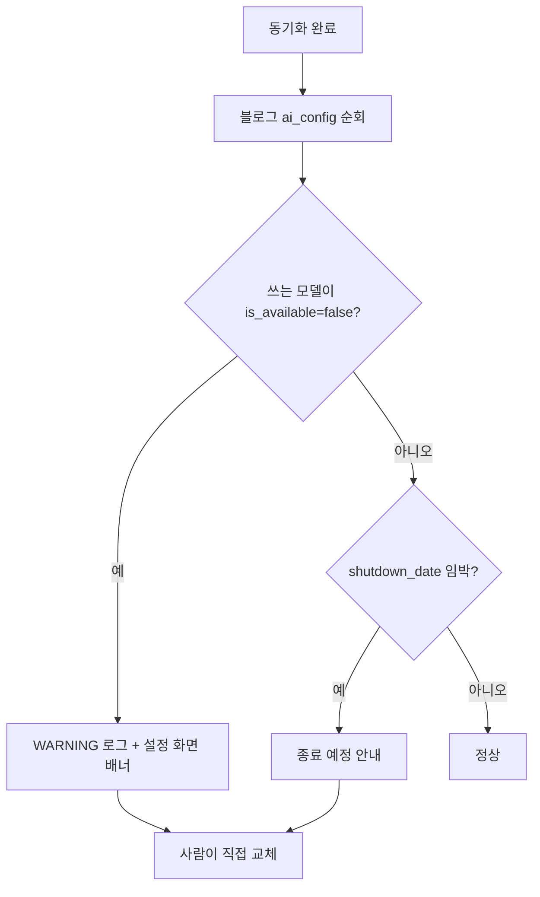

# AI 모델 카탈로그 — 동기화·표시·경고

> 모델 목록을 DB 한 곳으로 모으고, 제공자 API 에서 주기적으로 갱신한다.
> 화면은 하드코딩 대신 이 목록을 받아 쓴다.
> 계획서: `docs/plans/ai_model_catalog_sync.md`

## 동기화

**사라진 모델을 지우지 않는 이유**: 지우면 그 모델을 쓰던 블로그 설정이
무엇을 가리켰는지 알 수 없게 된다. `is_available=false` 로 남겨야
"지원 종료" 표시와 경고가 가능하다.

## 화면 표시

**저장된 값을 지우지 않는 이유**: 목록에서 사라졌다고 선택을 비우면
사용자가 모르는 사이 다른 모델로 글이 나간다.

## 경고

**자동 교체하지 않는다**: 모델이 바뀌면 글 품질과 요금이 달라진다.
gpt-4o-mini → gpt-4.1-mini 전환에서 분량이 1,618자 → 3,542자로 달라졌다.

## 요금 관리

모델 목록 API 어디에도 요금 필드가 없다(실측 확인). `ai_model_prices` 에
우리가 관리하고, 갱신일을 함께 표시해 오래된 값인지 알 수 있게 한다.

## 단계

| 단계 | 산출물 |
|---|---|
| 1 | 테이블 2개 + 동기화 서비스 + 조회 API |
| 2 | `지금 갱신` 버튼 + 결과 요약 |
| 3 | 블로그 AI 탭 교체 (요금·배지 표시) |
| 4 | 나머지 화면 5곳 교체 |
| 5 | 주기 동기화(사용자 설정) + 사라짐 경고 |
