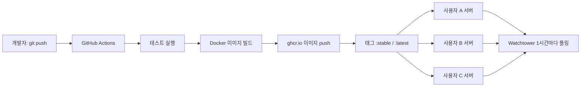
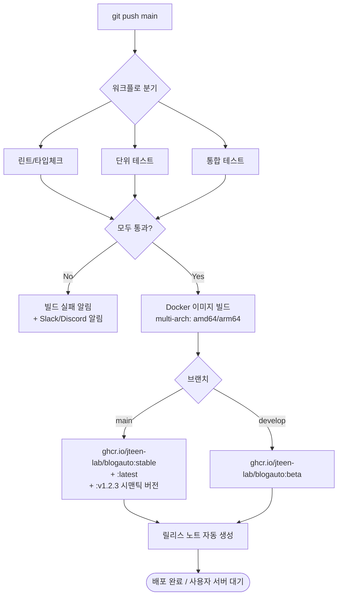
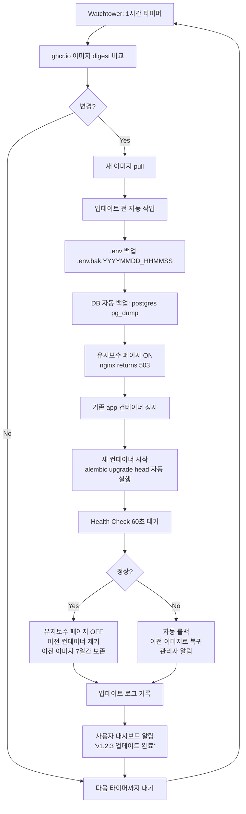
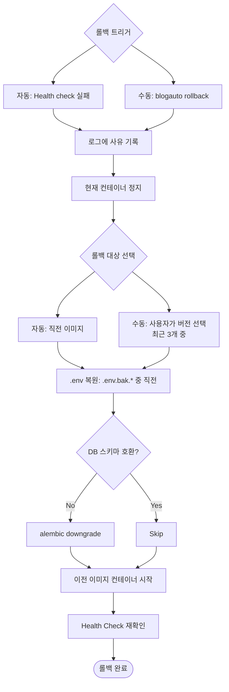
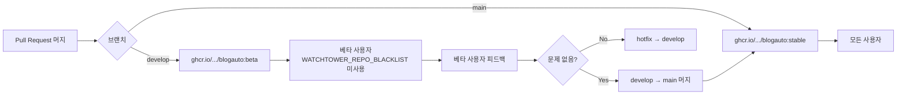

# 자동 업데이트 흐름

> **버전**: v1.0 / **작성일**: 2026-05-13 / **단계**: Phase A-1

---

## 1. 전체 흐름



---

## 2. 개발자 측 - GitHub Actions 빌드/배포



---

## 3. 사용자 서버 측 - Watchtower 자동 업데이트



---

## 4. 자동 업데이트 안전장치 (Defense in Depth)

| 장치 | 동작 | 트리거 |
|------|------|--------|
| **이미지 digest 검증** | pull한 이미지 SHA256이 ghcr.io의 공식 digest와 일치하는지 | 변조 차단 |
| **백업 자동화** | `.env` + DB 덤프를 update 전 자동 보관 | 매 업데이트 |
| **유지보수 페이지** | 업데이트 중 사용자에게 "잠시 후 다시 시도" | 컨테이너 교체 동안 |
| **Health Check** | `/health` 엔드포인트 60초 대기 | 새 컨테이너 시작 후 |
| **자동 롤백** | health 실패 시 즉시 이전 이미지 복귀 | health check 실패 |
| **이전 이미지 보존** | 최근 3개 버전을 로컬 디스크에 유지 | 항상 |
| **관리자 알림** | 롤백 발생 시 Slack/이메일로 즉시 통지 | 롤백 발생 |
| **수동 일시정지** | `blogauto pause-updates` 명령으로 자동 업데이트 중단 가능 | 사용자 선택 |

---

## 5. 롤백 흐름 (자동/수동)



---

## 6. 베타/정식 채널 분리 (사용자 30명+에서 활성화)



채널 전환은 `.env`에서 한 줄:
```env
# 안정 채널 (기본)
BLOGAUTO_IMAGE_TAG=stable

# 베타 채널 (베타 테스터만)
BLOGAUTO_IMAGE_TAG=beta
```

---

## 7. 업데이트 주기 옵션

| 주기 | 적합한 상황 | 환경변수 |
|------|----------|---------|
| 1시간 (권장) | 활발한 개발 단계, 빠른 버그 수정 반영 | `WATCHTOWER_POLL_INTERVAL=3600` |
| 6시간 | 균형 (안정성 + 비교적 빠름) | `WATCHTOWER_POLL_INTERVAL=21600` |
| 24시간 | 안정 운영, 큰 변경 적음 | `WATCHTOWER_POLL_INTERVAL=86400` |
| 수동 | 자동 업데이트 끄기 | `WATCHTOWER_DISABLE=true` |

---

**문서 끝**.
