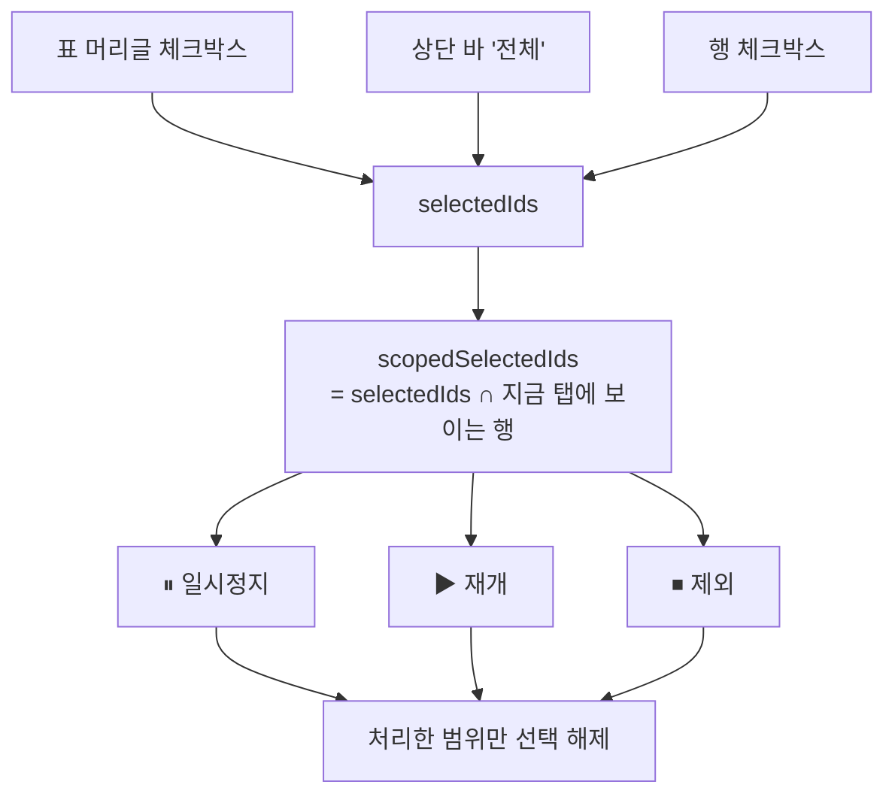

# 오토런 목록 표 전환

> 4단계 중 마지막. 블로그·모듈·플로우와 **같은 공용 컴포넌트**를 쓴다.
> 컴포넌트 규약: `docs/flowcharts/list_table_component.md`

## 다른 화면과 결정적으로 다른 점

**오토런은 이미 선택 기능이 있다.** 상단 바의 전체·일시정지·재개·제외
버튼이 모두 `selectedIds` 를 읽는다. 그래서 다른 화면이 쓰는
`listSelectionMixin()` 을 **쓰지 않는다** — 선택 저장소가 둘이 되면
표에서 고른 것과 버튼이 동작하는 대상이 갈라진다.

대신 공용 표가 요구하는 선택 함수를 `selectedIds` 위에 구현한다.
id 가 화면 전체에서 유일하므로 배열 하나로도 탭별 동작이 성립한다.

### 왜 범위를 좁혔나

탭으로 나뉘기 전에는 `selectAll()` 이 전체를 고르고 일괄 동작이 전체를
대상으로 해도 문제가 없었다. 화면에 다 보였기 때문이다. 탭으로 나눈 뒤
그대로 두면 **안 보이는 항목이 정지되거나 제외된다.**

그래서 셋 다 "지금 탭에서 보이는 행" 기준으로 바꿨다.

| 대상 | 전 | 후 |
|---|---|---|
| `selectAll()` | 전체 플로우 | 지금 탭의 보이는 행 |
| `isAllSelected` | 전체 대비 | 지금 탭의 보이는 행 대비 |
| `hasActiveSelected` / `hasPausedSelected` | selectedIds | scopedSelectedIds |
| `bulkPause` / `bulkResume` / `bulkRemove` | selectedIds | scopedSelectedIds |
| 동작 후 해제 | 전체 해제 | 처리한 범위만 해제 |

마지막 줄이 중요하다. 전체를 해제하면 다른 탭에서 골라 둔 것을 아무
동작도 하지 않은 채 말없이 버리게 된다.

## 탭 축

플로우 관리와 **같은 축**(연결 블로그의 플랫폼)을 쓴다. 오토런 항목이
곧 플로우라 두 화면이 다른 축으로 나뉘면 오히려 헷갈린다. 판정은
`components/platform_tabs.js` 한 곳에만 두어 두 화면이 갈리지 않게 한다.

## 카드 정보 이전

| 카드 | 표 |
|---|---|
| 체크박스 | 체크박스 열 |
| 🟢/🟡/🔴 + 헤더 색 | 상태 열 (실행중·일시정지·자동정지) |
| 이름 | 이름 열 |
| 다음 실행 시각 | 다음 실행 열 |
| 일시정지·재개·제외 | 행 액션 |
| 설명 | 모바일 2줄째 |
| 생성 정지(프리셋 없음) | 알림 배지 + 툴팁에 모듈명 |
| 연속 실패 N회 자동정지 | 알림 배지 + 툴팁에 정지된 동작 |
| 모듈 n개 / 블로그 n개 | 모듈·블로그 열 |

정렬은 이름·상태·다음 실행 세 열. 상태 오름차순은
**실행중 → 일시정지 → 자동정지** 순으로, 손봐야 할 것이 뒤로 모인다.
다음 실행이 없는 항목도 뒤로 보낸다 — 빈 값이 앞에 오면 훑기가 나빠진다.

카드의 슬라이드 애니메이션과 "더보기" 는 표에서 없앤다. `_card.html` 과
슬라이드 함수는 지우지 않고 남긴다.
