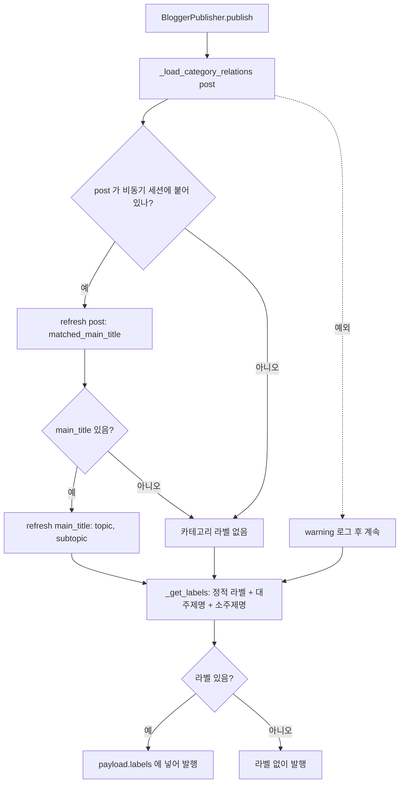

# 블로거 발행 시 카테고리 라벨 붙이기 (2026-09-29)

## 문제
`_get_labels` 가 `post.matched_main_title.topic/subtopic` 을 읽을 때, 비동기 세션에서
관계가 미리 로드되지 않아 예외(MissingGreenlet)가 났고 `except` 에서 debug 로그로만 삼켜졌다.
→ 모든 블로거 글이 라벨 0개로 발행됨(수작남 실측: 전 글 category=[]).

## 고침
발행 직전에 글이 속한 비동기 세션으로 관계를 **명시적으로 불러온 뒤** 라벨을 만든다.
실패하면 조용히 넘기지 않고 warning 로그를 남긴다(발행 자체는 계속).

