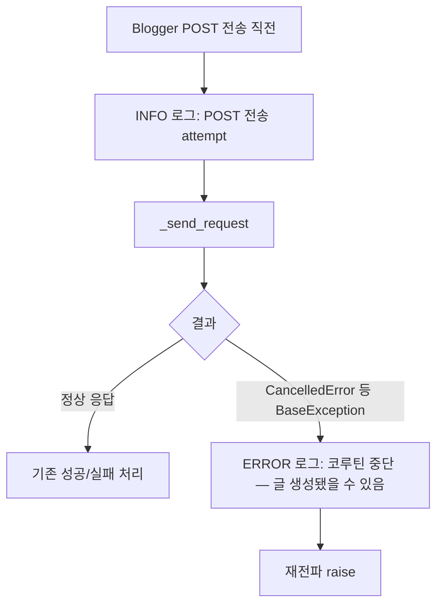
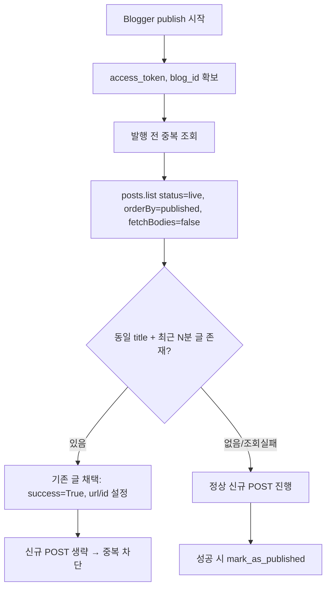

# Blogger 발행 관찰성 + 멱등성(중복 방지) (항목 ①, 2026-06-14)

## 배경
6/13 월드인포마스터: Blogger에 글은 생성됐으나 클라이언트가 응답을 못 받고 코루틴 중단 → Celery 재시도 → **동일 글 4개 중복**. 정확한 종료 예외는 로그 소실로 미확정. imgbb와 무관하게 **모든 Blogger 발행의 잠재 위험**(응답 지연·취소 시 재발).

## ①1a 관찰성 강화

- 현재 `except Exception`은 `CancelledError`(BaseException)를 못 잡아 로그 없이 사라짐 → `except asyncio.CancelledError`로 명시 포착+로그 후 재전파.

## ①1b 멱등성: 발행 전 중복 조회 후 차단

## 핵심
- `_find_recent_post_by_title(blog_id, title, token, window=10분)`: 동일 제목 + 최근 발행 글 조회. 조회 실패 시 None 반환(발행 차단 안 함).
- `publish()`: POST 루프 직전 조회 → 발견 시 그 글을 성공으로 채택하고 반환.
- 효과: 첫 시도가 응답 유실로 중단돼도, 재시도가 기존 글을 발견해 **중복 생성 차단**.

## 설계 판단
- **항상 조회**(첫 시도 포함): 취소 시나리오는 `publish_attempts`가 증가하지 않아 "재시도 여부"로 분기 불가 → 항상 조회가 안전.
- 윈도우 10분 + 정확 제목 일치로 의도적 동일제목 발행과의 충돌 최소화. 재발행 플로우는 별도 서비스(`BloggerRepublishService`)라 영향 없음.
- 조회 비용: 발행당 GET 1회 추가(수용).

## 변경 파일
- `blogger_publisher.py`: `_find_recent_post_by_title` 추가, `publish()`에 중복 조회 훅 + CancelledError 포착.
