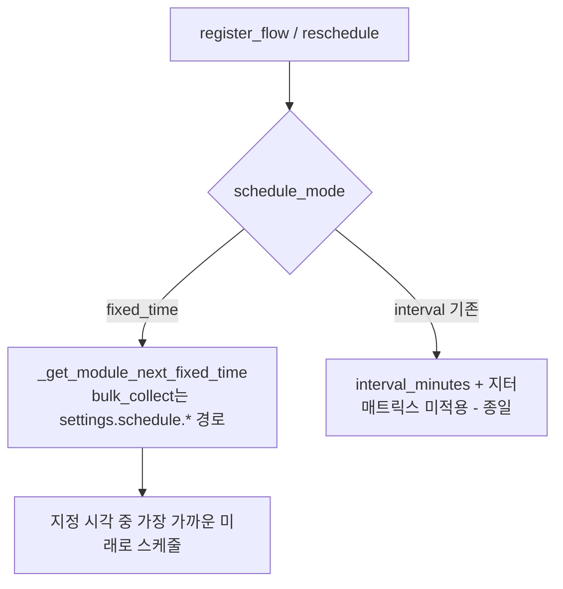

# 대량 수집(bulk_collect) 고정 시간(fixed_time) 스케줄 적용 (2026-06-23)

[[project_bulk_collect_redesign]]. 일반 수집(collect)의 검증된 fixed_time 방식을
대량 수집에도 적용. 기존 interval(매트릭스) 모드는 시간대 미적용 결함이 있어
fixed_time을 기본·권장 모드로 추가한다.

## 스케줄 결정 흐름

## 변경 (백엔드 app/scheduler/flow_scheduler.py)
- `_get_module_next_fixed_time`: bulk_collect는 `settings.schedule.schedule_mode`·
  `settings.schedule.fixed_times`(중첩) 읽기, collect/data는 기존 top-level 유지.
- `_schedule_next_execution`(최초 등록)·`_reschedule_next`(실행 후) 의 fixed_time
  게이트 `action_type in ("collect","data")` 에 `bulk_collect` 추가.
- register_flow `skip_immediate`: fixed_time bulk_collect는 등록 즉시 실행 안 함
  (지정 시각까지 대기) — 중첩 schedule_mode 읽어 판정.

## 변경 (프론트 bulk_collect 폼)
- `bulk-collect-form.js`: state `schedule_mode('fixed_time' 기본)`, `fixed_times`,
  `newFixedTime` + 헬퍼 `addFixedTime`/`removeFixedTime`. load는
  `settings.schedule.schedule_mode/fixed_times` 읽기, save는 schedule 객체에 추가.
- `bulk-collect-form-template.js`: 모드 라디오(고정 시간/간격) + 고정시간 편집 UI
  추가, 기존 매트릭스·간격·지터 블록은 `schedule_mode==='interval'` 일 때만 표시.
- `modules/list.html` `?v=` bump(JS 템플릿 캐시).

## 호환/주의
- 기존 모듈(schedule_mode 없음)은 백엔드가 interval로 간주 → 기존 동작 유지.
  사용자가 폼에서 fixed_time로 저장해야 고정시간 적용(운영 모듈 재저장 필요).
- 스키마 변경 없음(settings JSON 키만 추가).
