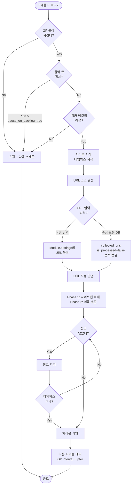
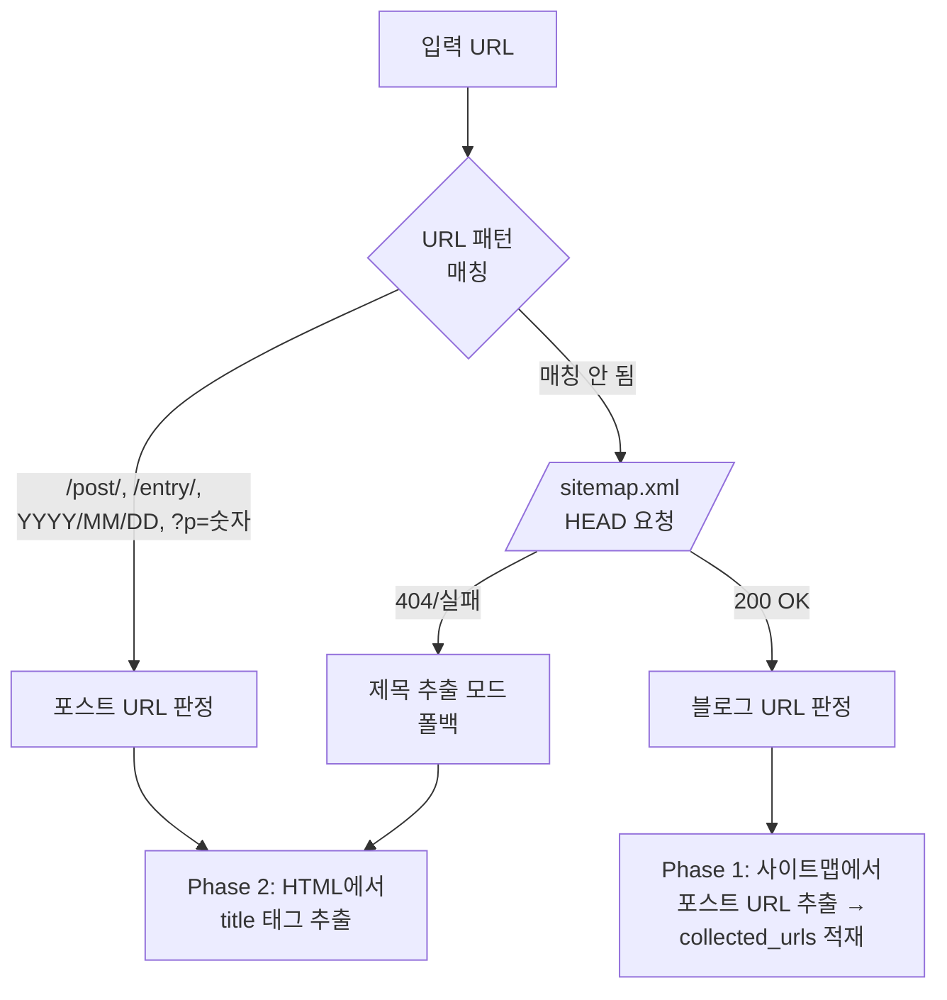
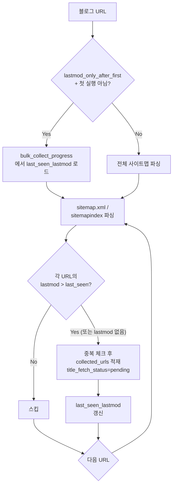
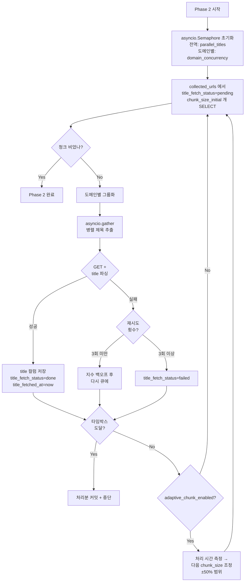
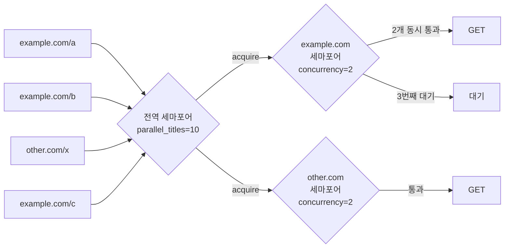
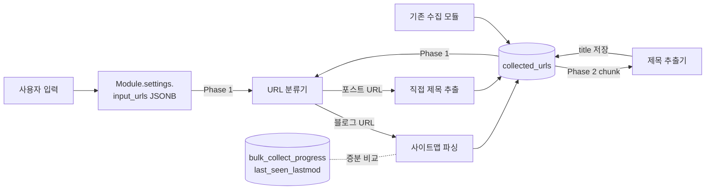
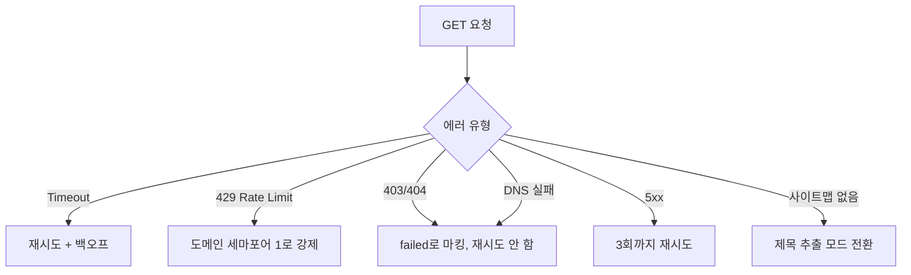

# 대량 수집 모듈 (bulk_collect) — 워크플로우 플로우차트

> **작성일**: 2026-06-02
> **모듈 타입**: `bulk_collect`
> **목적**: 저장된 URL 또는 사용자 입력 URL에서 대량으로 포스트 제목을 추출. 메모리·시간 분산을 위한 청크 기반 처리.

---

## 1. 모듈 전체 흐름 (High-Level)

---

## 2. URL 자동 판별 로직

---

## 3. Phase 1 — 사이트맵 URL 적재 (블로그 URL 입력 시)

**핵심 포인트**:
- Phase 1은 빠른 작업 (네트워크 1회 + XML 파싱). 1만 URL이라도 분 단위에 끝남.
- 적재만 하고 제목 추출은 Phase 2에 위임.

---

## 4. Phase 2 — 청크 단위 제목 추출 (메인 부하)

---

## 5. 도메인별 Rate Limit (Semaphore)

**효과**:
- 단일 도메인 1만개 → 동시 2개씩만 처리 (사이트 차단 회피)
- 도메인 분산되면 전체 10개 병렬 (1만 URL × 0.3초 = 50분 → 약 5분)

---

## 6. 시간 분산 (Time-Sliced Cycles)

```mermaid
gantt
    title 하루 사이클 분포 예시 (30분 간격, 5분 작업)
    dateFormat HH:mm
    axisFormat %H:%M

    section 활성 시간대 (08:00~22:00)
    사이클 1 :08:00, 5m
    사이클 2 :08:30, 5m
    사이클 3 :09:00, 5m
    사이클 4 :09:30, 5m
    사이클 N :11:00, 5m

    section 야간 부스트 (선택)
    부스트 사이클 :02:00, 8m
```

**계산 예시 (1만 URL, 청크 100, 5분 상한)**:
- 사이클당 100~150개 처리
- 활성 14시간 / 30분 간격 = 28사이클
- 일 처리량: 2,800~4,200개
- 1만 URL 완수: **3~4일**
- 이후 lastmod 증분: 신규 글만 → 사이클 1회로 끝

---

## 7. 데이터 흐름 (DB 관점)

---

## 8. 신규 DB 변경 요약

| 테이블 | 변경 | 설명 |
|--------|------|------|
| `module_types` | row 추가 | `code='bulk_collect'`, `name='대량 수집'` |
| `collected_urls` | 컬럼 추가 | `title_fetched_at`, `title_fetch_status`, `title` (이미 있으면 재사용) |
| `bulk_collect_progress` (신규) | 테이블 신설 | `module_id`, `blog_domain`, `last_seen_lastmod`, `last_cycle_at`, `last_cycle_stats` |
| `modules.settings` JSONB | 키 추가 | bulk_collect 전용 8개 파라미터 + `input_urls` 배열 + `url_source_mode` |

---

## 9. 위험·예외 흐름

---

## 10. 사용자 시나리오

### Scenario A. 처음 등록한 큰 블로그
1. 사용자가 `https://big-blog.com` 입력 (직접 입력)
2. 사이클 1 (Phase 1): 사이트맵 파싱 → 1만개 URL `collected_urls`에 적재 (1분)
3. 사이클 2~: Phase 2 청크 처리 시작, 100개씩 → 28사이클/일 → **3~4일 후 1만 제목 완수**
4. 이후 매 사이클: lastmod 증분 → 신규 5~10개만 처리 (수십 초)

### Scenario B. 수집 모듈에서 쌓인 미처리 URL 처리
1. 수집 모듈이 일주일 누적 500개 미처리 URL
2. 대량 수집 모듈: "DB → 미처리만 → 순서대로" 설정
3. 사이클당 100개 → 5사이클(2.5시간)에 완료

### Scenario C. 운영 중 콜백 적체 발생
1. 발행 워커가 막혀 callback_queue 적체
2. 다음 사이클 시작 시 `pause_on_callback_backlog` 체크 → 스킵
3. 적체 해소되면 자연 재개
