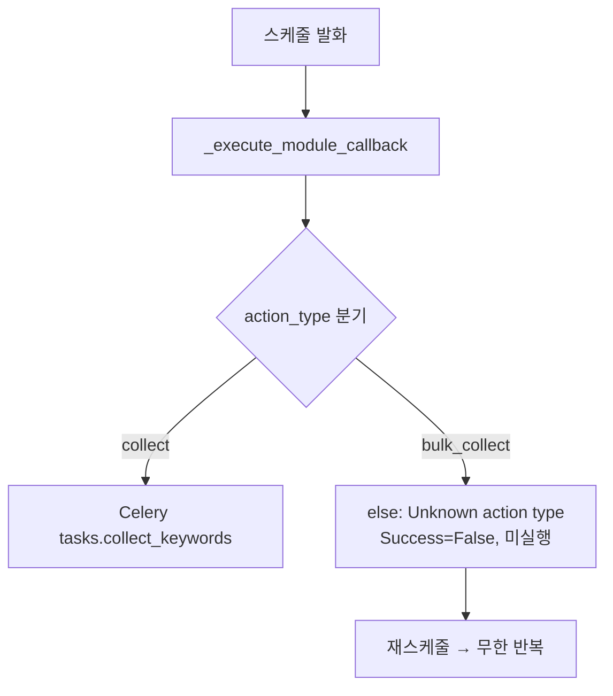
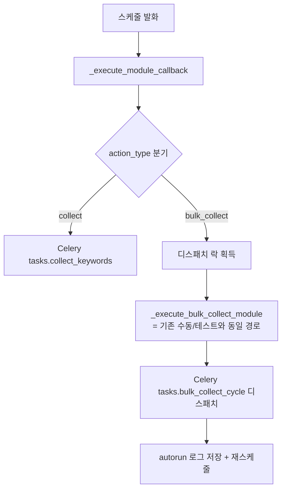

# 대량 수집(bulk_collect) 스케줄러 디스패치 연결 (2026-06-22)

[[project_bulk_collect_redesign]]. 오토런 스케줄은 발화하나 실행 콜백에
`bulk_collect` 분기가 없어 "Unknown action type"으로 빠져 미실행이던 버그 수정.
등록·재스케줄은 정상, 실행 디스패치만 누락된 비대칭 상태였음.

## 수정 전(버그)

## 수정 후

## 변경 (app/scheduler/flow_scheduler.py)
- 모듈 조회 가드(`action_type in (...)`)에 `bulk_collect` 추가 — 모듈 객체 확보.
- `_execute_module_callback` 디스패치 체인에 `elif action_type == "bulk_collect"` 추가:
  디스패치 락(`_acquire_module_dispatch_lock`) → `_execute_bulk_collect_module`
  (routers.flows_execute, 인라인 import로 순환 회피) → autorun 로그.
- `execute_flow_now`(수동 "지금 실행")에도 동일 분기 추가(같은 누락 존재).

## 비고
- 실행 본체(`_execute_bulk_collect_module` → Celery `tasks.bulk_collect_cycle` →
  `cycle_runner.run_bulk_collect_cycle`)는 이미 존재·검증됨. 스케줄러 연결만 추가.
- 스키마 변경 없음. collect 분기 패턴과 동일(락 + Celery + 로그).
