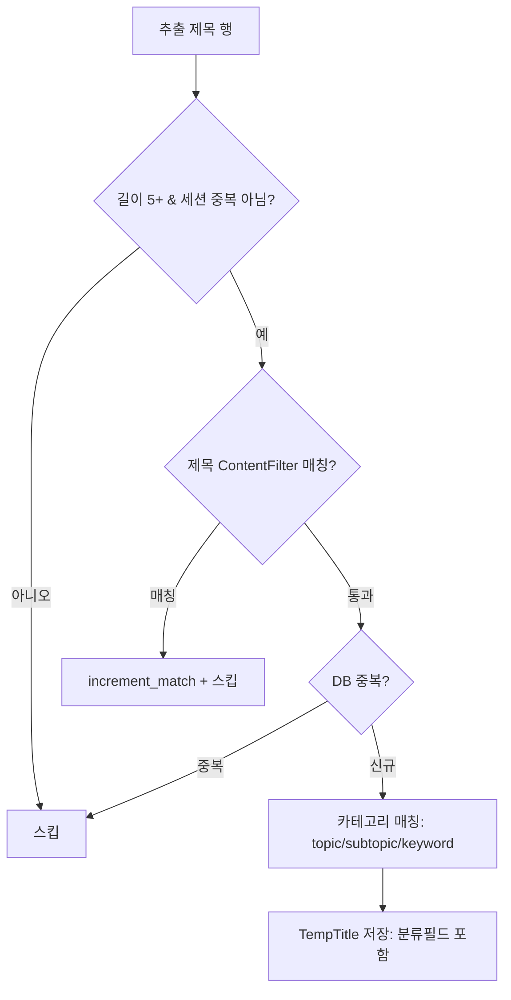

# 대량수집 제목 저장 ↔ 뉴스수집 기능 일치 (2026-06-15)

## 문제
대량수집(`ChunkProcessor._persist_temp_titles`)이 TempTitle 저장 시 뉴스수집
(`keyword_collector_service._save_title`)에 있는 2단계가 누락됨:
1. **카테고리 자동 분류**(topic/subtopic/keyword 매칭) — 미분류 양산(이사 730건 등)
2. **제목 ContentFilter**(원치 않는 제목 제외)

## 뉴스수집 vs 대량수집 (수정 전)

| 단계 | 뉴스수집 _save_title | 대량수집 _persist_temp_titles |
|------|------|------|
| 길이 체크 | <10 스킵 | <5 스킵 (유지) |
| 세션 중복 | ✓ | ✓ |
| **제목 필터** | `_check_filter(title,"title")` | ❌ 누락 |
| DB 중복 | `title_exists` | ✓ |
| **카테고리 분류** | `match_and_apply_to_title` | ❌ 누락 |
| TempTitle 저장 | topic/subtopic/keyword 포함 | 분류필드 없음 |

## 수정 후 흐름

## 구현
- `ChunkProcessor.__init__`: `_category_matcher`, `_title_filters` lazy 캐시 추가(청크 간 재사용; cycle당 1회 로드).
- `_persist_temp_titles`: 필터 통과 검사 + `CategoryMatcherService.match_and_apply_to_title` 호출 후 분류필드 채워 저장.
- `_match_title_filter`: 활성 ContentFilter(target=title/both) 규칙(keyword/pattern/domain) 적용, 뉴스수집 `_check_filter`와 동일.
- 매처는 `CategoryMatcherService(db)`(user_id 미지정 = 뉴스수집과 동일, 전체 키워드 로드).

## 비변경(범위 밖)
- 길이 임계값(5)은 유지 — 수집량 변화 방지.
- 기존 미분류분 소급 재분류는 데이터관리 재분류 기능으로 별도 처리(사용자가 이미 수행).
