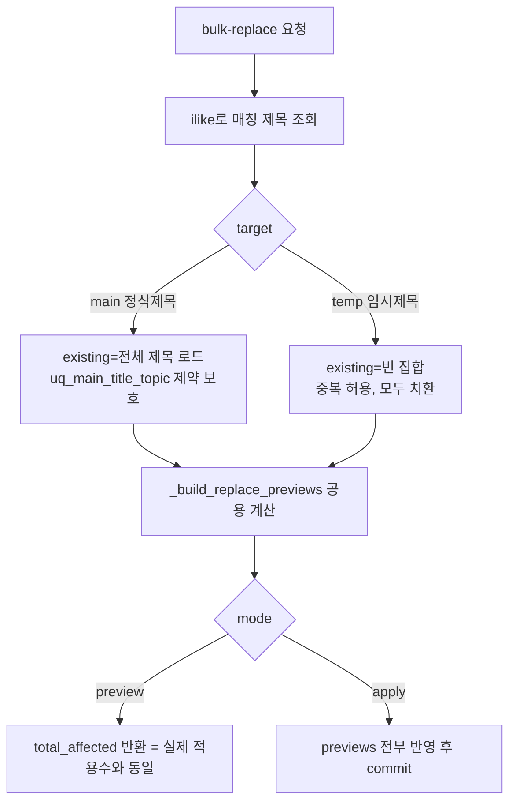

# 임시제목 단어 치환 미작동 수정 (2026-06-15)

## 증상
임시제목 단어 치환 시 매칭 제목이 있어도 "0건", 제목 미변경. 로그상 첫 적용은 성공(145건)하나 동일 작업 재시도 시 0건 반복.

## 근본 원인
`data_titles.bulk_replace_titles`에서 **apply 모드만** 전체 제목 집합(`existing_titles`)과 중복 비교해 결과가 기존 제목과 같으면 스킵. preview 모드는 중복 미체크.
- TempTitle은 **title 유니크 제약 없음**(중복 허용). 그런데도 apply가 중복을 스킵 → "결과가 기존과 중복"인 건이 영영 치환 안 됨.
- preview는 중복 미체크라 변경대상으로 카운트(>0) → apply는 전부 스킵(0) → **preview/apply 비대칭**. 사용자는 "preview엔 있는데 0건 적용".

## 수정: preview/apply 일관화 + 대상별 중복정책

## 핵심
- 중복 비교 대상 로드를 **mode가 아니라 target 기준**으로: `main`만 전체 로드(유니크 제약 보호), `temp`는 빈 집합.
- preview/apply 모두 동일 `existing_titles`로 공용 헬퍼 `_build_replace_previews` 호출 → 두 모드 결과 일치.
- intra-batch 중복(같은 배치에서 두 제목이 동일 결과) 누적 스킵은 유지(양 모드 동일).
- (프론트) 검색어/치환어 변경 시 미리보기 상태 초기화 — 미리보기 없이 stale 값 적용 방지.

## 검증
- 순수 헬퍼 단위 테스트: temp(중복 허용 치환), main(중복 스킵), 미변경/빈결과/intra-batch 스킵.
