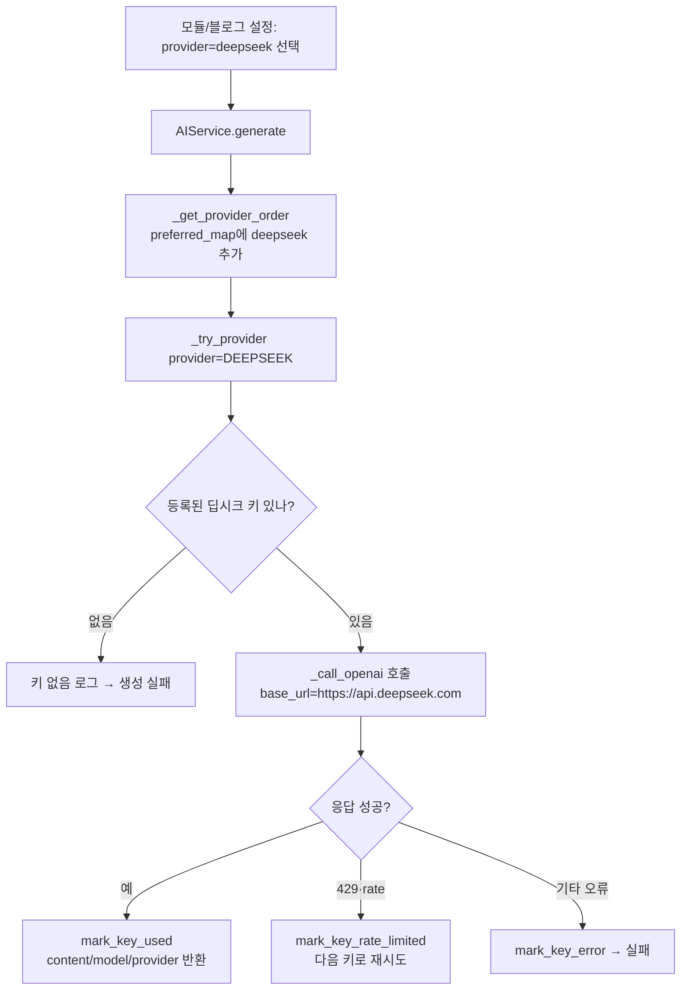
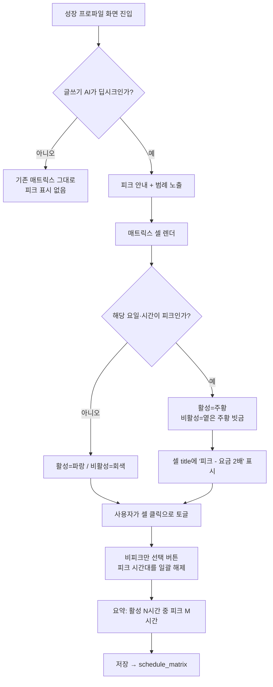

# 딥시크 제공자 추가 + 성장 프로파일 피크/비피크 시간대

> 딥시크(DeepSeek)를 AI 제공자로 쓸 수 있게 하고, 그 요금제의 피크·비피크
> 시간대를 성장 프로파일 화면에서 보이게 한다. 비피크는 피크의 절반 요금이라
> **어느 시간대에 발행하느냐가 곧 비용**이 된다.

## A. 딥시크 제공자 추가

딥시크는 OpenAI 호환 엔드포인트를 제공한다. 그래서 새 SDK를 붙이지 않고
기존 `_call_openai` 에 `base_url` 만 넘겨 재사용한다. 호출부를 하나로 두면
파라미터(top_p·penalty) 처리가 두 갈래로 갈라지지 않는다.

### 설계 원칙
- **base_url 주입만으로 재사용**: `_call_openai(base_url=None)` 기본값은 OpenAI.
  딥시크만 URL을 넘긴다. 분기가 늘지 않는다.
- **기본 모델은 `deepseek-v4-flash`**: 비피크 기준 출력 $0.66/1M 로 가장 싸다.
  고품질이 필요하면 `deepseek-v4-pro` 를 사용자가 고른다.
- **키 관리는 기존 체계 그대로**: `ai_api_keys` 에 provider=deepseek 로 등록.
  rate limit·오류 처리·키 순환이 다른 제공자와 동일하게 동작한다.

## B. 피크/비피크 시간대 표시

딥시크 요금은 2026-08-16부터 시간대별로 갈린다. 피크는 **UTC 01:00~04:00,
06:00~10:00 (월~금)**, 나머지는 전부 비피크로 피크의 50%다.

서버·스케줄러는 `Asia/Seoul` 로 돌고 `schedule_matrix` 도 KST 기준이므로,
표시할 때 KST로 환산한다.

| 구분 | UTC | KST |
|---|---|---|
| 피크 1 | 01:00~04:00 | **10·11·12시** |
| 피크 2 | 06:00~10:00 | **15·16·17·18시** |

UTC 01~10시는 KST로 같은 날 10~19시라 요일이 밀리지 않는다.

### 설계 원칙
- **강제하지 않는다**: 피크 시간을 막지 않고 **보여주기만** 한다. 애드센스 심사
  관점에서는 사람이 활동하는 시간대 발행이 자연스러워, 비용만으로 정할 문제가
  아니다. 선택은 사용자가 한다("사용자가 적용한 대로 적용").
- **딥시크일 때만 표시**: 다른 제공자에는 피크 개념이 없다. 항상 띄우면
  관계없는 정보로 화면만 복잡해진다.
- **판정은 서버·클라이언트 공용 규칙**: 피크 시간 정의를 한 곳
  (`app/services/ai/deepseek_pricing.py`)에 두고, 화면 표시와 요약 계산이
  같은 값을 쓴다. 두 곳에 적으면 요금제가 바뀔 때 한쪽만 고쳐진다.
- **요금제 변경 대비**: 피크 구간을 상수 테이블로 두어 시간이 바뀌어도
  한 줄 수정으로 끝나게 한다.

## 영향 범위

| 파일 | 변경 |
|---|---|
| `app/schemas/ai_api_key.py` | `AIProvider.DEEPSEEK` 추가 |
| `app/services/ai/ai_service.py` | provider 분기 + `_call_openai(base_url)` |
| `app/services/ai/deepseek_pricing.py` | **신규** — 피크 시간·기본 모델 정의 |
| `app/routers/settings.py` | 제공자별 모델 목록에 딥시크 |
| `app/static/js/settings.js` | 키 등록 UI 제공자 항목 |
| `app/templates/blogs/settings/_tab_ai.html` | 글쓰기 AI 선택지 |
| `app/static/js/modules/growth-profile-form.js` | 피크 판정·요약·일괄 해제 |
| `app/static/js/modules/growth-profile-form-template.js` | 매트릭스 셀 표시 |

## 검증 항목
- [ ] 딥시크 키 등록 → 글 생성 성공 (실제 호출)
- [ ] 피크 시간 판정이 UTC 기준과 KST 환산에서 일치
- [ ] 딥시크가 아닐 때 피크 표시가 뜨지 않음
- [ ] `비피크만 선택` 후 피크 시간이 모두 해제됨
- [ ] 기존 프로파일(schedule_matrix)이 그대로 열리고 저장됨
