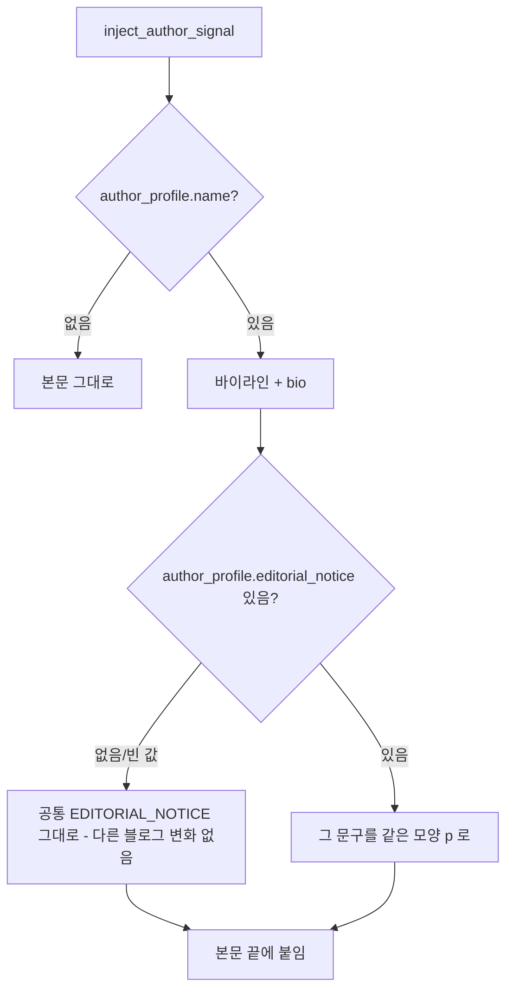

# 블로그별 꼬리말 갈래 (2026-10-20, 슈마즈 C)

```mermaid
flowchart TD
    A[inject_author_signal] --> B{author_profile.name?}
    B -- 없음 --> Z[본문 그대로]
    B -- 있음 --> C[바이라인 + bio]
    C --> D{author_profile.editorial_notice 있음?}
    D -- 없음/빈 값 --> E[공통 EDITORIAL_NOTICE 그대로 - 다른 블로그 변화 없음]
    D -- 있음 --> F[그 문구를 같은 모양 p 로]
    E --> G[본문 끝에 붙임]
    F --> G
```
