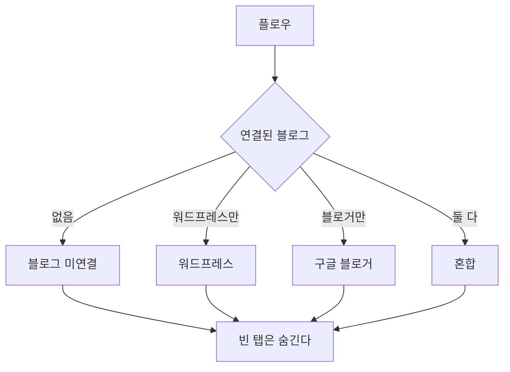
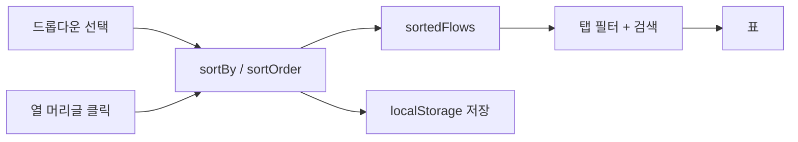

# 플로우 목록 표 전환

> 4단계 중 3번째. 블로그·모듈과 **같은 공용 컴포넌트**를 쓴다.
> 컴포넌트 규약: `docs/flowcharts/list_table_component.md`
> 계획서: `docs/plans/list_ui_redesign.md`

## 절대 규칙 — 기능 보존

표시 방식만 바꾼다. 카드가 하던 일이 표로 바꾼 뒤에도 전부 남아야 한다.

| 카드가 하던 것 | 표에서 |
|---|---|
| 수정 `editFlow(flow.id)` | 행 액션 |
| 복사 `copyFlow(flow.id)` | 행 액션 |
| 삭제 `deleteFlow(flow.id)` | 행 액션 + 일괄 삭제 |
| 이름 | 이름 열 |
| 설명 | 모바일 2줄째 · 이름 열 툴팁 |
| GP 배지(📈 성장 전략 + 모듈명) | 배지 열 |
| 모듈 n개 / 블로그 n개 | 모듈·블로그 열 |
| 모듈 아이콘 + 이름 | 모듈 열 |
| 블로그 WP/BL 배지 + 이름 | 블로그 열 |
| 정렬 5종 + 방향 토글 + 저장 | **그대로 유지** + 열 머리글 클릭 |

카드가 쓰던 슬라이드 애니메이션(`getModuleInfoItems` 순환 표시)과 "더보기"는
표에서 사라진다. 훑기가 목적인 화면에서 움직이는 텍스트는 방해된다 —
모듈 화면에서 내린 판단과 같다. `flows/_card.html` 과 슬라이드 함수는
지우지 않고 남겨 둔다(블로그의 `_card.html` 도 그렇게 두었다).

## 탭 축 — 무엇으로 나눌까

플로우 14개는 이렇게 나뉜다.

| 축 | 개수 |
|---|---|
| 워드프레스 블로그만 연결 | 6 |
| 구글 블로거만 연결 | 6 |
| 블로그 미연결(수집 전용) | 2 |

지금 화면은 이 셋이 한 그리드에 섞여 있다. 블로그 관리가 플랫폼으로
나뉘듯 같은 축으로 나눈다.



**혼합 탭은 지금 비어 있지만 만들어 둔다.** 한 플로우에 두 플랫폼 블로그를
붙일 수 있는 구조라 언젠가 생긴다. 어느 탭에도 안 들어가는 플로우가
생기면 화면에서 사라져 버린다 — 그게 가장 나쁜 결과다.
빈 탭은 숨기므로 평소에는 3개만 보인다.

## 정렬 — 기존 것을 지운 것이 아니라 입구를 늘린다

기존 드롭다운(이름·생성일·수정일·모듈 개수·블로그 개수)과 방향 토글,
localStorage 저장을 **그대로 둔다**. 열 머리글 클릭은 같은
`sortBy`/`sortOrder` 상태를 바꾼다.



**정렬 구현은 하나만 둔다.** `visibleFlows()` 는 이미 정렬된
`sortedFlows` 를 걸러 쓴다. 정렬을 한 벌 더 만들면 드롭다운과 머리글이
서로 다른 순서를 낸다.

생성일순은 열이 없어 드롭다운에만 남는다 — 열을 늘리면 훑기가 나빠진다.

## 파일 배치

`flows/list.js` 는 이미 1244줄이다. 어댑터를 여기에 더하면 더 나빠지므로
`flows/list_table.js` 로 분리해 `flowListTableMixin()` 을 펼쳐 쓴다.

```
flows/list.js          기존 앱(건드리지 않음)
flows/list_table.js    표 어댑터 — 열·셀·배지·탭·검색·일괄삭제
components/list_selection.js   선택 상태(블로그·모듈과 공유)
```

`listSelectionMixin()` 을 쓰는 화면은 반드시 그 스크립트를 먼저 싣는다.
블로그 화면에서 태그를 빠뜨려 앱이 예외로 죽고 표가 통째로 사라진 적이
있다.
