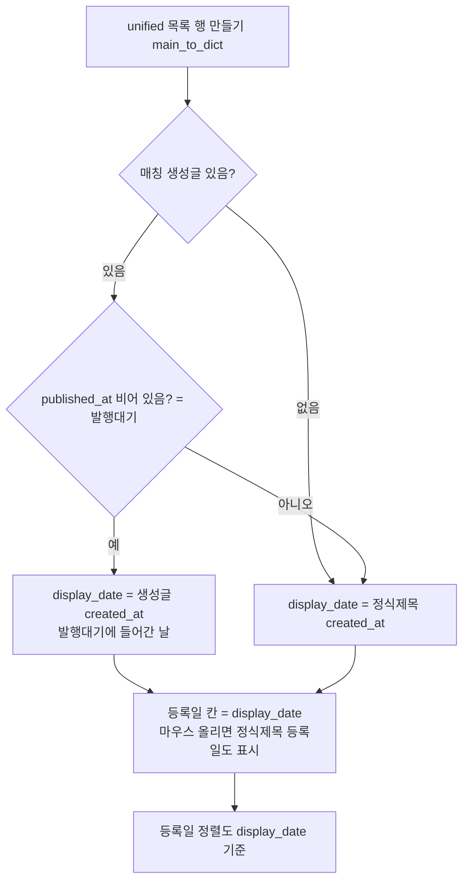

# 정식제목 탭 '등록일' — 발행대기 행은 발행대기 등록일 (2026-11-14)

```mermaid
flowchart TD
    A[unified 목록 행 만들기 main_to_dict] --> B{매칭 생성글 있음?}
    B -- 없음 --> D[display_date = 정식제목 created_at]
    B -- 있음 --> C{published_at 비어 있음? = 발행대기}
    C -- 예 --> E[display_date = 생성글 created_at<br/>발행대기에 들어간 날]
    C -- 아니오 --> D
    E --> F[등록일 칸 = display_date<br/>마우스 올리면 정식제목 등록일도 표시]
    D --> F
    F --> G[등록일 정렬도 display_date 기준]
```
