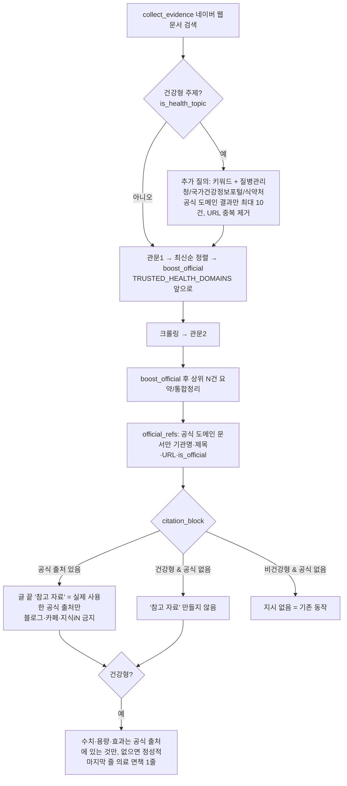

# 건강형 주제 공식 출처 우선 (수정 4번, 2026-09-29)

대상: 주제/하위주제 이름에 `HEALTH_TOPIC_KEYWORDS`(건강·의학·다이어트·비만·효능·출산·임신·육아·영양)가
있는 글. 분류가 없으면 제목으로 판정. 코드: `services/republish/app/services/reference/health_sources.py`

미구현: e약은요(DrbEasyDrugInfoService) 어댑터 — data.go.kr 키는 등록돼 있으나 해당 서비스 활용신청 여부 미확인.
