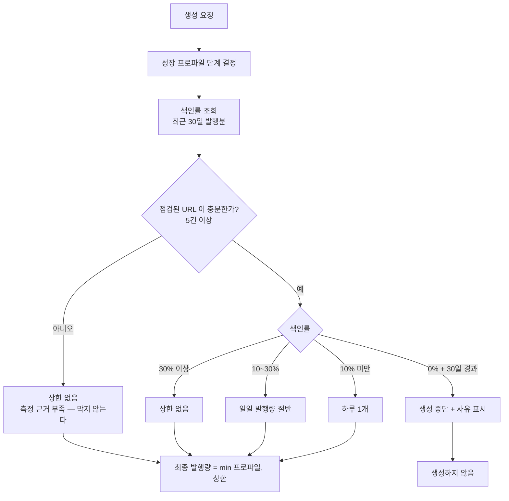
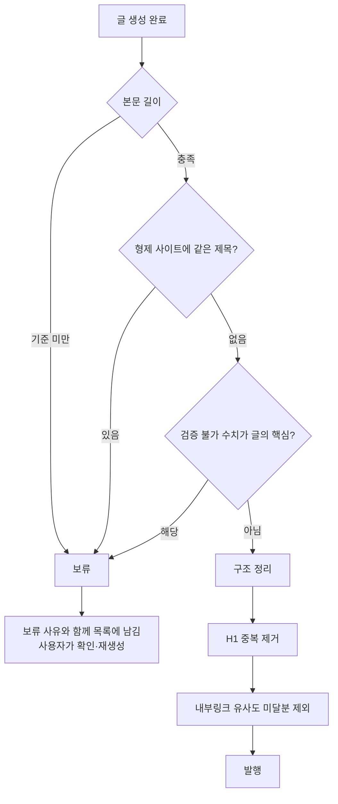
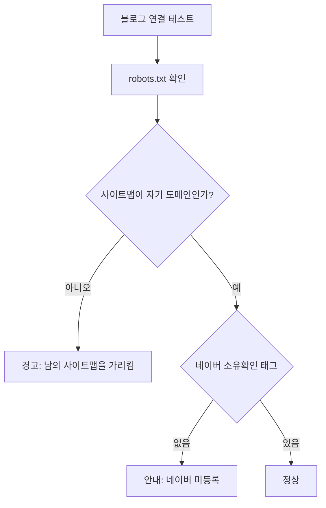

# 색인 되먹임 + 발행 전 품질 게이트

> 검색 노출이 죽은 상태에서 계속 발행하면 신호가 더 나빠진다. 색인 결과를
> 발행량에 되먹이고, 문제 있는 글은 발행 전에 잡는다.
> 진단: `docs/plans/search_visibility_all_blogs.md`

## 1. 색인률 → 발행량 되먹임

지금은 색인이 0이어도 발행량이 그대로다. 색인 점검 기능은 있는데 그 결과가
발행 결정에 전혀 반영되지 않아, 크롤 수요가 죽은 사이트에 글이 계속 쌓였다.

**측정 근거가 없으면 막지 않는다.** 새 블로그는 점검 이력이 없어 색인률이
0으로 보이는데, 그걸로 발행을 멈추면 시작조차 못 한다.

## 2. 발행 전 품질 게이트

**보류된 글은 조용히 버리지 않는다.** 왜 발행이 안 됐는지 모르면 사용자가
설정을 고칠 수 없다.

## 3. 등록 시 점검

레시피노트의 robots.txt 가 수작남 사이트맵을 가리키고 있었다. 등록 시점에
드러났으면 몇 주를 허비하지 않았다.

## 설계 원칙

- **막을 때는 이유를 남긴다.** 발행이 조용히 멈추면 고장과 구분되지 않는다.
- **근거 없이 막지 않는다.** 측정 표본이 적으면 상한을 걸지 않는다.
- **자동으로 되돌린다.** 색인률이 회복되면 발행량도 스스로 돌아온다.
