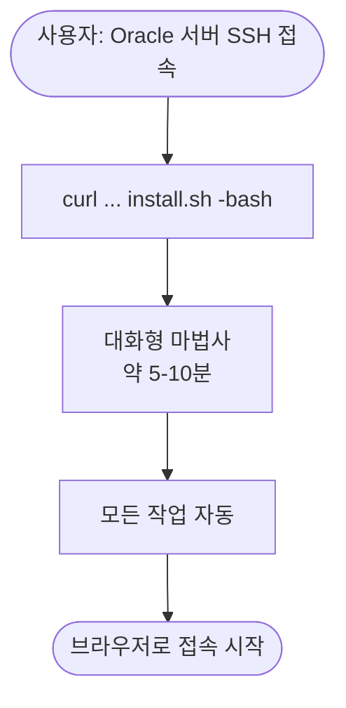
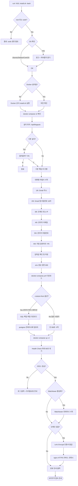

# install.sh 사용자 설치 흐름

> **버전**: v1.0 / **작성일**: 2026-05-13 / **단계**: Phase A-1

---

## 1. 사용자 시점 흐름 (간단)



---

## 2. 내부 처리 흐름 (상세)



---

## 3. 대화형 마법사 입출력 예시

```text
══════════════════════════════════════════════════════════
🚀 BlogAuto 자동 설치 마법사 v1.0
══════════════════════════════════════════════════════════

ℹ️  설치 위치: /opt/blogauto
ℹ️  예상 시간: 5-10분
ℹ️  중간에 취소하려면 Ctrl+C

------------------------------------------------------------
▶ 1/6: 이메일 발송용 Gmail 주소를 입력하세요
   (가입 알림/시스템 알림 발신자로 사용됩니다)
   Gmail: admin@gmail.com

▶ 2/6: Gmail 앱 비밀번호 (16자리)
   ※ 일반 Gmail 비밀번호 아님 - 2단계 인증 후 발급한 앱 비번
   ※ 발급 방법: https://myaccount.google.com/apppasswords
   비밀번호: ****************

▶ 3/6: 접속 도메인을 입력하세요
   - 도메인이 있다면 (예: blogauto.duckdns.org)
   - 없다면 그냥 엔터 (서버 IP 자동 감지)
   도메인: blogauto-test.duckdns.org

▶ 4/6: BlogAuto 관리자 이메일
   (이 이메일로 로그인합니다)
   이메일: my@gmail.com

▶ 5/6: 관리자 비밀번호 설정 (8자 이상)
   비밀번호: ********
   비밀번호 확인: ********

▶ 6/6: 자동 업데이트를 활성화하시겠습니까?
   1시간마다 새 버전 자동 적용 (권장)
   [Y/n]: Y

------------------------------------------------------------
✅ 입력 완료. 설치를 시작합니다...

[1/8] Docker 환경 점검 중...        ✅
[2/8] BlogAuto 이미지 다운로드 중...  ✅ (380MB)
[3/8] PostgreSQL 시작 중...          ✅
[4/8] Redis 시작 중...               ✅
[5/8] DB 마이그레이션 실행 중...      ✅
[6/8] 관리자 계정 생성 중...          ✅
[7/8] HTTPS 인증서 발급 중...        ✅
[8/8] Watchtower 자동 업데이트 활성화... ✅

══════════════════════════════════════════════════════════
🎉 설치 완료!
══════════════════════════════════════════════════════════

📌 접속 정보
   URL:       https://blogauto-test.duckdns.org
   관리자:    my@gmail.com
   비밀번호:  (입력하신 비밀번호)

📌 관리 명령
   상태 확인: blogauto status
   로그 보기: blogauto logs
   재시작:    blogauto restart
   업데이트:  blogauto update (자동이지만 수동도 가능)
   롤백:      blogauto rollback
   백업:      blogauto backup

📚 도움말: https://github.com/jteen-lab/blogauto/wiki
🐛 문제 신고: https://github.com/jteen-lab/blogauto/issues

설치 폴더: /opt/blogauto
환경설정 파일: /opt/blogauto/.env  (권한 600 — 노출 금지!)
══════════════════════════════════════════════════════════
```

---

## 4. 에러 처리 시나리오

| 단계 | 에러 | 대응 |
|------|------|------|
| 1 | sudo 없음 | "sudo로 다시 실행해주세요" + 종료 |
| 2 | OS 미지원 | 계속할지 묻기 (Ubuntu/Debian/CentOS 외 경고) |
| 3 | Docker 설치 실패 | 공식 가이드 URL 안내 + 종료 |
| 4 | 포트 충돌 (80/443/5432) | 어떤 프로세스가 사용 중인지 표시 |
| 5 | 디스크 부족 | 필요 용량 안내 (최소 5GB) |
| 6 | 메모리 부족 | 최소 1GB 권장 안내 |
| 7 | docker-compose.yml 다운로드 실패 | 네트워크 확인 안내 |
| 8 | Health check 실패 | `docker compose logs` 출력 + 재시도 옵션 |
| 9 | HTTPS 발급 실패 | HTTP로 fallback + 수동 방법 안내 |

---

## 5. 관리자 마이그레이션 모드

기본:
```bash
curl -fsSL https://[host]/install.sh | bash
```

관리자 데이터 승계 (`--restore-from` 옵션):
```bash
curl -fsSL https://[host]/install.sh | bash -s -- --restore-from=https://[secret-host]/my_data.sql
```

차이:
- 마법사 6번 항목 통과 후 SQL 파일 다운로드 → DB 임포트
- `media/blogs/` 자료도 함께 받아옴 (tar.gz)
- 관리자 계정 생성 단계 스킵 (기존 계정 사용)

---

## 6. 설치 후 자동 생성 명령

`blogauto` 래퍼 명령이 자동 설치되어 사용자가 docker 명령을 몰라도 됨:

| 명령 | 동작 |
|------|------|
| `blogauto status` | 컨테이너 상태 표시 |
| `blogauto logs [service]` | 로그 보기 (기본: app) |
| `blogauto restart` | 전체 재시작 |
| `blogauto stop` | 정지 |
| `blogauto start` | 시작 |
| `blogauto update` | 수동 업데이트 (자동 안 켜둔 경우) |
| `blogauto rollback` | 이전 이미지로 복귀 |
| `blogauto backup` | 데이터 백업 (.tar.gz) |
| `blogauto uninstall` | 완전 제거 |

---

**문서 끝**.
