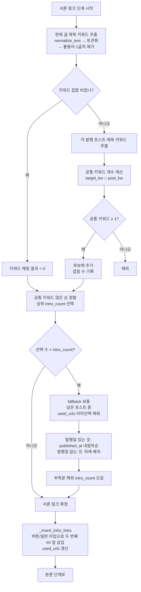

# 내부링크 — 서론 링크 매칭 순서도

> 작성: 2026-06-09 | 대상: `app/services/generation/internal_linker.py`

## 배경

서론 링크가 운영 블로그(수백 포스트)에서도 거의 달리지 않는 문제.
원인: 서론은 **현재 글 제목 전체 ↔ 발행 포스트 제목 전체**를 `calculate_text_similarity`
로 비교해 임계값(75%) 이상만 추출하는데, SEO상 긴 제목끼리는 `token_sort_ratio`가
75%를 넘는 일이 거의 없음(같은 주제 변형글도 ~52%). 본론은 짧은 섹션 제목이라
"포함 관계 보너스(85~95)"로 매칭되고, 결론은 랜덤이라 항상 달림.

## 해결 방향

서론은 **공통 핵심 키워드 기반 매칭** + **부족 시 최신순/랜덤 fallback** 으로 변경.
본론·결론 로직은 불변. UI/스키마/DB 변경 없음.

## 순서도

## 매칭 기준 (기본값)

- 서론 매칭: **공통 핵심 키워드 1개 이상** (본론 75% 임계값과 독립)
- fallback 순서: 최신 발행순(`published_at` desc) → 발행일 없음/랜덤
- 채울 개수: 기존 `intro_count` 설정 그대로 (최대 `MAX_INTRO_LINKS=5`)

## 영향 범위

- 수정: `internal_linker.py` (서론 단계 + 헬퍼 추가), `requirements.txt` (rapidfuzz)
- 무변경: 본론/결론 삽입, SimilarityService, substitution_processor, UI, 스키마, DB
