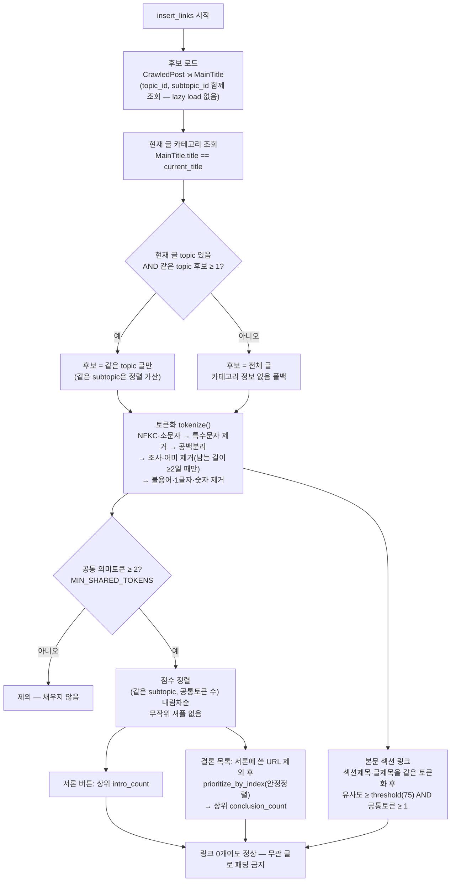

# 내부링크 — 관련성 판정 순서도 (무관 링크 차단)

> 작성: 2026-09-29 | 대상: `app/services/generation/internal_linker.py`, `app/services/generation/link_relevance.py`
> 이전 문서: `internal_link_intro_matching.md` (서론 키워드 1개 매칭 — 이 문서로 대체)

## 배경

블로그 '수작남' 실측에서 무관한 내부링크가 붙었다.

| 현재 글 | 붙은 링크 |
|---|---|
| 여드름 글 | 하나카드 분실신고 |
| 지방흡입 글 | AIA생명보험 지점 |
| 화목난로 글 | 외동딸 육아 |
| 안경사 글 | 우창윤다이어트 |

원인
1. 후보 = 블로그 전체 글(카테고리 무시)
2. 서론 버튼·결론 목록이 **공통 토큰 1개**만 있어도 통과
3. 토큰에 조사·어미가 붙은 채 남아(`방법과`, `무엇인가요`, `알아야`) 일반어끼리 매칭
4. 결론 목록은 통과한 글을 **무작위 셔플**

## 순서도

## 기준 (전 블로그 공통 기본값)

- `MIN_SHARED_TOKENS = 2` — 서론·결론 공통
- 현재 글 토큰이 2개 미만이면 서론·결론 링크 0개 (판단 근거 없음 → 넣지 않음)
- 본문 섹션: 기존 75% 유사도 유지, 토큰화 결과로 비교 + 공통 토큰 1개 이상
- 카테고리: 같은 topic 우선, 같은 subtopic 가산. 카테고리 정보가 없으면 전체 글.

## 영향 범위

- 신규: `link_relevance.py` (순수 함수: 토큰화·점수·카테고리 필터)
- 수정: `internal_linker.py` (후보 로드·서론·결론·본문 매칭이 위 모듈 사용)
- 무변경: `insert_links` 시그니처, 호출부(generator·renewal·pipeline_tester), 삽입 위치·마크업, DB 스키마
