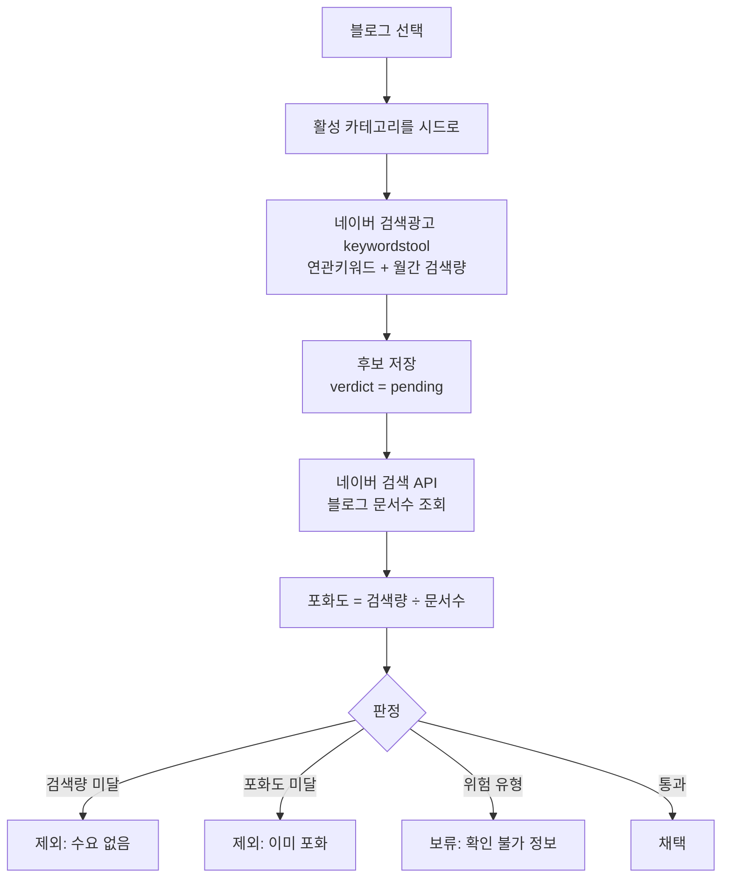

# 키워드 관리(실험실) — 수요에서 시작하는 수집

> 현재 수집은 **타 블로그 제목 스크랩 → 키워드 추출 → 재스크랩** 의 닫힌
> 고리다. 순서를 뒤집어 **수요를 먼저 재고** 거기서 후보를 만든다.
> 조사: `docs/plans/keyword_collection_redesign.md`

## 왜 별도 페이지인가

기존 수집 파이프라인(`seed_keywords` · `temp_titles` · `main_titles`)을
건드리지 않는다. 운영 중인 12개 블로그가 그 위에서 돌고 있어, 검증 안
된 방식을 섞으면 무엇이 원인인지 가릴 수 없다.

**별도 테이블(`keyword_candidates`)에만 쓴다.** 성과가 확인되면 그때
기존 파이프라인의 입력으로 승격한다 — 그래서 스키마를 처음부터
`seed_keywords` 를 대체할 수 있는 모양으로 잡는다.

## 흐름

**두 단계로 나눈 이유**: 검색광고 API 는 시드 5개씩 한 번에 처리되지만,
문서수는 키워드마다 한 번씩 호출해야 한다. 한 요청에 묶으면 타임아웃이
나고, 중간에 끊기면 무엇까지 쟀는지 알 수 없다.

## 시드는 고정값이 아니라 블로그에서 온다

지금 데이터랩 수집은 `["뉴스","이슈","트렌드","인기","화제"]` 로 고정돼
있다. 취업/자격증 블로그에도 "뉴스"로 조회한다. 그래서 취업/자격증
제목 유입이 30일간 0건이었다.

여기서는 **블로그의 활성 카테고리(subtopic) 이름**을 시드로 쓴다.
취업인포마스터라면 `자격증 · 직업 정보 · 취업 정보`.

## 판정 기준

국내 도구(블랙키위·키워드마스터)가 쓰는 축을 그대로 따른다.

| 지표 | 뜻 | 기본 하한 |
|---|---|---|
| 월간 검색량 | 수요 | 100 |
| 포화도 = 검색량 ÷ 문서수 | 수요 대비 공급 | 0.2 |

**검색량만 보면 안 된다.** 검색량이 커도 문서가 그보다 훨씬 많으면
비집고 들어갈 자리가 없다. 반대로 검색량이 작아도 문서가 거의 없으면
가치가 있다.

### 위험 유형은 따로 표시한다

품질 게이트가 쓰는 패턴(고객센터·연락처, 영업시간·시간표, 채용조건,
상품권 거래)에 걸리면 **제외가 아니라 보류**로 둔다. 지금 수집 유입
1·2위가 「매장·시설 정보」와 「고객센터·연락처」인데, 검색량은 충분하지만
라이프인포에서 146편을 걷어낸 바로 그 유형이다.

막지 않고 표시만 하는 이유: 같은 말이 들어가도 정상적인 정보 글일 수
있다. 사람이 보고 정한다.

## 나중에 대체할 수 있게

| 지금 | 대체 시 |
|---|---|
| `keyword_candidates` 에만 쓴다 | 채택 후보를 `seed_keywords` 로 승격 |
| 화면에서 수동 실행 | 수집 모듈의 소스로 편입 |
| 검색량·문서수 컬럼 보유 | `seed_keywords` 에 같은 컬럼 추가 |

`seed_keywords` 에는 검색량 컬럼이 아예 없어서, 지금 구조로는 승격해도
측정값이 사라진다. 대체 시점에 그 컬럼을 옮겨 심는 것이 전제다.

## API 키는 이미 있는 것을 쓴다

| 용도 | 설정 항목 |
|---|---|
| 연관키워드·검색량 | `naver_ads_api_key` / `secret` / `customer_id` |
| 블로그 문서수 | `naver_search_client_id` / `secret` |

새 키를 요구하지 않는다. 키가 없으면 화면에서 그 사실을 먼저 알린다.

## 호출량

검색광고 API 는 일일 호출 제한이 있다. 시드 5개씩 묶어 한 번에 보내고,
문서수 조회는 후보마다 1회다. 한 블로그(카테고리 3개, 후보 100개)면
검색광고 1회 + 검색 API 100회다.

**한 번에 다 돌리지 않는다.** 수집과 측정을 나눠 두었으므로 측정은
끊어서 여러 번 할 수 있고, 이미 잰 것은 다시 재지 않는다.
