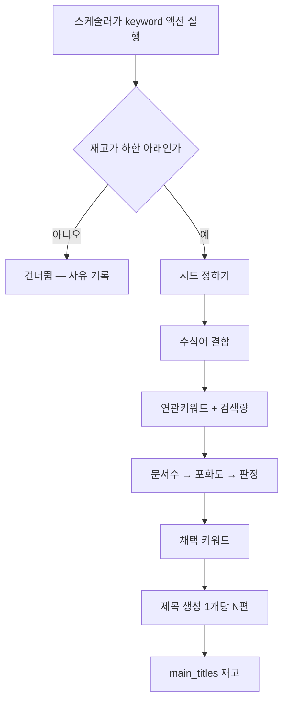
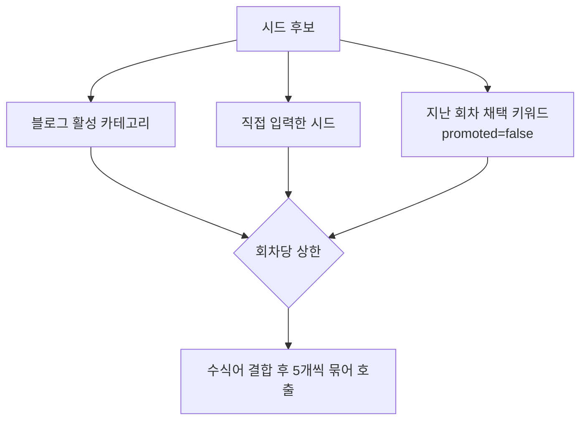
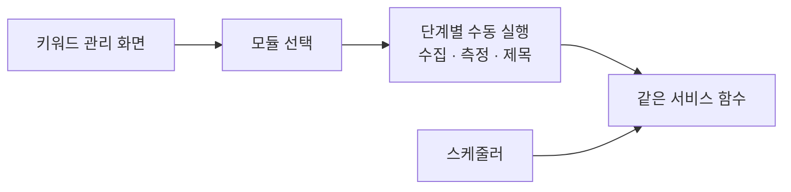

# 키워드 모듈 — 재고를 스스로 채운다

> 검토: `docs/plans/keyword_module_feasibility.md`
> 계획: `docs/plans/keyword_pipeline_rework.md`

## 왜 모듈인가

`keyword_lab` 은 화면에서 버튼을 눌러야만 돌았다. 플로우·오토런·동작
로그 어디에도 붙지 않아 **재고가 말라도 아무도 채우지 않는다.**

모듈이 되면 재고가 부족할 때 스스로 돈다.

## 실행 한 회차

**재고를 먼저 본다.** 생성 모듈이 `min_inventory` 로 재고를 보듯,
키워드 모듈도 충분하면 돌지 않는다. 매번 도는 것은 API 낭비다.

## 시드는 어디서 오나

**채택 키워드를 다음 회차 시드로 되먹인다.** 카테고리만 쓰면 매번 같은
결과가 나와 소재가 고갈된다. 쓴 시드는 `promoted` 로 표시해 반복을 막는다.

## 주기는 성장 프로파일이 아니다

성장 프로파일은 "얼마나 자주 **발행**할까" 를 정한다. 키워드 생산은
"재고가 부족한가" 로 돌아야 한다. 축이 다르다.

그래서 `settings.schedule.interval_minutes` 를 쓰고, 실행 시점에
재고를 확인한다. `bulk_collect` 와 같은 방식이다.

## 수동 실행을 남긴다

모듈이 되어도 **사람이 눌러 돌릴 수 있어야 한다.** 파라미터를 바꿔 가며
결과를 보는 일이 아직 필요하고, 자동화가 잘 도는지 확인할 방법도
있어야 한다.

**같은 함수를 부른다.** 수동과 자동이 다른 코드를 타면 한쪽에서만
나는 버그가 생긴다.

## 설계 조건 — 모듈화를 쉽게 만든 것

| 항목 | 규약 |
|---|---|
| 입력 | `blog_id` + `settings` dict (모듈 settings 와 같은 모양) |
| 출력 | `{success, ...}` — 다른 실행기와 같은 형태 |
| 상태 | `keyword_candidates` 에 남아 중단·재개 가능 |
| 화면 | 서비스 함수를 부르기만 |

## 되돌리기

모듈을 끄면 기존 수집(`collect`·`bulk_collect`)이 그대로 돈다.
키워드 모듈이 만든 제목은 `source='keyword_module'` 로 구분돼
지우면 원상 복구된다.
