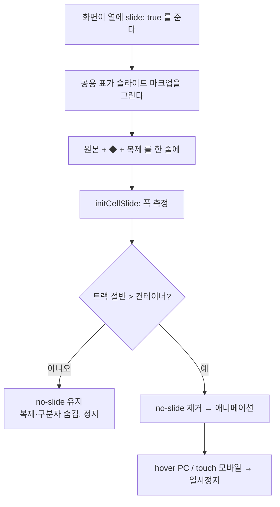
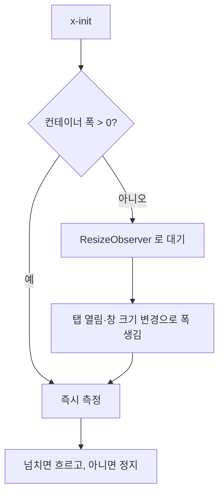

# 표 셀 슬라이드 — 카드가 전달하던 내부 정보 되살리기

> 카드는 좁은 폭에 모듈 설정을 담기 위해 가로 슬라이드를 썼다. 표로
> 바꾸면서 이 정보가 통째로 빠졌다.
> 컴포넌트 규약: `docs/flowcharts/list_table_component.md`

## 무엇이 빠졌나

카드의 모듈 행은 **왼쪽 고정 라벨(아이콘+이름) + 오른쪽 흐르는 설정값**
구조였다. 표에서는 이름만 남기고 설정값을 버렸다.

| 화면 | 열 | 카드에 있던 것 | 표(전) |
|---|---|---|---|
| 모듈 관리 | 설정 | 정보 행 전부가 흘렀다 | 잘린 한 줄 |
| 플로우 관리 | 모듈 | 모듈별 설정값이 흘렀다 | 이름만 |
| 오토런 | 모듈 | 모듈별 설정값이 흘렀다 | 이름만 |

## 흐름



**복제본을 붙이고 -50% 까지 이동**해야 끊김 없이 순환한다. 복제가 없으면
한 바퀴 돌 때마다 빈 구간이 지나간다.

## 측정 시점이 핵심

카드는 항상 보이는 자리에 있었지만, 표는 **탭 뒤에 숨어 있다.**
숨은 상태에서는 `clientWidth === 0` 이라 측정이 불가능하고, 그때 한 번
재고 끝내면 탭을 열어도 영영 흐르지 않는다.



창 크기가 바뀌면 넘침 여부도 바뀌므로 관찰은 계속 유지한다.

## 왜 셀 값을 늘리나

플로우·오토런의 모듈 열은 지금 `아이콘 이름` 만 담는다. 슬라이드를
붙여도 담긴 정보가 그대로면 의미가 없다. 카드가 보여주던 **설정값을
셀 값에 다시 넣고** 그것이 흐르게 한다.

```
📝 인생꿀팁_프롬프트 — 카테고리 요리 · 길이 1800자 · 이미지 2장   ◆   📈 …
```

## 모바일

같은 배열을 쓴다는 원칙대로, 모바일 2줄 목록에도 같은 슬라이드 줄을
붙인다. 데스크톱에만 넣으면 두 화면이 다른 정보를 보여주게 된다.
모바일은 hover 가 없으므로 **탭하면 멈춘다**(카드와 같은 방식).

## 접근성

- `prefers-reduced-motion: reduce` 면 흐르지 않는다.
- 복제본은 `aria-hidden="true"` — 스크린리더가 같은 내용을 두 번 읽지
  않게 한다.
