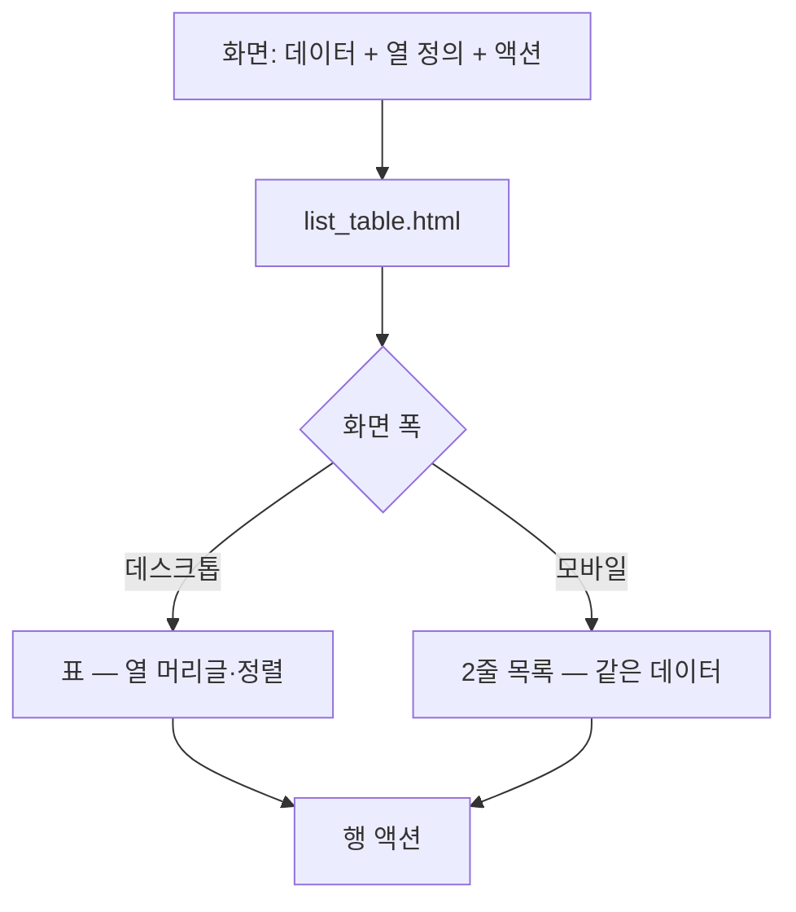
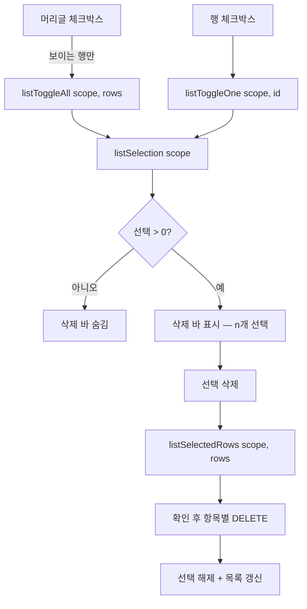

# 공용 목록 표 컴포넌트

> 블로그·모듈·플로우·오토런이 **같은 로직과 스타일**을 쓰도록 한 벌만 만든다.
> 화면마다 따로 만들면 동작이 갈라지고 고칠 곳이 네 배가 된다.
> 계획서: `docs/plans/list_ui_redesign.md`

## 절대 규칙 — 기능 보존

표시 방식만 바꾼다. **데이터·API·동작은 하나도 건드리지 않는다.**
아래는 블로그 카드가 지금 하는 일 전부이며, 표로 바꾼 뒤에도 모두 남아야 한다.

### 동작 5가지

| 동작 | 호출 |
|---|---|
| 수정 | `openEditSheet(blog)` |
| 설정 | `openSettingsSheet(blog)` |
| 발행 동기화 | `syncPublishedPosts(blog.id)` — 진행 중 스피너 |
| 연결 테스트 | `testConnection(blog.id)` — 진행 중 스피너 |
| 삭제 | `deleteBlog(blog.id, blog.name)` |

### 표시 정보 8가지

플랫폼 아이콘(WP/BL) · 이름 · URL(링크) · 애드센스 배지(점+라벨+tip,
applied 는 깜빡임) · 자동발행 배지 · 크롤 상태 6종 · SEO 플러그인 배지 ·
생성일

### 크롤 상태 6종

`never`(연결 필요) · `crawling` · `matching` · `synced`+신규(연결됨) ·
`synced`+기존(매칭 완료 n/m) · `error`(연결 오류)

### 화면 기능

플랫폼별 섹션(워드프레스/블로거) · 애드센스 상태 칩 필터 · 모바일 탭 ·
블로그 추가

## 구조



**같은 데이터를 두 형태로 그린다.** 모바일 전용 데이터를 따로 만들지 않는다 —
지금 모바일 탭이 그렇게 갈라져 있어 두 화면이 다른 것을 보여준다.

## 호출 규약

화면은 열 정의와 행 데이터를 넘기고, 컴포넌트는 그리기만 한다.

```

     -- Alpine 식
                -- 행 변수명

```

열·배지·액션은 **화면이 Alpine 함수로 제공한다.** 컴포넌트가 특정 화면의
필드를 알지 못하게 한다 — 알게 되면 재사용이 안 된다.

| 함수 | 반환 | 쓰이는 곳 |
|---|---|---|
| `listColumns()` | `[{key,label,align,width,strong,link}]` | 표 머리글·열 |
| `listCell(row, key)` | 문자열 | 표 셀 값 |
| `listBadges(row)` | `[{label,cls,dot,pulse,tip}]` | 상태 열·모바일 |
| `listActions(row)` | `[{key,title,icon,cls,busy,onClick}]` | 행 끝 버튼 |
| `listTitle(row)` | 문자열 | 모바일 1줄째 |
| `listSub(row)` | 문자열 | 모바일 2줄째 |

`key: '_badges'` 인 열은 `listBadges()` 를 그린다. `link: true` 면 셀 값을
바깥 링크로 만든다.

## 설계 원칙

- **모바일과 데스크톱은 같은 배열을 그린다.** 정렬·필터 결과가 갈리지 않는다.
- **행 높이를 고정한다.** 훑기가 목적이라 항목마다 높이가 다르면 안 된다.
- **액션은 아이콘으로 행 끝에.** 카드에 있던 5개를 그대로 옮긴다.
- **섹션 헤더는 유지한다.** 플랫폼 구분이 사라지면 안 된다.

## 선택 · 일괄 삭제 (2026-08-31 추가)

`selectable` 을 넘긴 화면만 체크박스가 생긴다. 안 넘기면 컴포넌트는
지금까지와 똑같이 그린다 — 플로우·오토런이 아직 안 바뀌었기 때문이다.



### 범위(scope)는 탭이다

`scope = table_id` 로 두어 **탭마다 선택 배열이 따로** 있다.
프롬프트 탭에서 전체선택하고 삭제해도 수집 탭 모듈은 건드리지 않는다.
하나의 배열을 공유하면 사용자가 보지 않는 탭의 항목이 지워진다.

### 전체선택은 '보이는 것'만

검색으로 걸러진 행만 대상으로 한다. 화면에 없는 항목이 선택되면
삭제 결과를 예측할 수 없다.

### x-model 을 쓰지 않는 이유

아직 만들어지지 않은 범위 키에 `x-model` 을 걸면 Alpine 이 배열이 아닌
불리언으로 다뤄 선택이 통째로 깨진다. `:checked` + `@change` 로 명시한다.

### 화면이 제공할 것

| 함수 | 용도 |
|---|---|
| `deleteSelectedBlogs(scope, rows)` | 블로그 일괄 삭제 |
| `deleteSelectedModules(scope, rows)` | 모듈 일괄 삭제 — 플로우 사용 중(409)은 한 번만 되물어 강제 삭제 |

선택 상태 자체는 `static/js/components/list_selection.js` 의
`listSelectionMixin()` 한 벌을 두 화면이 함께 쓴다.
