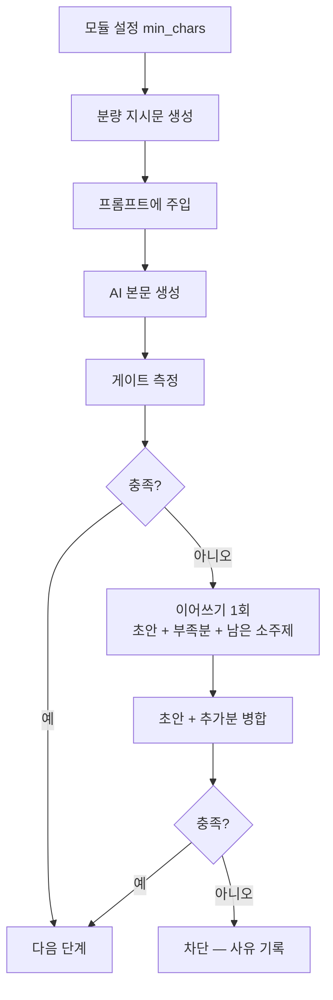
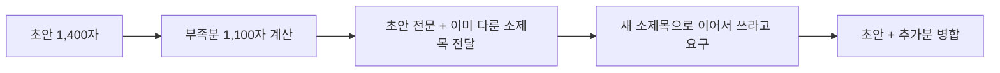

# 최소 글자수 — 생성 단계에서 채우기

> 지금은 짧게 나오면 전부 버리고 처음부터 다시 만든다. 그러면서
> 모델에게는 "짧았다" 는 사실조차 전하지 않는다.
> 조사: `docs/plans/min_length_generation.md`

## 왜 고치는가

400편을 게이트와 같은 기준으로 재보니 **중앙값 1,883자, 1,800자 미만이
42%** 다. 임계값이 실제 생산 분포의 한가운데 있다. 수작남의 3연속 실패는
이상 현상이 아니라 그 분포의 아래 꼬리다.

분량을 정하는 실제 변수는 **구획당 글자수**다. 소제목 1개당 약 231자,
프롬프트는 "3~6개 구획" 만 요구한다. 6 × 231 = 1,386자 — 실패값과 겹친다.
모델은 지시를 어긴 것이 아니라 지시받은 대로 썼다.

`max_tokens` 는 상한이라 이 문제와 무관하다. 올려도 아무 효과가 없다.

## 전체 흐름



**임계값 하나를 근원으로 삼는다.** 지금은 게이트가 1,800을 보고
프롬프트는 2,000을 말하는데 둘이 서로를 모른다. 모듈에서 임계를 바꿔도
모델에게 가는 말은 그대로다.

## 목표치는 임계값보다 크게 잡는다

요구한 만큼 나오지 않는다. 실측(요구 2,000자):

| 분위 | 결과 | 요구 대비 |
|---|---|---|
| 10% | 1,484자 | 0.74배 |
| 50% | 1,883자 | 0.94배 |

하위 10%가 임계를 넘으려면 `임계 ÷ 0.74 ≈ 임계 × 1.35` 를 요구해야 한다.
여유를 조금 더 두어 **1.4배**를 기본값으로 한다.

게이트가 마크다운 기호와 링크를 걷어내고 세므로 "2,000자 썼다" 가
1,800자로 계산되는 격차도 이 여유분이 흡수한다.

## 구획을 함께 지시한다

길이만 말하는 지시는 약하다.

| 소제목 수 | 편수 | 1800 통과율 |
|---|---|---|
| 5 | 28 | 32% |
| 6 | 101 | 50% |
| 7 | 134 | 71% |
| 10 | 14 | 93% |

다만 **구획 수만 늘리면 얕아진다** — 11구획 글은 통과율 36%로 오히려
낮다. 구획 수와 구획당 분량을 함께 지시한다.

```
목표 = 임계 × 1.4
구획당 = 목표 ÷ 구획 수   (구획 수 기본 6)
```

## 이어쓰기 — 버리지 않는다



- **참조 수집과 제목 재조합을 다시 하지 않는다.** 재생성은 검색 30회·
  크롤 10회를 매번 되풀이한다.
- 모델에게 **몇 자 모자란지, 무엇을 이미 다뤘는지**를 준다. 지금은 이
  정보가 전혀 전달되지 않아 같은 분포에서 다시 뽑을 뿐이다.
- **한 번만** 한다. 두 번 세 번 이어 붙이면 글이 늘어지고 비용도 는다.
- 이어쓰기가 실패하면 그때 차단한다. 차단을 없애는 것이 아니라 마지막
  수단으로 물린다.

## 측정값을 남긴다

지금은 실패했을 때만 게이트 기준 글자수가 남는다. 성공 로그의
"길이 3,336자" 는 HTML 길이라 기준이 다르다. **같은 기준으로 매번**
남겨야 임계값을 추측이 아니라 데이터로 조정할 수 있다.

## 임계값 자체는 건드리지 않는다

1,800은 실제 분포의 43번째 백분위다. 위 세 가지를 적용해 분포가 올라간
뒤에 다시 판단한다. 먼저 낮추면 기준을 현실에 맞추는 것이 아니라
포기하는 것이 된다.
