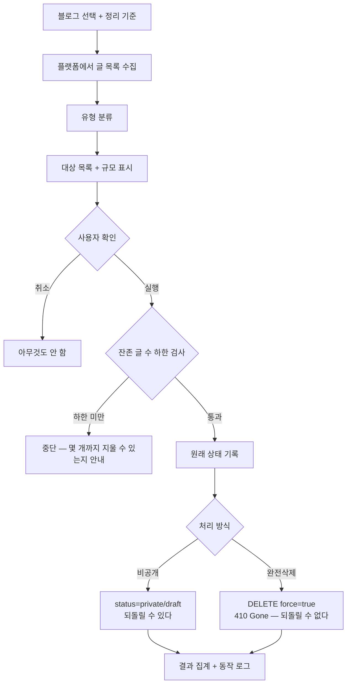

# 발행글 정리 — 비공개·완전삭제

> 라이프인포 146개를 일회성 스크립트로 비공개했다. 같은 일이 12개 블로그에서
> 반복되므로 앱 기능으로 만든다.
> 진단: `docs/plans/search_visibility_all_blogs.md`

## 흐름

## 유형 분류

라이프인포에서 쓴 기준을 그대로 옮긴다. 「대한주택관리사협회 채용정보」의
연봉표가 창작이었던 것이 근거다 — 확인 가능한 사실이 글의 핵심인데 그 값을
AI가 지어내는 구조.

| 유형 | 예 |
|---|---|
| 고객센터·연락처 | 롯데카드 고객센터 전화번호 |
| 상품권·현금화 | 금강제화 상품권 현금화 |
| 구인구직·채용 | 대한주택관리사협회 채용정보 |
| 시설 운영정보 | 창원시청 주차요금과 무료시간 |
| 본문 짧음 | 설정한 글자수 미만 |

## 안전장치

**잔존 글 수 하한(기본 100)** — 애드센스 승인 사이트에서 콘텐츠가 부족해지면
광고 게재가 중단될 수 있다. 하한 아래로 내려가는 삭제는 실행하지 않고,
"지금 N개까지 지울 수 있다"를 알려준다.

미신청 블로그는 하한을 0으로 두어 전체 삭제가 가능하다.

## 되돌리기

| 방식 | 되돌리기 |
|---|---|
| 비공개 | 기록해 둔 원래 status 로 복구 |
| 완전삭제 | **불가능**. 실행 전 목록을 파일로 남긴다 |

완전삭제는 410(Gone)을 유발한다. 구글이 404보다 훨씬 빨리 재크롤을 멈춘다.

## 설계 원칙

- **미리 보여주고 실행한다.** 몇 개가 어떤 이유로 지워지는지 확인 없이
  실행하지 않는다.
- **하한은 앱이 지킨다.** 사용자가 실수로 승인 사이트를 비우지 못하게 한다.
- **비공개가 기본.** 완전삭제는 명시적으로 골라야 한다.
