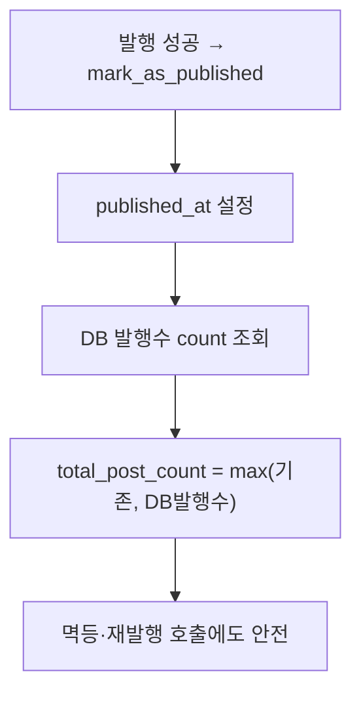
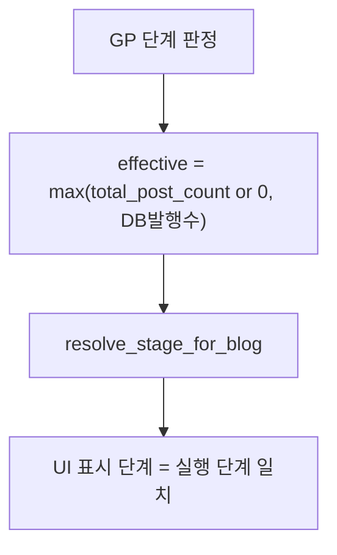
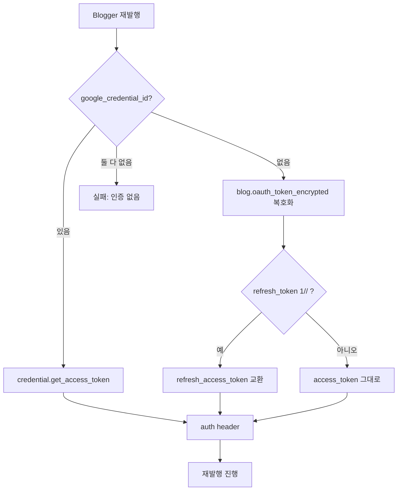

# 발행 카운트 동기화 + 재발행 인증 일원화 (2026-06-13)

## 문제
1. `blogs.total_post_count`가 발행 시 자동 갱신 안 됨(군타/수작남 NULL) → 블로그 카드/스케줄러 카운트 불일치.
2. 스케줄러는 raw `total_post_count`, UI는 `max(total_post_count, DB발행수)` → 표시 단계 ≠ 실행 단계.
3. 재발행은 `google_credential_id` 필수(레거시 oauth 폴백 없음) → 신규계정 Blogger 재발행 실패.

## Fix ① 발행 시 total_post_count 자동 갱신

## Fix ② 스케줄러도 보정 카운트 사용

- 공용 헬퍼 `build_effective_post_counts(db, blogs)` → flow_scheduler(2462/2742/1800/2080), flows_execute(980) 적용.

## Fix ③ 재발행 인증 일원화 (발행과 동일)

- 공용 `resolve_blogger_access_token(blog, credential)`(google_oauth_helper) — 발행기 `_get_access_token`과 동일 로직.
- BloggerRepublishService가 resolved token 사용. publish_workflow는 NULL credential이어도 진행.
