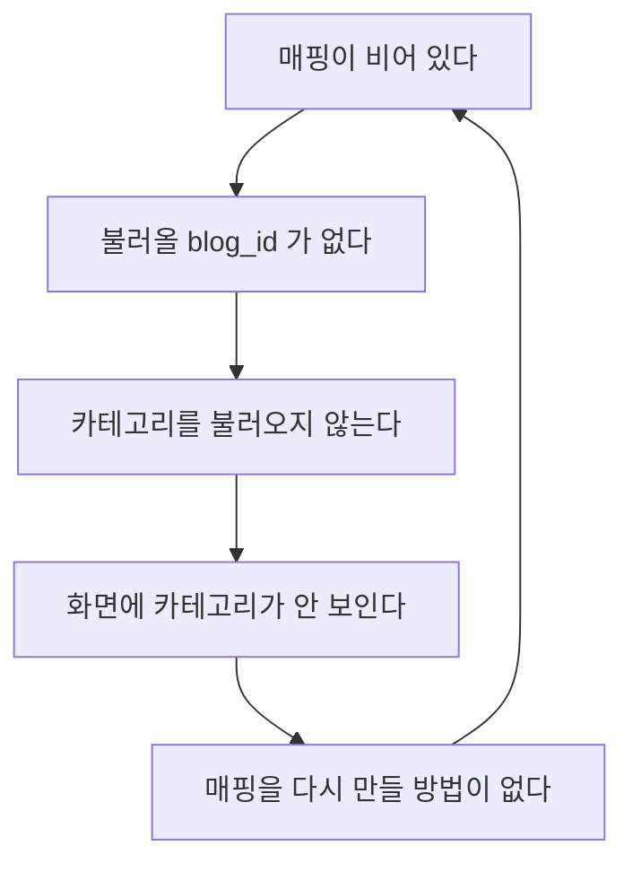
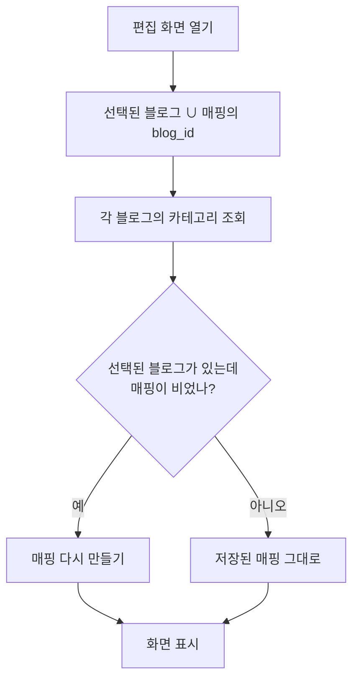

# 프롬프트 모듈 — 블로그 카테고리 자동 연동

> 수작남만 연동되지 않았다. 데이터는 정상이었고, 편집 화면이 회복
> 불가능한 상태에 빠져 있었다.

## 무엇이 문제였나

편집 화면은 **저장된 매핑(`blog_category_map`)에서만** 불러올 블로그를
뽑았다.

한 번 매핑이 비면 **스스로 빠져나올 수 없다.** 다른 블로그가 멀쩡했던
것은 매핑이 비어 있지 않았기 때문이지, 수작남에 특별한 문제가 있어서가
아니다.

| 블로그 | 카테고리(DB) | 저장된 매핑 |
|---|---|---|
| 슈마즈 | 6 | 6 |
| 레시피노트 | 6 | 6 |
| **수작남** | **6** | **0** |

## 고친 흐름

### 둘을 합치는 이유

선택 목록에만 있는 블로그(매핑이 빈 경우)와 매핑에만 있는 블로그
(선택이 지워진 경우)가 모두 있을 수 있다. 한쪽만 보면 다른 쪽이 빠진다.

### 비었을 때만 다시 만드는 이유

제외 목록(`excludedCategories`)은 **저장되지 않는다.** 그래서 매번 다시
만들면 사용자가 일부러 뺀 카테고리가 되살아난다.

선택된 블로그가 있는데 매핑이 완전히 빈 상태는 그 블로그로 아무것도
만들지 못한다는 뜻이라, 의도된 설정으로 볼 수 없다. 그때만 다시 만든다.

## 생성에는 영향이 없었다

`_filter_categories_for_blog` 는 매핑이 비면 `categories` 를 쓰고,
그마저 비면 `inventory_trigger` 가 **블로그의 BlogCategory 로 폴백**한다.
그래서 수작남도 자기 카테고리 안에서 제목을 골라 왔다.
표시 문제였지 생성 문제가 아니다.

## 남는 일

화면이 고쳐져도 **저장된 매핑은 저장해야 채워진다.** 편집 화면을 열면
매핑이 다시 만들어지므로, 저장 버튼을 한 번 누르면 DB 에도 반영된다.
