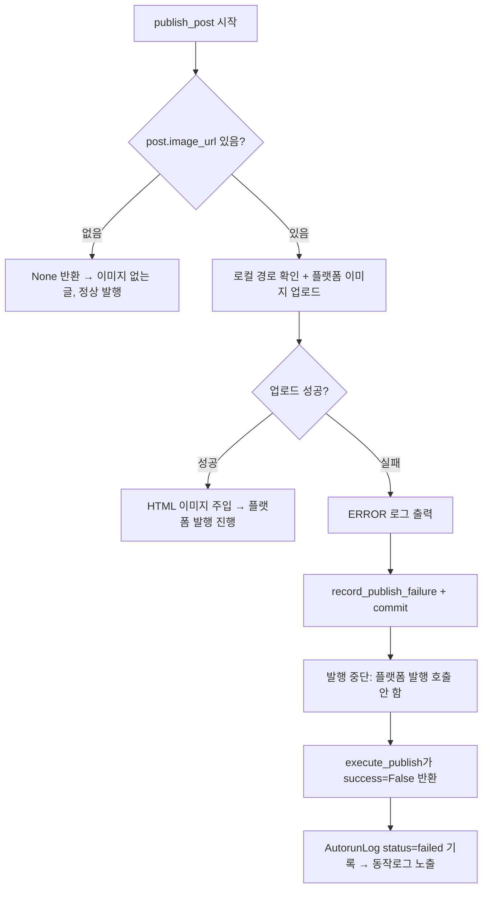

# 대표이미지 업로드 실패 시 발행 중단 (2026-06-14)

## 문제
- Blogger AI 이미지 블로그(월드인포마스터)에서 imgbb 키 미설정 → 대표이미지 업로드 실패.
- 기존 동작: `post.image_url=None`으로 지우고 **이미지 없이 발행 계속**.
- 결과: 이미지 없는 포스트가 발행됨(원치 않음). 사용자 요구 = 이미지 실패 시 **발행 금지 + 오류 로그**.

## 변경 후 흐름

## 핵심
- `_upload_image`: 실패 시 `image_url` NULL 처리/이미지 없는 발행 제거 → 실패 결과 반환.
  - 경로 미존재도 실패로 취급(`ImageUploadResult(success=False)`).
- `publish_post`: `image_result`가 실패면 플랫폼 발행 전에 중단.
  - 플랫폼 발행 호출 안 됨 → **중복/이미지 누락 발행 방지**.
  - `record_publish_failure`로 시도 횟수 누적(3회 초과 시 재선택 차단).
- 정상 발행(이미지 업로드 성공) 및 이미지 없는 글은 영향 없음.

## 범위 밖(미변경)
- 본문 인라인 이미지(`_upload_inline_images`)는 기존대로 실패 시 제거 후 발행 계속.
- Celery 재시도 정책(`max_retries=3`)은 유지 → 영구 실패는 최대 4회 시도 후 중단(중복 발행 없음).
