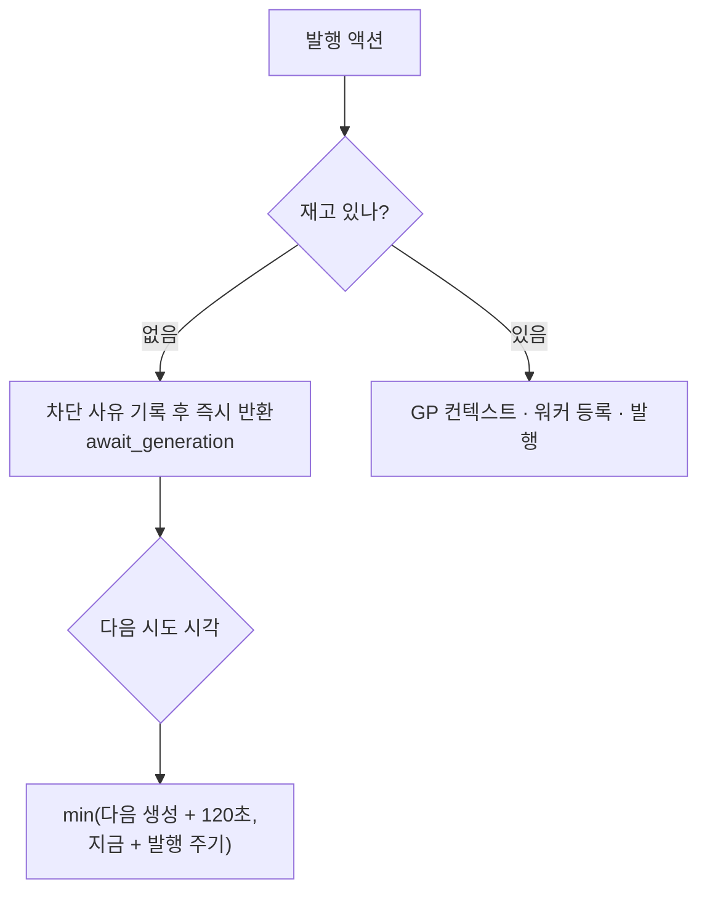

# 발행·생성 순서와 당일 기준

> 2026-09-01 · 조사: `docs/plans/publish_skip_investigation.md`
> 대상: `app/scheduler/flow_scheduler.py`, `app/services/generation/flow_generate_executor.py`

굿팁꿀팁이 하루 30번 발행을 건너뛰고, 하루 2개 설정인데 1개도 못 만들었다.
원인이 셋이었고 서로 얽혀 있었다.

## 1. '오늘' 이 오늘이 아니었다

로그가 `오늘 2개 생성` 이라고 말했지만 그 2개는 전날 것이었다.

| 블로그 | 스킵 로그 | 실제 생성 시각 |
|---|---|---|
| 굿팁꿀팁 | 09-01 "오늘 2개" | 08-31 11:06 · 08-31 22:04 |
| 인포노트 | 08-31 "오늘 1개" | 08-30 15:24 |

문구도 함께 고쳤다. `하루 1개로 제한` 만 보이면 성장 프로파일이 무시된
것처럼 읽힌다. 이제 `성장 프로파일 2개 → 색인 되먹임으로 1개` 로 근거를
밝힌다.

## 2. 오토런 첫 등록에서 발행이 먼저 돌았다

즉시 실행이 액션 종류와 무관하게 전부 `3초 뒤` 였다. 생성과 발행이 사실상
동시에 출발해, 발행이 아직 만들어지지도 않은 글을 찾다 건너뛰었다.

```mermaid
gantt
    dateFormat s
    axisFormat %Ss
    section 옛 방식
    생성 시작   :0, 3s
    발행 시작   :0, 3s
    section 새 방식
    생성 시작   :0, 3s
    글 완성     :3, 40s
    발행 시작   :180, 3s
```

`IMMEDIATE_DELAYS` — 생성·프롬프트 3초, 수집류 5초, 발행 180초,
재발행 240초. 한 편 만드는 데 통상 20~40초가 걸린다.

## 3. 재고 확인이 맨 마지막이었다

옛 순서는 GP 컨텍스트, 워머업 매니저, Publisher, PublisherPipeline 을
모두 만든 뒤에야 재고가 없다는 것을 알았다.

차단 사유도 함께 남긴다. `발행 가능 글 없음` 만으로는 재고가 정말 없는
것인지 카테고리가 안 맞는 것인지 구분되지 않았다 — 굿팁꿀팁이 30번
건너뛰는 동안 진짜 이유가 한 번도 안 남았다.

## 4. 왜 '다음 생성 시각' 인가

발행할 글이 없으면 10분마다 되물었다. **생성 전에는 되물어도 결과가 같다.**
그래서 다음 생성 직후로 미룬다.

### 발행 주기를 무너뜨리지 않는 이유

상한을 둔다 — `지금 + 발행 주기` 를 넘겨 기다리지 않는다.

| 상황 | 옛 동작 | 새 동작 |
|---|---|---|
| 30분 뒤 생성, 발행 주기 4시간 | 10분마다 6번 헛시도 | 32분 뒤 한 번 |
| 10시간 뒤 생성, 발행 주기 1시간 | 10분마다 60번 | 1시간 뒤 (상한) |
| 생성 예정이 이미 지남(밀림) | 10분마다 | 5분 뒤 |
| 생성 모듈 없는 플로우 | 10분마다 | 발행 주기마다 |

**실제 발행 시각은 옛 방식과 같거나 빠르다.** 재고가 없는 동안의 시도는
어차피 전부 실패하므로, 그 시도를 없애도 발행이 늦어지지 않는다. 상한이
있어 수동 생성 등 다른 경로로 글이 생겨도 한 주기 안에 발견한다.

### 카운터를 올리는 이유

`await_generation` 은 `record_execution(True)` 를 부른다. 옛 `skip_interval`
경로가 이걸 안 불러서 `successful_executions` 가 0에 머물렀고, 스케줄러는
계속 '최초 실행' 으로 보고 10분마다 다시 걸었다. 스스로를 유지하는 고리였다.
