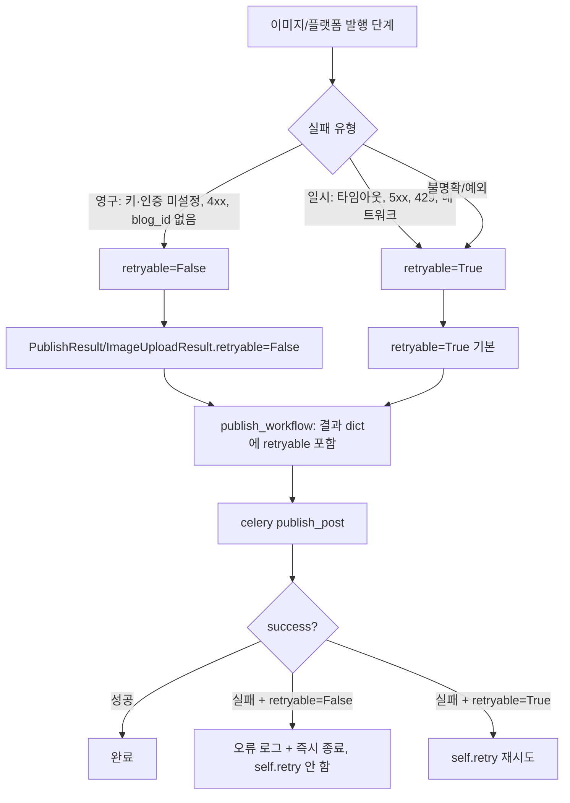

# 발행 실패 영구/일시 분류 → 재시도 억제 (항목 ②, 2026-06-14)

## 문제
영구 실패(imgbb 키 미설정, OAuth 미설정, 4xx 등)도 Celery가 30초 간격 4회 재시도 → 무의미한 오류 로그 반복.

## 설계: `retryable` 플래그 전파

## 분류 기준
- **영구(retryable=False)**: OAuth/이미지 키 미설정, 인증정보 복호화 실패, blog_id 확인 불가, 토큰 갱신 후 401, 4xx 클라이언트 오류, 이미지 파일 미존재.
- **일시(retryable=True, 기본)**: 타임아웃, 5xx, 429, 네트워크 오류, 분류 불가 예외(보수적으로 재시도 유지).

## 변경 파일
- `publish_result.py`: `PublishResult.retryable`, `ImageUploadResult.retryable` 추가(기본 True).
- `image_uploader.py`: imgbb 키 미설정 등 영구 실패 → retryable=False.
- `blogger_publisher.py` / `wordpress_publisher.py`: 인증·blog_id·4xx → retryable=False.
- `publisher_pipeline.py`: 이미지 실패 중단 시 `result.retryable=image_result.retryable` 전파.
- `publish_workflow.py`: 실패 dict에 `retryable` 포함.
- `celery_publish_tasks.py`: `retryable=False`면 self.retry 없이 종료.

## 회귀 주의
- 일시 실패를 영구로 오분류하면 정상 재시도가 막힘 → **불명확하면 retryable=True 기본 유지**.
- 영구 실패도 AutorunLog `failed` + last_publish_error는 그대로 기록(가시성 유지).
