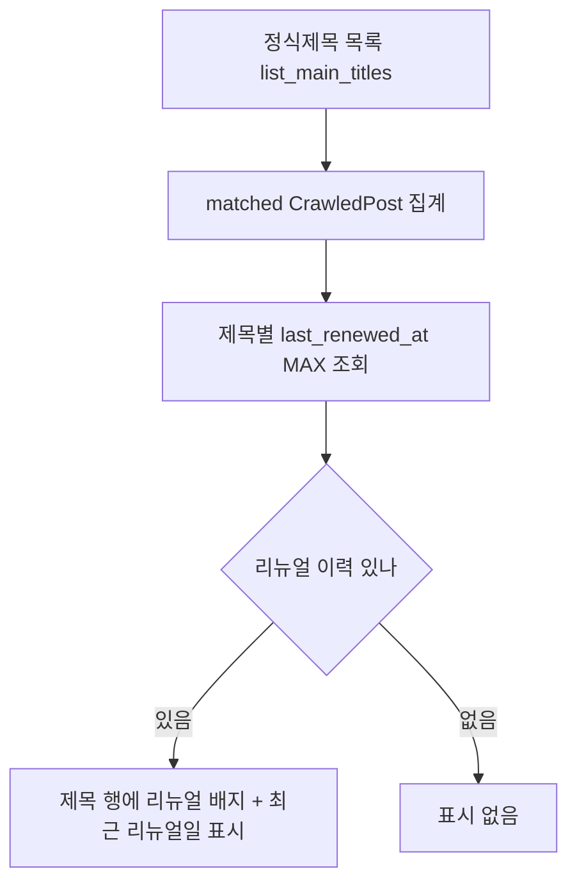

# 재발행 리뉴얼 #2 — 정식제목 리뉴얼 표시 (2026-06-22)

[[project-republish-renewal]]. 리뉴얼된 글을 정식제목(MainTitle) 관리 화면에서
식별. `CrawledPost.last_renewed_at`은 이미 기록됨(스키마 변경 없음). 표시만 추가.

## 동작

## 범위
- 백엔드: `titles.list_main_titles` 응답에 제목별 `last_renewed_at`(매칭 글 중 최신) 추가.
- 프론트: 정식제목 목록 템플릿에 "리뉴얼됨(날짜)" 배지.
- 스키마 변경 없음(기존 컬럼 read-only 집계).

## 비고
- 한 정식제목에 여러 매칭 글이 있으면 가장 최근 last_renewed_at 사용.
- 순수 표시 기능(데이터 변경 없음, 운영 안전).
