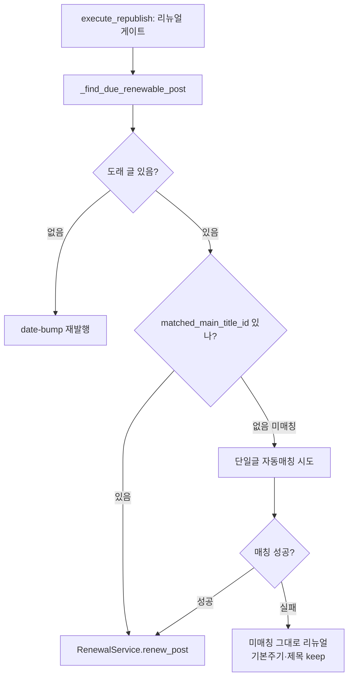

# 재발행 리뉴얼 #4 — 미매칭 글 자동 정식제목 등록 (2026-06-22)

[[project-republish-renewal]]. 재발행(리뉴얼) 대상 글이 정식제목에 미매칭이면,
기존 매칭 로직으로 자동 등록 시도 → 카테고리 주기·제목 재조합이 동작하도록.

## 동작

## 범위
- `AutoMatchService`에 단일 글 매칭 진입점 추가(기존 `similarity_matcher`/카테고리
  필터 로직 재사용) — `match_single_post(post) -> bool`.
- 게이트(`publish_workflow`)에서 도래 글이 미매칭이면 호출 후 재조회.
- 매칭 실패해도 리뉴얼은 진행(기본주기·제목 keep로 폴백) — 비차단.

## 비고
- 매칭은 그 블로그 카테고리 필터 ∩ 미사용/사용가능 MainTitle 대상.
- 성공 시 `mark_matched` + `match_status="matched"` 기록(영구).
- 스키마 변경 없음.
