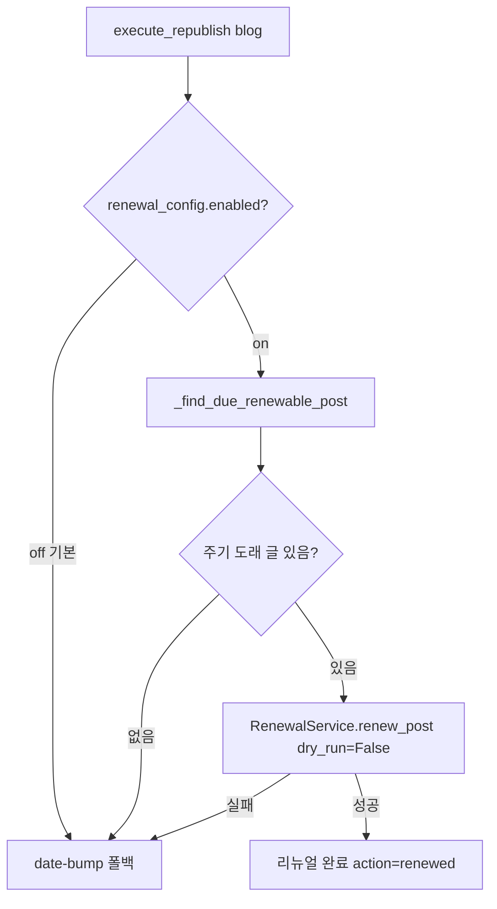

# 재발행 리뉴얼 게이트 (c,d) (2026-06-17)

[[project-republish-renewal]]. 재발행에 리뉴얼 연결: enabled + 주기 도래 글만 리뉴얼.

## 주기 도래 판정 (_find_due_renewable_post)
- 후보: source=generated + published_at + platform_post_id + generation_history, 나이 오래된 순.
- 나이 기준 = COALESCE(last_renewed_at, published_at)(우리 DB, 플랫폼 날짜 안 씀).
- 주기(월) = category_periods[matched MainTitle.subtopic_id] ?? default_period_months.
- `ref <= now - relativedelta(months=period)`면 도래 → 그 글 반환(가장 오래된 1개).

## 안전장치
- **enabled 기본 off** → 사용자가 블로그별로 켜기 전엔 자동 리뉴얼 안 함(기존 동작 유지).
- 주기 미도래/리뉴얼 실패 → 기존 date-bump로 폴백(재발행 자체는 보장).
- 스키마 변경 없음(renewal_config.enabled = JSON 키).

## 잔여
- #2 정식제목 리뉴얼 표시, #4 미매칭 자동 매칭, P4 저장정리.
