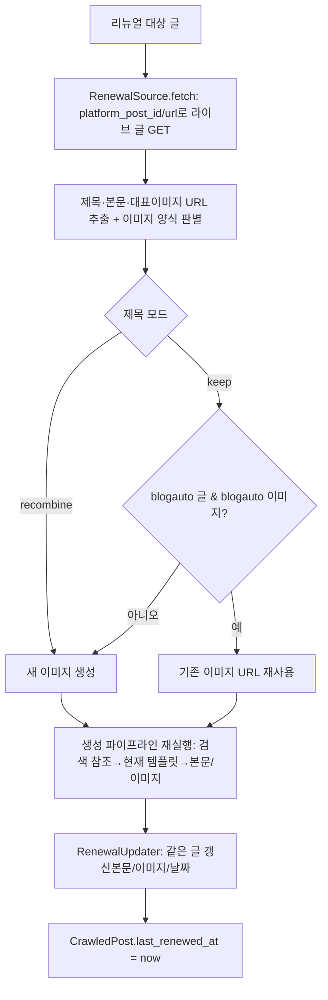

# 재발행 리뉴얼 P2 — 리뉴얼 서비스 (2026-06-16)

전체 설계 [[project-republish-renewal]]. P1(스키마/설정/백필) 완료 후 P2.

## P2 목표
라이브 글을 가져와 현재 양식·최신 내용으로 재생성해 같은 글을 갱신.

## P2a 이미지/글 양식 판별 (read-only, 이번 구현)
- blogauto 글 판별: 해당 platform_post_id/url의 CrawledPost 존재 여부.
- 이미지 양식 판별(featured `` src):
  - WP: `blogauto_*.webp` 파일명 → blogauto, 그 외 → legacy.
  - Blogger: `i.ibb.co`/`ibb.co`(imgbb) → blogauto, `googleusercontent.com`/`blogspot` → legacy.
- 이미지 규칙: 새 이미지 생성, 단 (제목 keep AND blogauto글 AND blogauto이미지)면 기존 URL 재사용.

## P2b 생성 재실행 — 설계 결정 필요 ⚠️
현재 `ContentGenerator.generate(blog_id, prompt_module_id, source_title_id)`는
**프롬프트 모듈 + MainTitle**에 결합. 리뉴얼은 (라이브 글 제목 + 제목모드 +
이미지 재사용)이 필요해 그대로 못 씀. 두 방식:
- (A) generate() 재사용: 블로그의 생성 프롬프트 모듈 + 임시/매칭 MainTitle 사용,
  제목모드(keep/recombine)·이미지재사용은 오버라이드. 빠르나 우회 많음.
- (B) 전용 경로: 하위 서비스(title_recombiner/reference_collector/
  content_generator/image_generator)를 직접 조립. 제목모드·이미지규칙 정밀제어.
→ 사용자/검토 후 택1. 어떤 프롬프트 모듈을 리뉴얼에 쓸지도 결정 필요.

## P2c 갱신
- WP: POST /posts/{id} (content/title/date). Blogger: PATCH/PUT posts/{id}.
- 성공 시 last_renewed_at=now. (게이트·스케줄러 연동은 P3)
