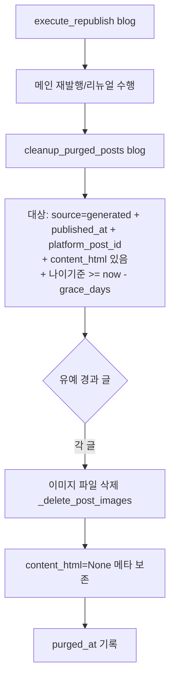

# 재발행 리뉴얼 P4 — 발행/리뉴얼 후 저장 정리 (2026-06-22)

[[project-republish-renewal]]. 유예기간 지난 발행/리뉴얼 글의 본문(content_html)+
이미지 파일을 삭제하고 경량 메타(제목·url·platform_post_id·날짜)는 보존.
리뉴얼은 라이브 글에서 fetch하므로 서버 저장본 불필요.

## 동작

## 안전장치
- **grace 기준**: 나이기준 = COALESCE(last_renewed_at, published_at), `now - delete_grace_days` 이전 글만.
- **platform_post_id 필수**: 라이브 글이 존재해야(리뉴얼 재fetch 가능) 삭제. 없으면 보존.
- 메타(title/url/platform_post_id/published_at/last_renewed_at/matched_main_title_id/
  generation_history_id)는 **삭제 안 함** — 주기 판정·리뉴얼·표시에 필요.
- `content_html`은 리뉴얼이 라이브 fetch로 충당하므로 삭제 안전.
- delete_grace_days=0이면 정리 비활성(안전 기본 아님; 기본 7).
- 트리거: 재발행 흐름에 편승(블로그별, 옵트인 재발행 시에만). 별도 cron 미신설.

## 스키마
- alembic 045: `CrawledPost.purged_at`(DateTime, nullable) — 정리 시각 기록(재정리 방지·추적).
- 로컬 먼저 마이그레이션 후 배포([[feedback_local_migration_first]]).

## 비고
- 이미 `titles._delete_post_images(post, db)` 존재 → 공용 유틸로 이동/재사용.
- 정리 대상 0건이면 no-op.
