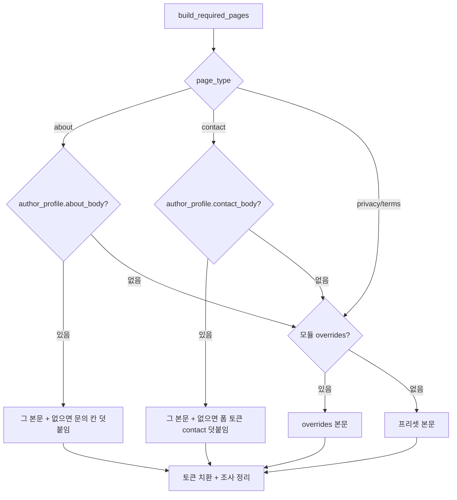

# 필수 페이지 본문 고르기 — 블로그별 소개·문의 (2026-11-02, 인포노트)

필수 페이지 모듈(contact_form)이 다시 돌면 4쪽을 덮어쓴다. 블로그마다 손으로 다듬은 소개·문의 글이
덮이지 않도록 author_profile 에 블로그별 본문을 둔다.

```mermaid
flowchart TD
    A[build_required_pages] --> B{page_type}
    B -- about --> C{author_profile.about_body?}
    B -- contact --> D{author_profile.contact_body?}
    B -- privacy/terms --> E{모듈 overrides?}
    C -- 있음 --> F[그 본문 + 없으면 문의 칸 덧붙임]
    D -- 있음 --> G[그 본문 + 없으면 폼 토큰 contact 덧붙임]
    C -- 없음 --> E
    D -- 없음 --> E
    E -- 있음 --> H[overrides 본문]
    E -- 없음 --> I[프리셋 본문]
    F --> J[토큰 치환 + 조사 정리]
    G --> J
    H --> J
    I --> J
```
