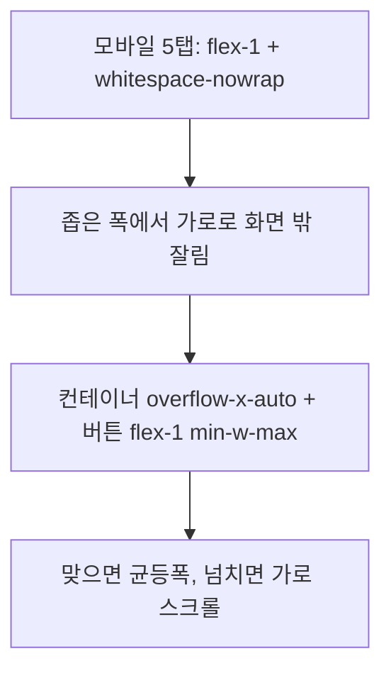
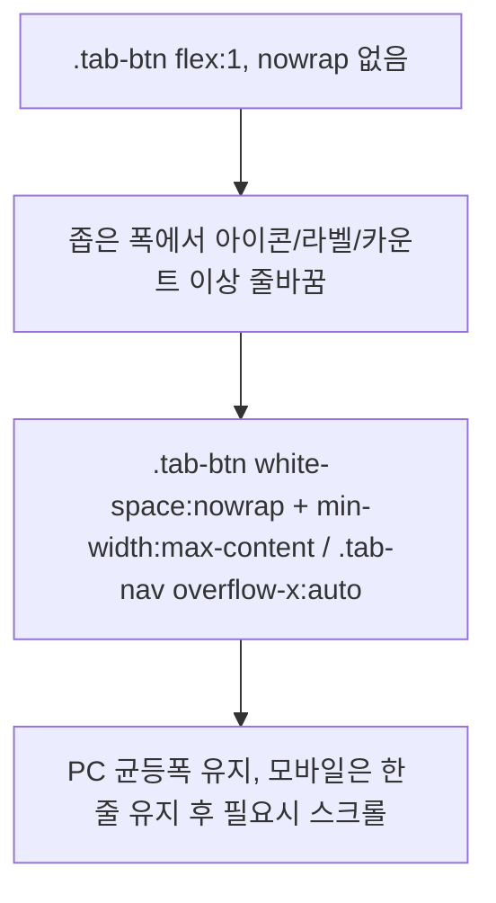

# 동작로그 필터 드롭다운화 + 모바일 탭 수정 (2026-06-15)

## A. 동작로그 액션/표시 → 드롭다운 + 누락 액션 추가

```mermaid
flowchart TD
    A[동작로그 확장] --> B[액션 필터: 버튼 나열 → select 드롭다운]
    A --> C[표시(페이지수) 필터: 버튼 → select 드롭다운]
    B --> D[누락 액션 추가: 대량수집/워커등록]
    D --> E[백엔드 _get_action_type에 bulk_collect 매핑 누락 수정]
    E --> F[bulk_collect 로그가 '시스템'→'대량수집' 정상 표시]
```
- 실제 AutorunLog.action: queue_register/generate/publish/republish/**bulk_collect**/collect.
- `bulk_collect`는 `_get_action_type` 미매핑으로 action_type="system"(시스템)으로 표시되고 필터에도 없었음.
- 수정: 액션 select에 대량수집·워커등록 옵션 추가, JS getActionLabel/getActionBadgeClass에 bulk_collect 추가, 백엔드 _get_action_type에 bulk_collect 매핑.
- 액션/표시 모두 블로그 필터(이미 select)와 동일 다크 스타일 select로 통일.

## B. 모듈 관리 모바일 탭 오버플로우



## C. 데이터 관리 탭 라벨 줄바꿈



## 변경 파일
- `app/templates/components/global_summary.html`: 액션/표시 select 전환.
- `app/static/js/components/GlobalSummary.js`: getActionLabel/getActionBadgeClass에 bulk_collect.
- `app/routers/dashboard_logs.py`: `_get_action_type`에 bulk_collect.
- `app/templates/modules/list.html`: 모바일 탭 컨테이너 overflow-x-auto + flex-1 min-w-max.
- `app/templates/collection/index.html`: `.tab-nav`/`.tab-btn` nowrap+min-width+overflow.
