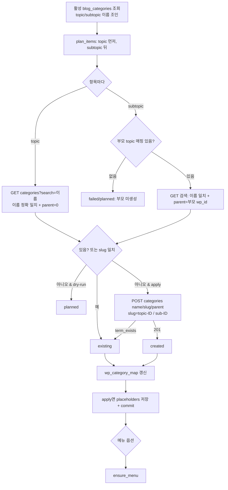
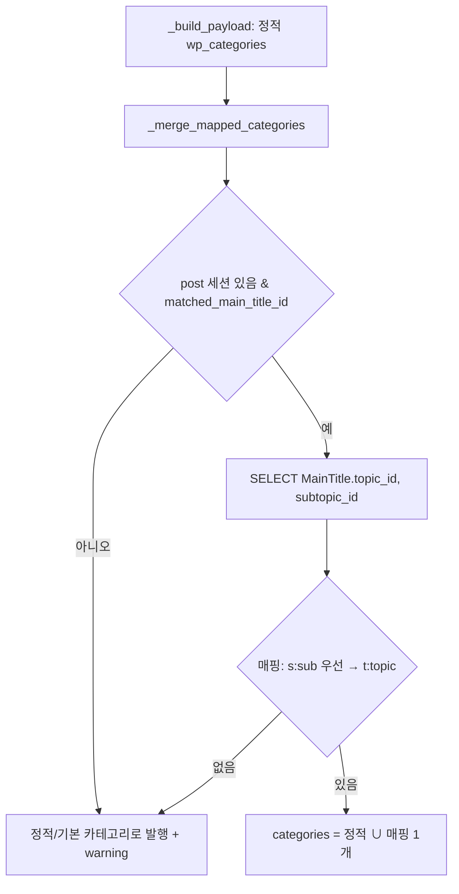

# WordPress 카테고리·메뉴 동기화

> 2026-09-29 | 문제: WP 6개 블로그 글이 전부 기본 카테고리(Uncategorized/Lifestyle 등)로 발행됨.
> 원인: `_get_categories()` 가 `placeholders['wp_categories']`(정적 ID)만 보는데 6개 모두 비어 있음.

## 1. 동기화 (API `POST /api/v1/blogs/{id}/wp/categories/sync` · `scripts/wp_sync_categories.py`)



## 2. 메뉴 (best-effort)

```mermaid
flowchart TD
    A[GET menu-locations] -->|401/403/404| X[supported:false 반환]
    A -->|200| B[GET menus → 'BlogAuto 메뉴' 찾기/없으면 POST]
    B --> C[GET menu-items → 없는 항목만 POST<br/>topic → subtopic(자식) → 필수페이지 4개]
    C --> D{위치 선택: 우리 메뉴가 걸린 곳 → 빈 위치}
    D -->|있음| E[POST menus/id locations]
    D -->|없음| F[지정 안 함 — 남의 메뉴 덮지 않음]
```

## 3. 발행 시 카테고리 결정



실패해도 발행은 절대 막지 않는다(모든 예외 → warning 후 생략).

## 메뉴 구성 변경 (2026-09-29, 오너 결정)
- 메뉴에는 **상위 주제 + 필수 페이지 4개**만 넣는다(하위주제는 주제 페이지에 모이므로 제외). `include_subtopics=True` 로만 하위주제 포함.
- 주 메뉴 자리에 **이미 메뉴가 걸려 있으면** 새 메뉴를 만들지 않고 그 메뉴에 빠진 항목만 뒤에 보탠다(기존 항목은 지우거나 바꾸지 않음).
- 비어 있으면 'BlogAuto 메뉴'를 만들어 주 메뉴처럼 보이는 자리(primary/main/header/menu-1/top)부터 건다.
