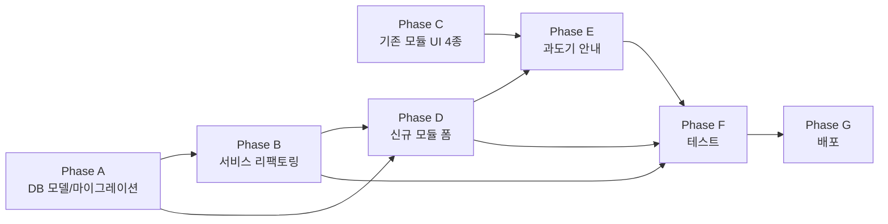

# 수집 모듈 분리 & 대량 수집 모듈 신설 작업 계획

> **작성일**: 2026-06-02
> **트리거**: 사용자 보고 — "별도 폼에는 수집 대상 6종이 표시되나 실제 프론트엔드(`modules/list.js` 인라인 폼)에는 3종만 표시"
> **결정 사항 출처**: 본 세션 대화 (2026-06-02)
> **연관 문서**: `docs/flowcharts/bulk_collect_module.md`

---

## 1. 작업 배경

### 발견된 문제
- 기존 수집 모듈(`type_code='collect'`)이 **일반 수집 + 대량 수집 두 기능을 한 모듈에 묶어** 운영 중
- 사용자 프론트엔드(`modules/list.js` 인라인 HTML, 286~344줄)에 **키워드 수집 4종 누락** (네이버 데이터랩 / 네이버 검색광고 / 구글 트렌드 / 구글 키워드 플래너)
- 고아 파일 `templates/modules/_form.html`에는 6종 모두 있음 (어디서도 include 안 됨)
- 결과: `form.js`(42~49, 720~727줄)는 4종 formData를 저장하지만 사용자가 토글할 수단이 없어 **항상 false로 저장**

### 분리 방향
1. **기존 수집 모듈(`collect`)** → 일반 수집 전용 + 누락 4종 UI 추가 + 대량 수집 옵션 제거
2. **신규 `bulk_collect` 모듈** → 대량 수집 전용. 시간·메모리 분산을 위한 청크 큐 + lastmod 증분 + 도메인 병렬 + 타임박스 사이클

### 운영 환경 가정
- **현재**: 옛 오라클 E2.1.Micro (1 OCPU / 1 GB RAM, 144.24.82.130) — 운영 중
- **목표**: A1.Flex 2 OCPU / 12 GB RAM (2026-06-02 생성 완료) — 본 작업 완료 후 마이그레이션 + 배포

---

## 2. 결정 사항 요약 (확정)

| # | 항목 | 결정 |
|---|------|------|
| 1 | 기존 `collect` 처리 | 일반 수집 유지, 대량 수집 옵션 제거, **누락 4종 UI 추가** |
| 2 | 신규 모듈 영문 키 | `bulk_collect` |
| 3 | 신규 모듈 한국어명 | "대량 수집" |
| 4 | 기존 데이터 마이그레이션 | **C 옵션** — 안내 후 수동. 과도기 동안 기존 `enable_bulk_collect` 값 동작 유지 |
| 5 | 워커 배치 | utility_queue 그대로 (전용 컨테이너 분리 안 함) |
| 6 | 알고리즘 조합 | 🅑 청크 큐 + 🅐 lastmod 증분 + 🅒 도메인 분산 병렬 + 🅕 시간 분산 실행 |
| 7 | URL 입력 방식 | 직접 입력 / 수집 모듈 DB (둘 다 지원) |
| 8 | 직접 입력 URL 종류 구분 | **자동 판별** (사이트맵 시도 → 폴백) |
| 9 | DB 가져오기 필터 | `is_processed=false` (미처리만) |
| 10 | DB 가져오기 정렬 | 저장 순서 / 랜덤 선택 |
| 11 | 입력 URL 저장 위치 | `Module.settings` JSONB |
| 12 | 파라미터 노출 | 8개 모두 직접 입력 |
| 13 | 스케줄러 UI | 기존 GP 폼과 동일 |
| 14 | 진행률/통계 | **표시 안 함** (워커 진행률로 대체), 통계는 사용 테스트 후 결정 |

---

## 3. 신규 모듈 폼 구조 (사용자 시안 반영)

```
┌─ 기본 정보 ────────────────────────────────┐
│ 모듈 이름, 설명                              │
├─ 📥 수집 대상 URL ──────────────────────────┤
│ 입력 방식: ○ 직접 입력  ○ 수집 모듈 DB     │
│                                              │
│ [직접 입력]                                  │
│   URL 목록 (1줄 1개, 자동 판별)              │
│   ※ 블로그 URL → 사이트맵 추출               │
│   ※ 포스트 URL → 제목 추출                   │
│                                              │
│ [수집 모듈 DB]                               │
│   필터: is_processed=false 고정              │
│   정렬: ○ 저장 순서  ○ 랜덤                  │
│   최대 가져올 URL 수: [입력]                 │
├─ ⚙️ 대량 수집 파라미터 (8개) ───────────────┤
│   cycle_max_duration_sec      [300]         │
│   chunk_size_initial          [100]         │
│   adaptive_chunk_enabled      [✓]           │
│   domain_concurrency          [2]           │
│   parallel_titles             [10]          │
│   lastmod_only_after_first    [✓]           │
│   pause_on_callback_backlog   [✓]           │
│   quiet_hours_chunk_boost     [ ]           │
├─ ⏰ 수집 스케줄 ─────────────────────────────┤
│   ───── 기존 GP 폼과 동일 ─────              │
│   schedule_matrix / interval / jitter        │
└──────────────────────────────────────────────┘
```

---

## 4. Phase별 작업 분장

### 🅐 Phase A — DB 모델 / Alembic 마이그레이션

**담당**: `@backend-agent`

**변경 파일**:
- `app/models/collected_url.py` — 컬럼 추가
- `app/models/bulk_collect_progress.py` — 신규 모델
- `alembic/versions/034_bulk_collect_module_type.py` — 신규 마이그레이션
- `app/models/module.py` — Settings JSONB 스키마 문서화 (코드 변경 없음, 주석)

**구체 변경**:
1. `module_types` row INSERT:
   ```python
   {"code": "bulk_collect", "name": "대량 수집", "description": "사이트맵·URL에서 포스트 제목 대량 추출"}
   ```
2. `collected_urls` 컬럼 추가:
   - `title_fetched_at` DateTime nullable
   - `title_fetch_status` String(20) default='pending' (pending/done/failed)
   - `title` String 이미 존재 시 재사용, 없으면 추가
3. `bulk_collect_progress` 테이블 신설:
   ```python
   id, module_id (FK), blog_domain, last_seen_lastmod, last_cycle_at,
   last_cycle_duration_sec, last_cycle_processed, last_cycle_failed,
   created_at, updated_at
   ```
4. 복합 인덱스: `(module_id, blog_domain)` UNIQUE
5. `collected_urls`에 부분 인덱스: `WHERE title_fetch_status='pending'`

**완료 기준**:
- [ ] `alembic upgrade head` 로컬 PostgreSQL/SQLite 양쪽 성공
- [ ] `alembic downgrade -1` 양쪽 성공 (롤백 가능 확인)
- [ ] 신규 `module_types` row가 `select * from module_types` 결과에 나타남
- [ ] 모델 단위 테스트: 새 컬럼 read/write OK

---

### 🅑 Phase B — 대량 수집 서비스 리팩토링

**담당**: `@backend-agent`

**변경 파일**:
- `app/services/bulk_title_collector_service.py` — 메인 리팩토링 (현재 단일 클래스 → 청크 처리 모드)
- `app/services/url_classifier.py` — **신규** (블로그/포스트 자동 판별)
- `app/services/bulk_collect/__init__.py` — **신규 패키지** (코드 분리)
- `app/services/bulk_collect/chunk_processor.py` — **신규**
- `app/services/bulk_collect/lastmod_tracker.py` — **신규**
- `app/services/bulk_collect/domain_limiter.py` — **신규** (asyncio.Semaphore 관리)
- `app/services/bulk_collect/timebox.py` — **신규** (사이클 타임박스)
- `app/core/celery_tasks.py` — `tasks.bulk_collect_cycle` 신규 등록
- `app/core/celery_config.py` — task_routes에 `tasks.bulk_collect_cycle: utility_queue` 추가

**구체 변경**:
1. **URL 분류기** (`url_classifier.py`):
   - 정규식 우선 (`/post/`, `/entry/`, `?p=`, `/YYYY/MM/DD/`)
   - 폴백: `/sitemap.xml` HEAD 요청
2. **청크 처리** (`chunk_processor.py`):
   - `process_next_chunk(module_id, chunk_size)` → `pending` URL N개 SELECT + 도메인별 분산 fetch
   - 처리 시간 측정 → `last_cycle_duration_sec` 저장 → 다음 청크 사이즈 조정
3. **Lastmod 추적** (`lastmod_tracker.py`):
   - `get_last_seen(module_id, domain)` / `update_last_seen(module_id, domain, lastmod)`
   - Phase 1에서 사이트맵 파싱 시 `lastmod > last_seen`만 적재
4. **도메인 제한** (`domain_limiter.py`):
   - `DomainLimiter(global_n, per_domain_n)` → `async with limiter.acquire(domain)`
5. **타임박스** (`timebox.py`):
   - `Timebox(max_sec)` → `if box.expired(): break`
6. **Celery 태스크**:
   ```python
   @celery_app.task(name="tasks.bulk_collect_cycle")
   def bulk_collect_cycle(module_id: int): ...
   ```
   utility_queue로 라우팅

**완료 기준**:
- [ ] 각 신규 모듈 500줄 미만, 함수 50줄 미만
- [ ] 타입 힌트 + Docstring 전부
- [ ] 단위 테스트: URL 분류기 정확도, 청크 처리 진행, 타임박스 중단, 세마포어 동시성
- [ ] 기존 `bulk_title_collector_service.py`의 외부 진입점은 deprecation 처리 (호환성 잠시 유지)

---

### 🅒 Phase C — 기존 수집 모듈 UI 보강 (누락 4종 추가)

**담당**: `@frontend-agent`
**Phase A·B와 독립 — 가장 먼저 시작 가능**

**변경 파일**:
- `static/js/modules/list.js` — 인라인 HTML 286~344줄 (수집 대상 grid)
- `static/js/modules/list.js` — 512~560줄 (대량 수집 섹션) 제거 + 안내 배너 추가
- `static/js/modules/form.js` — 기존 4종 formData 이미 있음 (변경 없음, 확인만)

**구체 변경**:
1. `list.js` 수집 대상 grid에 4개 카드 추가 (기존 3개와 동일한 스타일):
   - 네이버 데이터랩 (`apiStatus.naver_datalab`, `formData.source_naver_datalab`)
   - 네이버 검색광고 (`apiStatus.naver_ads`, `formData.source_naver_ads`)
   - 구글 트렌드 (항상 사용 가능)
   - 구글 키워드 플래너 (`apiStatus.google_planner`, `formData.source_google_planner`)
2. `list.js` 대량 수집 섹션 제거 (또는 `x-show="false"`로 숨김 후 D-Day 후 제거)
3. 대량 수집 옵션이 켜진 기존 모듈에 안내 배너 표시:
   ```
   ⚠️ 대량 수집은 별도 모듈로 분리되었습니다.
   설정을 유지하려면 새로 "대량 수집" 모듈을 만들어 주세요.
   ```

**완료 기준**:
- [ ] 수집 모듈 만들기 → 6종 수집 대상 표시
- [ ] 4종 토글 → 저장 → 다시 열기 → 값 유지
- [ ] 대량 수집 옵션이 켜진 기존 모듈은 카드에 안내 배지 표시
- [ ] 신규 일반 수집 모듈에서 대량 수집 옵션이 보이지 않음

---

### 🅓 Phase D — 신규 대량 수집 모듈 폼

**담당**: `@frontend-agent`

**변경 파일**:
- `static/js/modules/list.js` — 신규 타입 분기 (`type_code === 'bulk_collect'`)
- `templates/modules/_bulk_collect_form.html` — **신규** (재사용 위해 별도 파일)
- `templates/modules/list.html` — 신규 폼 include
- `static/js/modules/bulk-collect-form.js` — **신규** (Alpine.js 컴포넌트)
- `templates/modules/_card.html` — 신규 타입 카드 분기
- `templates/modules/_growth_profile_form.html` 참조 (스케줄러 섹션 재사용 가능 부분 분리)

**구체 변경**:
1. 신규 모듈 만들기 화면에 "대량 수집" 선택지 추가
2. 폼 섹션 4개: 기본 정보 / URL 입력 / 파라미터 / 스케줄
3. URL 입력 토글에 따라 영역 전환 (Alpine `x-show`)
4. 스케줄러 섹션은 GP 폼과 동일한 컴포넌트 재사용 (`_growth_profile_form.html`의 schedule_matrix 부분 추출 검토)
5. 저장 시 `formData.input_urls`, `url_source_mode`, `bulk_params` 등을 `Module.settings` JSONB로 전송

**완료 기준**:
- [ ] 신규 대량 수집 모듈 생성·수정·삭제 정상
- [ ] URL 입력 모드 전환 정상
- [ ] 저장된 값이 다시 열 때 정확히 복원
- [ ] 스케줄러가 일반 GP 폼과 동일하게 동작

---

### 🅔 Phase E — 과도기 안내 (C 옵션)

**담당**: `@backend-agent` + `@frontend-agent`

**변경 파일**:
- `app/services/modules/legacy_bulk_detector.py` — **신규** (기존 collect 모듈 중 `enable_bulk_collect=true` 감지)
- `app/api/modules.py` — 모듈 목록 응답에 `legacy_bulk_warning` 플래그 포함
- `templates/modules/_card.html` — 경고 배지 UI
- `app/services/keyword_collector_service.py` — `enable_bulk_collect` 분기 deprecation 주석 + 동작 유지

**구체 변경**:
1. 모듈 목록 API에서 `enable_bulk_collect=true` 모듈에 경고 메타데이터 추가
2. 카드 우측 상단에 노란 배지: "⚠️ 분리 예정 — 새 대량 수집 모듈로 이전 권장"
3. 클릭 시 상세 안내 모달 (분리 이유 + 새 모듈 만들기 버튼)
4. 백엔드: `keyword_collector_service.py`의 `enable_bulk_collect` 분기는 그대로 두되 deprecation 주석 추가. 추후 N일 후 제거 예정 (별도 작업)

**완료 기준**:
- [ ] 기존 enable_bulk_collect=true 모듈에 배지 표시
- [ ] 안내 모달 동작
- [ ] 기존 모듈의 대량 수집 동작은 그대로 유지 (회귀 없음)

---

### 🅕 Phase F — 테스트 & 검증

**담당**: `@reviewer-agent`

**변경 파일**:
- `tests/integration/test_url_classifier.py` — **신규**
- `tests/integration/test_chunk_processor.py` — **신규**
- `tests/integration/test_lastmod_tracker.py` — **신규**
- `tests/integration/test_domain_limiter.py` — **신규**
- `tests/integration/test_bulk_collect_cycle.py` — **신규** (Celery 태스크 통합)
- `tests/regression/test_legacy_collect_compat.py` — **신규** (기존 collect 모듈 회귀)

**테스트 시나리오**:
1. URL 분류기: 100개 URL 케이스 (티스토리/네이버/WP/Blogger 혼합) → 분류 정확도
2. 청크 처리: 1만 mock URL → 100개씩 100사이클로 분산 처리 확인
3. Lastmod 증분: 첫 사이클 전체 / 두 번째 사이클 신규만
4. 도메인 세마포어: 단일 도메인 100요청 → 동시 2개 제한 확인
5. 타임박스: 300초 상한 → 100개 처리 중 강제 중단 → 다음 사이클 재개 OK
6. 콜백 적체 감지: 큐 적체 시뮬레이션 → 사이클 스킵
7. 메모리 가드: 모킹된 메모리 임계치 도달 시 스킵
8. 회귀: 기존 collect 모듈 (`enable_normal_collect=true`)은 변경 없이 동작

**완료 기준**:
- [ ] 모든 신규 테스트 PASSED
- [ ] 기존 collect 관련 테스트 회귀 없음
- [ ] 통합 테스트 환경에서 1만 mock URL 처리 시뮬레이션 통과

---

### 🅖 Phase G — 배포

**담당**: 사용자 + 보조 안내 (Claude)

**전제**:
- 모든 Phase A~F 완료 및 사용자 로컬 검증 완료
- A1.Flex 2/12 인스턴스 준비 완료 (✓ 2026-06-02 생성)

**배포 절차** ([[feedback_deploy_workflow]] 참조):
1. 로컬에서 모든 파일 개별 commit + push
2. GitHub Actions 빌드 대기 (~3~7분)
3. 신규 A1.Flex 인스턴스 초기 설정:
   - `install.sh` 실행 (commit 0038987 버그 수정 반영본)
   - 옛 서버에서 신선한 백업 받아 복원
4. 도메인/SSL 전환
5. 옛 E2.1.Micro 종료
6. `oci-capacity-retry` 컨테이너 중지 (`docker stop oci-capacity-retry`)
7. 사용자에게 보고

**완료 기준**:
- [ ] 신규 서버에서 SHA 일치 (`git rev-parse origin/main` = docker image revision label)
- [ ] 대량 수집 모듈 신규 생성/실행/스케줄 정상
- [ ] 기존 collect 모듈 회귀 없음
- [ ] 발행/생성 워커 정상 (콜백 적체 없음)

---

## 5. 의존성 그래프



**병렬 가능**:
- Phase A, Phase C → 독립
- Phase B, Phase D → A 완료 후 동시 가능
- Phase E → C, D 완료 후

**우선순위 (사용자 요청)**:
- Phase C가 가장 짧고 독립적이며 회귀 방지 성격 → **착수 가능 시 첫 번째**

---

## 6. 위험 요소 & 완화

| 위험 | 영향도 | 완화책 |
|------|--------|--------|
| 운영 중 옛 서버의 collect 모듈 회귀 | 🔴 높음 | Phase E에서 기존 동작 유지, Phase F에서 회귀 테스트 필수 |
| utility 워커 콜백 적체 | 🟡 중간 | `pause_on_callback_backlog` 기본 ON, 모니터링 |
| URL 분류 오판 | 🟡 중간 | 폴백 로직 (사이트맵 → 제목 추출), 사용자 로그 노출 |
| 사이트맵 lastmod 없는 사이트 | 🟢 낮음 | 전체 사이트맵 매번 파싱 폴백 (Phase 1만 무거워짐) |
| 마이그레이션 중 데이터 손실 | 🔴 높음 | 백업 필수, `docker compose down -v` 절대 금지 ([[feedback_deploy_workflow]]) |
| A1.Flex 첫 배포 환경 차이 | 🟡 중간 | install.sh 검증된 버전 (commit 0038987) 사용 |

---

## 7. 측정 지표 (Phase G 이후)

- 사이클당 처리량 (URLs/min)
- Lastmod 증분 사이클 비율 (전체 사이트맵 파싱 vs 증분)
- 도메인 차단/429 발생률
- utility 워커 큐 적체 (callback_queue 길이)
- 메모리 사용량 (워커당 max)
- 사용자 직접 입력 vs DB 입력 비율

→ 측정 결과로 기본 파라미터값(`chunk_size_initial=100`, `parallel_titles=10` 등) 조정

---

## 8. 미결정 / 추후 결정 사항

1. **고아 파일 `templates/modules/_form.html` 처리**: 삭제 / 보존 / 새 일반 수집 폼으로 재활용 — Phase C 진행하며 사용자에 확인
2. **`bulk_collect_progress` 테이블이 필요한가 vs `Module.settings` 안에 lastmod 저장**: 다중 도메인 처리 단순성 위해 별도 테이블 권장하나, 단순화 가능성 검토 필요
3. **통계 노출 시점**: Phase G 배포 후 1~2주 사용 데이터 보고 결정
4. **`enable_bulk_collect` deprecation 완전 제거 시점**: Phase G 후 안정화 N주 후 별도 작업
