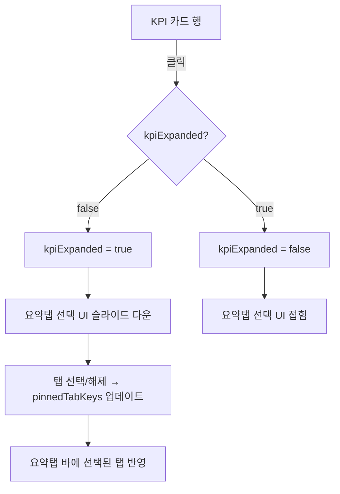
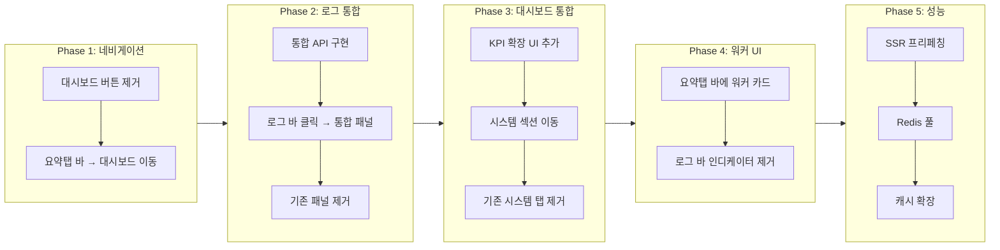

# 대시보드 통합 프로젝트 작업 계획서

> **프로젝트**: BlogAuto V2 대시보드/요약/로그 시스템 재구성  
> **버전**: v1.0.0  
> **작성일**: 2026-04-23  
> **예상 공수**: Phase 1~5 총 5~7일

---

## 1. 개요

### 1.1 프로젝트 목표

현재 BlogAuto V2의 대시보드, 요약탭, 로그 시스템이 분산/중복되어 있어 사용자 경험과 성능에 문제가 발생하고 있다. 이 프로젝트는 다음을 달성한다:

1. **네비게이션 단순화**: 대시보드 버튼 제거, 요약탭 바 클릭으로 대시보드 진입
2. **로그 통합**: 최근활동 + 동작로그 + 생성이력을 단일 "동작로그"로 통합
3. **대시보드 콘텐츠 통합**: 시스템 탭 내용을 대시보드에 통합, KPI 카드 확장 UI
4. **워커 UI 개선**: 로그 바의 G/P/U 인디케이터를 요약탭 바의 카드형 UI로 이동
5. **성능 최적화**: 즉시 로딩, Celery inspect 최적화, Redis 연결 재사용

### 1.2 핵심 원칙

- 기존 API 엔드포인트는 가능한 유지하고, 새 통합 API를 추가
- 프론트엔드 변경은 단계적으로 진행하여 중간 상태에서도 동작 보장
- 모든 변경은 모바일/PC 양쪽에서 테스트

---

## 2. 현재 상태 분석

### 2.1 분산된 UI 컴포넌트

| 컴포넌트 | 파일 위치 | 문제점 |
|---------|----------|--------|
| 대시보드 페이지 | `app/templates/dashboard/dashboard_v2.html` | 네비바의 "대시보드" 버튼으로만 접근 |
| 요약탭 패널 | `app/templates/components/global_summary.html` | 대시보드와 기능 중복 (요약탭 선택, 최근활동, 동작로그, 시스템) |
| 요약탭 JS | `app/static/js/components/GlobalSummary.js` (495줄) | 워커 상태, 로그, 시스템 탭 모두 포함 |
| 대시보드 JS | `app/static/js/dashboard/kpi_spark.js` | 별도 워커/로그 로딩 로직 존재 |
| 대시보드 워커 패널 | `app/static/js/dashboard/perf_panel.js` | 워커/로그 표시 헬퍼 (GlobalSummary와 중복) |

### 2.2 중복되는 로그 시스템

```
현재 3개의 로그 소스가 분산:

[최근 활동]  ← GlobalSummary.panelTab='activities'
  API: GET /api/v1/dashboard/activities
  표시: 타입 아이콘 + 이름 + 상세 + 시간

[동작 로그]  ← GlobalSummary.panelTab='logs'
  API: GET /api/v1/dashboard/logs
  표시: 시간 + 레벨 + 플랫폼 뱃지 + 메시지

[생성 이력]  ← 네비바 "생성 이력" 링크 → /generation/history
  API: GET /api/v1/generation/content
  표시: 별도 페이지 (generation_pages.py)
```

### 2.3 워커 상태 표시 중복

```
현재 워커 상태가 3곳에 표시:

1. 로그 바 (global_summary.html 41~57줄)
   → G●/P●/U● 텍스트 + 도트 + Q:n
   → 영문 약어로 가독성 낮음

2. 요약 패널 시스템 탭 (global_summary.html 417~434줄)
   → 워커 카드 (Online/Offline + 상세 정보)

3. 대시보드 v2 (dashboard_v2.html 146~153줄)
   → 워커 상태 패널 (perf_panel.js)
```

### 2.4 API 라우터 구조

| 라우터 | 파일 | 줄 수 | 주요 엔드포인트 |
|--------|------|-------|----------------|
| dashboard | `app/routers/dashboard.py` | 561줄 | `/summary`, `/stats`, `/activities`, `/logs` |
| dashboard_celery | `app/routers/dashboard_celery.py` | 318줄 | `/celery/status`, `/celery/workers`, `/celery/history` |
| dashboard_trends | `app/routers/dashboard_trends.py` | 128줄 | `/trends`, `/blog_stats`, `/hourly` |

### 2.5 성능 문제

- 대시보드 진입 시 8개 API를 `Promise.all`로 동시 호출 (`kpi_spark.js:39~48`)
- Celery `inspect()` 호출이 느림 (워커 오프라인 시 타임아웃 대기)
- 워커 캐시 TTL이 5초로 짧음 (`dashboard_celery.py:45`)
- Redis 연결을 매 요청마다 새로 생성

---

## 3. 변경 요약

| # | 변경 항목 | Before | After |
|---|----------|--------|-------|
| 1 | 대시보드 접근 | 네비바 "대시보드" 버튼 클릭 | 요약탭 바 클릭 |
| 2 | 네비바 대시보드 버튼 | 존재 | 제거 |
| 3 | 설정 버튼 위치 | 요약 패널 헤더 | 대시보드 우상단 |
| 4 | 최근활동 탭 | 요약 패널 내 독립 탭 | 통합 동작로그에 흡수 |
| 5 | 동작로그 탭 | 요약 패널 내 독립 탭 | 로그 바 클릭 시 열리는 통합 패널 |
| 6 | 생성이력 링크 | 네비바 독립 메뉴 | 통합 동작로그 필터로 접근 |
| 7 | 시스템 탭 | 요약 패널 내 독립 탭 | 대시보드에 통합 |
| 8 | 워커 인디케이터 | 로그 바의 G●/P●/U● | 요약탭 바의 카드형 UI |
| 9 | KPI 카드 | 정적 표시 | 클릭 시 요약탭 선택 UI 확장 |
| 10 | 데이터 로딩 | 페이지 진입 후 빈 프레임 | 즉시 로딩 + 캐시 |

---

## 4. Phase 1: 네비게이션 재구성

### 4.1 목표

- 네비바에서 "대시보드" 버튼 제거
- 요약탭 바 클릭 시 대시보드 페이지(`/dashboard`)로 이동
- 대시보드 페이지 내에 설정 버튼 배치

### 4.2 상세 변경

#### 4.2.1 네비바에서 대시보드 버튼 제거

**파일**: `app/templates/base.html`

```
변경 전 (168줄):
  <a href="/dashboard" class="bg-blue-700 ...">대시보드</a>

변경 후:
  (삭제)
```

- PC 메뉴 (168줄)와 모바일 메뉴 (203줄) 양쪽에서 제거
- 로고(`BlogAuto V2`) 클릭은 기존처럼 `/dashboard`로 이동 유지

#### 4.2.2 요약탭 바 클릭 시 대시보드 이동

**파일**: `app/templates/components/global_summary.html`

```
변경 전 (7줄):
  <div @click="togglePanel()" ...>

변경 후:
  <div @click="navigateToDashboard()" ...>
```

**파일**: `app/static/js/components/GlobalSummary.js`

```javascript
// 기존 togglePanel() 대체
navigateToDashboard() {
    // 이미 대시보드 페이지면 요약탭 선택 UI 확장
    if (window.location.pathname === '/dashboard') {
        this.expandKpiSelector();
        return;
    }
    window.location.href = '/dashboard';
},
```

#### 4.2.3 설정 버튼을 대시보드로 이동

**파일**: `app/templates/dashboard/dashboard_v2.html`

```
헤더 영역 (43~46줄) 변경:
  <div class="flex items-center justify-between mb-2">
      <h1 ...>Dashboard</h1>
+     <div class="flex items-center gap-2">
+         <button @click="openSettingsModal()" ...>⚙️</button>
          <span class="text-xs text-gray-400" x-text="lastUpdated"></span>
+     </div>
  </div>
```

### 4.3 네비게이션 플로우 (변경 후)

```mermaid
flowchart TD
    A[사용자] --> B{현재 위치}
    B -->|어느 페이지든| C[요약탭 바 클릭]
    C --> D{/dashboard인가?}
    D -->|No| E[/dashboard로 이동]
    D -->|Yes| F[KPI 카드 확장 - 요약탭 선택 UI]
    E --> G[대시보드 렌더링]
    G --> H[KPI + 차트 + 시스템 + 로그]

    A --> I[로고 클릭]
    I --> E

    A --> J[로그 바 클릭]
    J --> K[통합 동작로그 패널 열기]
```

### 4.4 체크리스트

- [ ] `base.html`: PC 메뉴에서 대시보드 링크 제거
- [ ] `base.html`: 모바일 메뉴에서 대시보드 링크 제거
- [ ] `global_summary.html`: `togglePanel()` → `navigateToDashboard()` 변경
- [ ] `GlobalSummary.js`: `navigateToDashboard()` 메서드 구현
- [ ] `dashboard_v2.html`: 헤더에 설정 버튼 추가
- [ ] `kpi_spark.js`: `openSettingsModal()` 메서드 추가
- [ ] 테스트: 모든 페이지에서 요약탭 바 클릭 시 대시보드 이동 확인
- [ ] 테스트: 대시보드에서 요약탭 바 클릭 시 KPI 확장 확인
- [ ] 테스트: 모바일에서 동일 동작 확인

---

## 5. Phase 2: 로그 통합

### 5.1 목표

- "최근활동" + "동작로그" + "생성이력(네비바)" → 단일 "동작로그"로 통합
- 로그 바 클릭 시 통합 동작로그 패널 열기
- 필터/검색으로 로그 타입 구분

### 5.2 현재 로그 소스 분석

#### 최근활동 (activities)
```
API: GET /api/v1/dashboard/activities?limit=5
소스: FlowExecutionState, AutorunLog, Blog, Module 변경 이벤트
데이터: { type, name, detail, timestamp }
타입: flow, blog, module, crawl, match
```

#### 동작로그 (logs)
```
API: GET /api/v1/dashboard/logs?limit=50
소스: ActionLog 테이블
데이터: { timestamp, level, message }
레벨: INFO, SUCCESS, WARN, ERROR
```

#### 생성이력 (generation history)
```
API: GET /api/v1/generation/content?limit=20
소스: GenerationHistory 테이블
데이터: { id, title, blog_name, status, created_at, ... }
별도 페이지: /generation/history
```

### 5.3 통합 API 설계

#### 새 엔드포인트: `GET /api/v1/dashboard/unified-logs`

```python
# 요청 파라미터
class UnifiedLogParams:
    limit: int = 30           # 조회 건수
    offset: int = 0           # 페이지네이션
    log_type: str = "all"     # "all" | "action" | "activity" | "generation"
    level: str = "all"        # "all" | "INFO" | "SUCCESS" | "WARN" | "ERROR"
    search: str = ""          # 메시지 검색
    since: str = ""           # ISO 날짜 (이후 로그만)

# 응답 형식
{
    "logs": [
        {
            "id": "action_123",
            "type": "action",        # action | activity | generation
            "timestamp": "2026-04-23T10:30:00",
            "level": "INFO",
            "icon": "⚡",            # 타입별 아이콘
            "title": "플로우 실행 완료",
            "detail": "[워] blog-001 수집 30건",
            "platform": "워",        # 플랫폼 뱃지 (nullable)
            "metadata": {}           # 추가 정보 (generation: blog_name, status 등)
        }
    ],
    "total": 150,
    "has_more": true
}
```

### 5.4 통합 로그 패널 UI

로그 바 클릭 시 하단에서 슬라이드 업되는 패널:

```
┌──────────────────────────────────────────────────────┐
│ [PC 레이아웃]                                          │
│                                                        │
│ ┌─ 요약탭 바 ──────────────────────────────────────┐  │
│ │ [활성블로그 12] [오늘생성 5] [생성워커 ●2] [발행워커 ●0] │  │
│ └──────────────────────────────────────────────────┘  │
│ ┌─ 로그 바 (클릭 시 아래 패널 토글) ──────────────────┐  │
│ │ 04/23 10:30:05 INFO [워] 수집 완료 30건              │  │
│ │ 04/23 10:29:12 SUCCESS 생성 완료: "AI 활용법"        │  │
│ └──────────────────────────────────────────────────┘  │
│                                                        │
│ ┌─ 통합 동작로그 패널 (슬라이드 다운) ─────────────────┐  │
│ │  [전체] [작업로그] [활동] [생성이력]  🔍 검색...      │  │
│ │  ─────────────────────────────────────────────      │  │
│ │  ⚙️ 로그 바 표시 설정                               │  │
│ │  노출 로그 수: [1] [2] [3]                          │  │
│ │  ─────────────────────────────────────────────      │  │
│ │  04/23 10:30:05 INFO  [워] blog-001 수집 완료 30건  │  │
│ │  04/23 10:29:12 ✅    생성 완료: "AI 활용법"         │  │
│ │  04/23 10:28:00 ⚡    플로우 #3 실행 시작             │  │
│ │  04/23 10:25:33 INFO  [구] blog-002 발행 완료        │  │
│ │  04/23 10:20:00 📝    블로그 "기술블로그" 설정 변경    │  │
│ │  ...                                                │  │
│ │  [더 보기]                                          │  │
│ └──────────────────────────────────────────────────┘  │
└──────────────────────────────────────────────────────┘
```

### 5.5 모바일 통합 로그 패널

```
┌────────────────────────┐
│ [모바일 레이아웃]        │
│                          │
│ ┌─ 요약탭 바 ──────────┐│
│ │ [활성블로그 12] [생성 5]││
│ │ [생성워커 ●2] [발행 ●0]││
│ └──────────────────────┘│
│ ┌─ 로그 바 ────────────┐│
│ │ 10:30 INFO 수집완료.. ││
│ └──────────────────────┘│
│                          │
│ ▼ 로그 바 클릭 시 ▼      │
│                          │
│ ┌─ 통합 로그 (풀스크린) ┐│
│ │ ✕ 닫기               ││
│ │ [전체][로그][활동][생성]││
│ │ 🔍 검색...           ││
│ │ ──────────────────── ││
│ │ ⚙️ 노출 수: [1][2][3]││
│ │ ──────────────────── ││
│ │ 10:30 INFO 수집완료   ││
│ │ 10:29 ✅ 생성완료     ││
│ │ ...                   ││
│ │ [더 보기]             ││
│ └──────────────────────┘│
└────────────────────────┘
```

### 5.6 요약 패널 탭 변경

기존 패널의 4개 탭을 정리:

| 기존 탭 | 변경 후 |
|---------|---------|
| 요약탭 선택 | 대시보드 KPI 확장 UI로 이동 (Phase 3) |
| 최근 활동 | 통합 동작로그에 흡수 |
| 동작 로그 | 통합 동작로그에 흡수 |
| 시스템 | 대시보드에 통합 (Phase 3) |

결과: 기존 전체 화면 요약 패널(`panelOpen`)은 제거됨

### 5.7 체크리스트

- [ ] `dashboard.py`: `GET /dashboard/unified-logs` 엔드포인트 구현
- [ ] `dashboard.py`: activities + logs + generation을 통합 쿼리
- [ ] `global_summary.html`: 로그 바에 `@click="toggleLogPanel()"` 추가
- [ ] `global_summary.html`: 통합 로그 패널 HTML 추가 (슬라이드 다운)
- [ ] `global_summary.html`: 기존 전체화면 패널 (panelOpen) 제거
- [ ] `GlobalSummary.js`: `toggleLogPanel()`, `loadUnifiedLogs()` 구현
- [ ] `GlobalSummary.js`: 필터/검색 로직 구현
- [ ] `GlobalSummary.js`: 기존 `loadActivities()`, `loadLogs()` 제거
- [ ] `base.html`: 네비바에서 "생성 이력" 링크 제거 (통합 로그에서 접근)
- [ ] `generation_pages.py`: `/generation/history` 페이지는 유지 (직접 접근 가능)
- [ ] 테스트: 로그 바 클릭 시 통합 패널 열림 확인
- [ ] 테스트: 필터 전환 (전체/작업/활동/생성) 동작 확인
- [ ] 테스트: 검색 기능 동작 확인
- [ ] 테스트: 모바일에서 풀스크린 패널 동작 확인

---

## 6. Phase 3: 대시보드 통합

### 6.1 목표

- 시스템 탭 콘텐츠 (워커 카드, 큐 상태, 최근 태스크) → 대시보드에 통합
- KPI 카드 클릭 시 요약탭 선택 UI 확장
- 대시보드 디자인 (Sora 폰트, 컴팩트 카드) 통일

### 6.2 대시보드 레이아웃 (변경 후)

```
┌──────────────────────────────────────────────────────────────────┐
│ [대시보드 PC 레이아웃]                                             │
│                                                                    │
│  Dashboard                                    ⚙️ 설정  14:30:05   │
│                                                                    │
│  ┌─ KPI 카드 행 (클릭 시 확장) ─────────────────────────────────┐  │
│  │ [활성블로그] [오늘생성] [오늘발행] [성공률] [대기큐]            │  │
│  │    12          5         3        92%      2                  │  │
│  │  ▃▅▇▅▃      ▁▃▅▇▅    ▁▂▃▅▇    ▇▇▇▅▃    ▁▁▂▁▁             │  │
│  └──────────────────────────────────────────────────────────────┘  │
│                                                                    │
│  ▼ KPI 클릭 시 확장되는 요약탭 선택 UI ▼                          │
│  ┌──────────────────────────────────────────────────────────────┐  │
│  │ 블로그                                                        │  │
│  │ [전체 15] [워드프레스 8] [블로거 7] [✓활성 12] [비활성 3]      │  │
│  │                                                                │  │
│  │ 카테고리                                                       │  │
│  │ [주제 20] [하위주제 45] [키워드 120]                            │  │
│  │                                                                │  │
│  │ 모듈                                                           │  │
│  │ [전체 30] [프롬프트 8] [생성 6] [발행 8] [재발행 5] [GP 3]     │  │
│  │                                                                │  │
│  │ 플로우                      이번 주             오늘           │  │
│  │ [전체 10] [활성 7] [비활성 3] [생성 35] [발행 28] [생성 5]     │  │
│  └──────────────────────────────────────────────────────────────┘  │
│                                                                    │
│  ┌─ 차트 행 ─────────────────┐  ┌─ 시간대별 ──────────┐          │
│  │ 생성/발행 추이 [7d][30d][90d] │  │ 시간대별 생성 분포   │          │
│  │  📈 라인 차트                │  │  📊 컬럼 차트        │          │
│  │  ── 콘텐츠 상태 바 ──       │  │                      │          │
│  └────────────────────────────┘  └──────────────────────┘          │
│                                                                    │
│  ┌─ 블로그별 생성량 (7일) ──────────────────────────────────────┐  │
│  │  기술블로그  ████████████████  25                              │  │
│  │  일상블로그  ████████          12                              │  │
│  └──────────────────────────────────────────────────────────────┘  │
│                                                                    │
│  ┌─ 콘텐츠 테이블 (60%) ───────┐  ┌─ 시스템 상태 (40%) ────────┐  │
│  │ 최근 생성 콘텐츠              │  │ 워커 상태                    │  │
│  │ ┌────┬───────┬────┬───┐    │  │ ┌──────┬──────┬──────┐    │  │
│  │ │시간│제목    │블로그│상태│    │  │ │ 생성  │ 발행  │ 유틸  │    │  │
│  │ ├────┼───────┼────┼───┤    │  │ │ ●Online│●Online│●Off  │    │  │
│  │ │10:30│AI활용법│기술 │ ✅ │    │  │ │ 활성:2│ 활성:0│ -    │    │  │
│  │ └────┴───────┴────┴───┘    │  │ │ 완료:48│ 완료:35│ -    │    │  │
│  │ 전체보기 →                   │  │ └──────┴──────┴──────┘    │  │
│  └────────────────────────────┘  │                              │  │
│                                    │ 큐 상태                      │  │
│                                    │ generation ██░░ 3 대기       │  │
│                                    │ publish    ░░░░ 0 대기       │  │
│                                    │                              │  │
│                                    │ 최근 태스크                   │  │
│                                    │ 10:30 ✅ generate_content    │  │
│                                    │ 10:28 ✅ recombine_title     │  │
│                                    │ 🌸 Flower 상세 보기          │  │
│                                    └──────────────────────────────┘  │
└──────────────────────────────────────────────────────────────────┘
```

### 6.3 KPI 카드 확장 메커니즘



**구현 핵심**:
- `compactDashboard()`에 `kpiExpanded: false` 상태 추가
- KPI 카드 행에 `@click="kpiExpanded = !kpiExpanded"` 바인딩
- 확장 UI는 기존 `global_summary.html`의 요약탭 선택 콘텐츠를 Sora 폰트 스타일로 재디자인

### 6.4 시스템 섹션 통합

기존 `global_summary.html`의 시스템 탭 내용을 `dashboard_v2.html`의 우측 하단 영역에 통합:

- 워커 카드 3개 (생성/발행/유틸)
- 큐 상태 프로그레스 바
- 최근 태스크 리스트
- Flower 링크

**데이터 소스**: 기존 `/api/v1/dashboard/celery/workers` + `/celery/status` + `/celery/history` 그대로 사용

### 6.5 디자인 통일

요약탭 선택 UI에 대시보드 디자인 적용:

```css
/* 요약탭 선택 카드도 dashboard 스타일 사용 */
.summary-select-card {
    font-family: 'Sora', sans-serif;
    background: white;
    border: 0.5px solid #e5e7eb;
    border-radius: 12px;
    padding: 12px 16px;
    cursor: pointer;
    transition: all 0.2s;
}
.summary-select-card.selected {
    border-color: var(--accent-color);
    box-shadow: 0 0 0 2px var(--accent-color-light);
}
```

### 6.6 체크리스트

- [ ] `dashboard_v2.html`: KPI 카드 행에 클릭 이벤트 추가
- [ ] `dashboard_v2.html`: KPI 아래에 접이식 요약탭 선택 UI 추가
- [ ] `dashboard_v2.html`: 우측 하단에 시스템 상태 섹션 추가 (워커/큐/태스크)
- [ ] `dashboard_v2.html`: 헤더에 설정 버튼 추가
- [ ] `kpi_spark.js`: `kpiExpanded` 상태 + `toggleKpiExpand()` 메서드
- [ ] `kpi_spark.js`: `loadSystemData()` 메서드 추가 (celery API 호출)
- [ ] `kpi_spark.js`: 요약탭 선택 로직 (pinnedTabKeys 동기화)
- [ ] `perf_panel.js`: 시스템 상태 렌더링 로직 확장
- [ ] Sora 폰트 스타일을 요약탭 선택 카드에 적용
- [ ] `global_summary.html`: 시스템 탭 관련 HTML 제거
- [ ] `GlobalSummary.js`: 시스템 탭 관련 로직 제거 (`systemWorkers`, `systemQueues`, `recentTasks`)
- [ ] 테스트: KPI 카드 클릭 시 요약탭 선택 UI 확장/접힘 확인
- [ ] 테스트: 요약탭 선택이 요약탭 바에 즉시 반영 확인
- [ ] 테스트: 시스템 상태가 대시보드에서 정상 표시 확인
- [ ] 테스트: 모바일에서 레이아웃 확인

---

## 7. Phase 4: 워커 UI 이동

### 7.1 목표

- 로그 바의 G●/P●/U● 인디케이터 제거
- 요약탭 바에 워커 상태 카드 추가
- 한국어 레이블 + 상태 도트 + 활성 작업 수 표시

### 7.2 요약탭 바 새 레이아웃

```
┌─ 요약탭 바 (PC) ─────────────────────────────────────────────────────┐
│                                                                        │
│ [활성블로그    ] [오늘생성    ] [오늘발행    ] ║ [생성 워커   ] [발행 워커   ] [유틸 워커   ] │
│ [    12       ] [    5       ] [    3       ] ║ [   ● 2     ] [   ● 0     ] [   ●       ] │
│  bg-blue-50      bg-orange-50   bg-red-50    ║  bg-gray-100   bg-gray-100   bg-gray-100  │
│                                               ║  dot:green     dot:green     dot:red      │
└───────────────────────────────────────────────────────────────────────┘

┌─ 요약탭 바 (모바일, 2열 그리드) ──────────────┐
│ [활성블로그  12] [오늘생성   5]                   │
│ [오늘발행    3] [생성워커 ●2]                    │
│ [발행워커  ●0 ] [유틸워커  ● ]                   │
└───────────────────────────────────────────────┘
```

### 7.3 워커 카드 컴포넌트 설계

```html
<!-- 워커 상태 카드 (요약탭 바 내) -->
<div class="flex items-center gap-2 rounded-xl px-4 py-2.5 bg-gray-100 whitespace-nowrap shadow-sm">
    <span class="text-sm font-medium text-gray-600">생성 워커</span>
    <span class="w-2.5 h-2.5 rounded-full"
          :class="{
              'bg-green-400': workerStatus.workers.generation.status === 'online',
              'bg-red-400': workerStatus.workers.generation.status === 'offline',
              'bg-gray-400': workerStatus.workers.generation.status === 'unknown',
              'animate-pulse': workerStatus.workers.generation.active_tasks > 0
          }"></span>
    <span class="font-bold text-lg text-gray-800"
          x-text="workerStatus.workers.generation.status === 'online'
              ? workerStatus.workers.generation.active_tasks
              : ''"></span>
</div>
```

### 7.4 워커 카드 상태 표현

| 상태 | 도트 색상 | 숫자 표시 | 예시 |
|------|----------|----------|------|
| Online + 활성 작업 | `bg-green-400 animate-pulse` | 활성 작업 수 | `생성 워커 ●2` |
| Online + 유휴 | `bg-green-400` | `0` | `발행 워커 ●0` |
| Offline | `bg-red-400` | (빈칸) | `유틸 워커 ●` |
| 확인중 | `bg-gray-400` | (빈칸) | `생성 워커 ●` |

### 7.5 로그 바 변경

```
변경 전:
┌────────────────────────────────────────────────────┐
│ G● P● U● Q:3 │ 04/23 10:30 INFO 수집 완료 30건    │
└────────────────────────────────────────────────────┘

변경 후:
┌────────────────────────────────────────────────────┐
│ 04/23 10:30:05 INFO [워] 수집 완료 30건             │
│ 04/23 10:29:12 SUCCESS 생성 완료: "AI 활용법"       │
└────────────────────────────────────────────────────┘
```

- 워커 인디케이터 영역 전체 제거
- 구분선(`div.w-px`) 제거
- 로그 메시지가 전체 너비를 사용
- 대기 큐 수(`Q:n`)는 대시보드 KPI "대기 큐" 카드에서 확인

### 7.6 체크리스트

- [ ] `global_summary.html`: 요약탭 바에 워커 카드 3개 추가
- [ ] `global_summary.html`: 로그 바에서 워커 인디케이터 영역 제거 (41~57줄)
- [ ] `global_summary.html`: 로그 바에서 구분선 제거
- [ ] `GlobalSummary.js`: 워커 카드 데이터 바인딩 (기존 `workerStatus` 활용)
- [ ] CSS: 요약탭 바 모바일 그리드에 워커 카드 포함
- [ ] 테스트: 워커 온라인/오프라인 상태 표시 확인
- [ ] 테스트: 활성 작업 수 실시간 업데이트 확인
- [ ] 테스트: 모바일 2열 그리드에서 워커 카드 표시 확인
- [ ] 테스트: 로그 바 전체 너비 사용 확인

---

## 8. Phase 5: 성능 최적화

### 8.1 목표

- 대시보드 진입 시 데이터 즉시 표시 (빈 프레임 제거)
- 시스템 데이터 즉시 로딩
- Celery inspect 타임아웃 단축
- Redis 연결 재사용
- 워커 상태 적극적 캐싱

### 8.2 Celery Inspect 최적화

**파일**: `app/routers/dashboard_celery.py`

```python
# 변경 전
_CACHE_TTL: float = 5.0  # 5초 캐시

# 변경 후
_CACHE_TTL: float = 15.0  # 15초 캐시 (워커 폴링도 15초)

# inspect 타임아웃 단축
def _inspect_workers():
    """Celery inspect with short timeout."""
    from celery import current_app
    inspector = current_app.control.inspect(timeout=1.0)  # 기존 3초 → 1초
    # ...
```

### 8.3 Redis 연결 풀 재사용

**파일**: `app/core/redis_pool.py` (신규)

```python
"""Redis 연결 풀 싱글턴 모듈."""
import redis
from functools import lru_cache

@lru_cache(maxsize=1)
def get_redis_pool() -> redis.ConnectionPool:
    """Redis 연결 풀을 싱글턴으로 반환."""
    return redis.ConnectionPool(
        host=os.getenv("REDIS_HOST", "redis"),
        port=int(os.getenv("REDIS_PORT", 6379)),
        db=int(os.getenv("REDIS_DB", 0)),
        max_connections=10,
        decode_responses=True,
    )

def get_redis_client() -> redis.Redis:
    """풀에서 Redis 클라이언트 반환."""
    return redis.Redis(connection_pool=get_redis_pool())
```

**파일**: `app/routers/dashboard_celery.py` 변경

```python
# 변경 전: 매번 새 연결
import redis
r = redis.Redis(host=..., port=...)

# 변경 후: 풀에서 가져오기
from ..core.redis_pool import get_redis_client
r = get_redis_client()
```

### 8.4 대시보드 데이터 프리페칭

**전략 1: SSR 초기 데이터**

```python
# app/routers/dashboard.py (페이지 라우터)
@router.get("/dashboard", response_class=HTMLResponse)
async def dashboard_page(request: Request, db: AsyncSession = Depends(get_db_session)):
    """대시보드 페이지 렌더링 (초기 데이터 포함)."""
    initial_data = await _get_dashboard_initial_data(db)
    return templates.TemplateResponse(
        "dashboard/dashboard_v2.html",
        {"request": request, "initial_data": json.dumps(initial_data)}
    )
```

```html
<!-- dashboard_v2.html -->
<script>
    window.__DASHBOARD_INITIAL__ = {{ initial_data | safe }};
</script>
```

```javascript
// kpi_spark.js
async init() {
    // SSR 데이터가 있으면 즉시 사용
    if (window.__DASHBOARD_INITIAL__) {
        this._applyInitialData(window.__DASHBOARD_INITIAL__);
        delete window.__DASHBOARD_INITIAL__;
    }
    // 백그라운드에서 최신 데이터 갱신
    await this.loadAll();
    // ...
}
```

**전략 2: 워커 상태 캐시 확장**

```python
# 워커 상태 캐시를 Redis에도 저장 (프로세스간 공유)
REDIS_WORKER_CACHE_KEY = "blogauto:worker_status"
REDIS_CACHE_TTL = 30  # 30초

async def get_cached_worker_status():
    """Redis 캐시 → 메모리 캐시 → inspect 순으로 조회."""
    # 1. 메모리 캐시 확인
    if _worker_cache and time.time() - _worker_cache_time < _CACHE_TTL:
        return _worker_cache

    # 2. Redis 캐시 확인
    r = get_redis_client()
    cached = r.get(REDIS_WORKER_CACHE_KEY)
    if cached:
        data = json.loads(cached)
        _update_memory_cache(data)
        return data

    # 3. inspect 호출 (최후 수단)
    data = _inspect_workers()
    r.setex(REDIS_WORKER_CACHE_KEY, REDIS_CACHE_TTL, json.dumps(data))
    _update_memory_cache(data)
    return data
```

### 8.5 프론트엔드 최적화

| 최적화 | 상세 |
|--------|------|
| API 호출 병렬화 | 기존 `Promise.all` 유지 + 실패 시 개별 fallback |
| 초기 렌더링 | SSR 데이터로 즉시 표시, 이후 API로 갱신 |
| 조건부 로딩 | 시스템 섹션은 대시보드 진입 시에만 로딩 |
| 폴링 주기 | 워커: 15초, 로그: 10초, 통계: 30초 (기존 유지) |
| 캐시 활용 | `sessionStorage`에 마지막 데이터 저장, 페이지 재진입 시 즉시 표시 |

### 8.6 체크리스트

- [ ] `dashboard_celery.py`: 캐시 TTL 5초 → 15초
- [ ] `dashboard_celery.py`: inspect timeout 3초 → 1초
- [ ] `app/core/redis_pool.py`: Redis 연결 풀 싱글턴 모듈 생성
- [ ] `dashboard_celery.py`: Redis 연결 풀 사용으로 변경
- [ ] `dashboard.py` (페이지 라우터): SSR 초기 데이터 전달
- [ ] `dashboard_v2.html`: `window.__DASHBOARD_INITIAL__` 스크립트 추가
- [ ] `kpi_spark.js`: SSR 데이터 즉시 적용 로직
- [ ] `kpi_spark.js`: `sessionStorage` 캐시 로직
- [ ] `dashboard_celery.py`: Redis 기반 워커 상태 캐시
- [ ] 테스트: 대시보드 진입 시 즉시 데이터 표시 확인
- [ ] 테스트: 워커 오프라인 시 타임아웃 속도 확인
- [ ] 테스트: Redis 연결 풀 정상 동작 확인
- [ ] 테스트: 메모리 누수 없음 확인 (연결 풀)

---

## 9. 파일 변경 목록

### 9.1 수정 파일

| 파일 | Phase | 변경 내용 |
|------|-------|----------|
| `app/templates/base.html` | 1, 2 | 대시보드/생성이력 네비 링크 제거 |
| `app/templates/components/global_summary.html` | 1, 2, 3, 4 | 전면 재구성 (패널 제거, 로그 바 변경, 워커 카드 추가) |
| `app/static/js/components/GlobalSummary.js` | 1, 2, 3, 4 | navigateToDashboard, toggleLogPanel, 시스템 탭 제거, 워커 카드 |
| `app/templates/dashboard/dashboard_v2.html` | 3, 5 | KPI 확장 UI, 시스템 섹션, 설정 버튼, SSR 데이터 |
| `app/static/js/dashboard/kpi_spark.js` | 3, 5 | kpiExpanded, loadSystemData, SSR 초기화 |
| `app/static/js/dashboard/perf_panel.js` | 3 | 시스템 상태 렌더링 확장 |
| `app/routers/dashboard.py` | 2, 5 | unified-logs API, SSR 초기 데이터 |
| `app/routers/dashboard_celery.py` | 5 | 캐시 TTL, inspect timeout, Redis 풀 |

### 9.2 신규 파일

| 파일 | Phase | 내용 |
|------|-------|------|
| `app/core/redis_pool.py` | 5 | Redis 연결 풀 싱글턴 |

### 9.3 제거 대상 (코드 블록)

| 위치 | Phase | 제거 내용 |
|------|-------|----------|
| `global_summary.html` 112~491줄 | 2, 3 | 전체화면 슬라이드 패널 + 백드롭 |
| `global_summary.html` 44~57줄 | 4 | 로그 바 워커 인디케이터 |
| `GlobalSummary.js` systemWorkers 관련 | 3 | 시스템 탭 상태/로직 |
| `GlobalSummary.js` loadActivities() | 2 | 최근활동 별도 로딩 |
| `GlobalSummary.js` panelTab 분기 | 2 | 4탭 패널 로직 |

---

## 10. 마이그레이션 전략

### 10.1 단계별 전환



### 10.2 안전 전환 규칙

1. **API 호환성**: 기존 API 엔드포인트는 삭제하지 않고, 새 통합 API를 추가한다. 기존 API는 deprecated 표시 후 다음 메이저 버전에서 제거.

2. **Feature Flag 방식**: GlobalSummary.js에 `DASHBOARD_V2_MODE` 플래그를 두어, 문제 발생 시 기존 동작으로 즉시 롤백 가능.

```javascript
// GlobalSummary.js
const DASHBOARD_V2_MODE = true; // false로 변경 시 기존 동작 복원

navigateToDashboard() {
    if (!DASHBOARD_V2_MODE) {
        this.togglePanel(); // 기존 패널 열기
        return;
    }
    // 새 동작: 대시보드로 이동
    window.location.href = '/dashboard';
},
```

3. **점진적 배포**: Phase별로 독립 커밋 + 테스트 후 배포. Phase 간 의존성이 있으나, 각 Phase 완료 후 독립적으로 동작 가능하도록 설계.

4. **데이터 무손실**: 로그 데이터, 통계 데이터, 설정(pinnedTabKeys)은 기존 localStorage/DB에서 그대로 유지.

### 10.3 롤백 계획

| Phase | 롤백 방법 |
|-------|----------|
| Phase 1 | `base.html` 대시보드 링크 복원 + `DASHBOARD_V2_MODE = false` |
| Phase 2 | `DASHBOARD_V2_MODE` 내 로그 분기로 기존 패널 복원 |
| Phase 3 | 대시보드에서 시스템 섹션 숨김, 요약 패널 시스템 탭 복원 |
| Phase 4 | 로그 바 워커 인디케이터 복원, 요약탭 바 워커 카드 숨김 |
| Phase 5 | SSR 제거, 캐시 TTL 원복 (기능 영향 없음) |

---

## 11. 리스크 및 고려사항

### 11.1 기술 리스크

| 리스크 | 영향도 | 대응 방안 |
|--------|--------|----------|
| GlobalSummary.js 대규모 변경으로 인한 리그레션 | 높음 | Feature Flag + 단계적 변경 |
| SSR 초기 데이터와 클라이언트 데이터 불일치 | 중간 | 클라이언트 로드 시 SSR 데이터 덮어쓰기 |
| Redis 연결 풀 고갈 | 낮음 | max_connections=10 + 모니터링 |
| Celery inspect timeout 1초가 너무 짧음 | 중간 | 워커 응답 못 받을 경우 캐시 데이터 반환 |
| 모바일 레이아웃 깨짐 | 중간 | 각 Phase마다 모바일 테스트 필수 |

### 11.2 UX 고려사항

| 항목 | 고려 내용 |
|------|----------|
| 학습 곡선 | 기존 사용자가 대시보드 버튼 제거에 혼란 가능 → 로고 클릭 안내 |
| 로그 통합 | 기존 3개 탭 사용자가 필터링 방법 학습 필요 → 기본값 "전체" |
| 워커 카드 | 요약탭 바 공간 제약 → 워커 카드는 최소 너비 유지 |
| 생성 이력 접근 | 네비바에서 제거되지만 대시보드 "전체보기" + 통합 로그 필터로 접근 가능 |

### 11.3 성능 고려사항

| 항목 | 현재 | 목표 |
|------|------|------|
| 대시보드 첫 렌더링 | ~2초 (빈 프레임 → API 로드) | <0.5초 (SSR 즉시 표시) |
| 워커 상태 표시 | ~3초 (inspect 타임아웃) | <1초 (캐시 + 짧은 timeout) |
| 시스템 탭 로딩 | 탭 클릭 후 ~2초 | 대시보드 진입 시 병렬 로딩 |
| 로그 바 갱신 | 10초 폴링 | 10초 폴링 유지 (충분) |

### 11.4 파일 크기 제약

CLAUDE.md 규칙에 따라 모든 파일은 500줄 이하를 유지해야 한다:

| 파일 | 현재 줄 수 | 예상 변경 후 | 조치 |
|------|-----------|------------|------|
| `GlobalSummary.js` | 495줄 | ~350줄 (패널/시스템 탭 제거) | 안전 |
| `dashboard.py` | 561줄 | ~620줄 (unified-logs 추가) | 분리 필요 |
| `global_summary.html` | 491줄 | ~200줄 (대폭 축소) | 안전 |

`dashboard.py`는 Phase 2에서 `dashboard_logs.py`로 로그 관련 엔드포인트를 분리하여 500줄 이하를 유지한다.

---

## 부록 A: Mermaid 다이어그램

### A.1 전체 네비게이션 플로우 (변경 후)

```mermaid
flowchart TD
    START[사용자 접속] --> NAV[네비게이션 바]
    NAV --> LOGO[로고 클릭]
    NAV --> MENU[메뉴 항목 클릭]

    LOGO --> DASH[/dashboard 이동]

    MENU --> |데이터관리| COL[/collection]
    MENU --> |블로그관리| BLOG[/blogs]
    MENU --> |카테고리| CAT[/categories]
    MENU --> |모듈관리| MOD[/modules]
    MENU --> |플로우관리| FLOW[/flows]
    MENU --> |오토런| AUTO[/autorun]

    START --> SUMBAR[요약탭 바 클릭]
    SUMBAR --> CHECK{현재 /dashboard?}
    CHECK --> |No| DASH
    CHECK --> |Yes| EXPAND[KPI 확장 - 요약탭 선택]

    START --> LOGBAR[로그 바 클릭]
    LOGBAR --> LOGPANEL[통합 동작로그 패널]
    LOGPANEL --> FILTER[필터: 전체/작업/활동/생성]
    LOGPANEL --> SEARCH[검색]
    LOGPANEL --> SETTINGS[로그 바 표시 설정]

    DASH --> KPI[KPI 카드 클릭]
    KPI --> EXPAND
    DASH --> CHART[차트 영역]
    DASH --> CONTENT[최근 콘텐츠]
    DASH --> SYSTEM[시스템 상태]
    DASH --> SETTINGSBTN[설정 버튼]
    SETTINGSBTN --> SETTINGSMODAL[설정 모달]
```

### A.2 데이터 흐름 (변경 후)

```mermaid
flowchart LR
    subgraph Backend
        DB[(PostgreSQL)]
        REDIS[(Redis)]
        CELERY[Celery Workers]
    end

    subgraph API
        SUMMARY[/dashboard/summary]
        TRENDS[/dashboard/trends]
        WORKERS[/dashboard/celery/workers]
        UNIFIED[/dashboard/unified-logs]
        STATS[/dashboard/stats]
    end

    subgraph Frontend
        SUMBAR[요약탭 바]
        LOGBAR[로그 바]
        DASHPAGE[대시보드 페이지]
        LOGPANEL[통합 로그 패널]
    end

    DB --> SUMMARY --> DASHPAGE
    DB --> TRENDS --> DASHPAGE
    DB --> UNIFIED --> LOGPANEL
    DB --> STATS --> SUMBAR
    REDIS --> WORKERS --> DASHPAGE
    REDIS --> WORKERS --> SUMBAR
    CELERY --> REDIS
```

---

## 부록 B: API 엔드포인트 변경 요약

### 새로 추가

| 메서드 | 경로 | 설명 |
|--------|------|------|
| GET | `/api/v1/dashboard/unified-logs` | 통합 동작로그 (필터/검색/페이지네이션) |

### 변경 (내부 로직)

| 메서드 | 경로 | 변경 내용 |
|--------|------|----------|
| GET | `/api/v1/dashboard/celery/workers` | inspect timeout 단축, Redis 캐시 추가 |
| GET | `/dashboard` (페이지) | SSR 초기 데이터 전달 |

### 유지 (Deprecated 예정)

| 메서드 | 경로 | 비고 |
|--------|------|------|
| GET | `/api/v1/dashboard/activities` | unified-logs로 대체 가능 |
| GET | `/api/v1/dashboard/logs` | unified-logs로 대체 가능 |

---

*End of Document*
