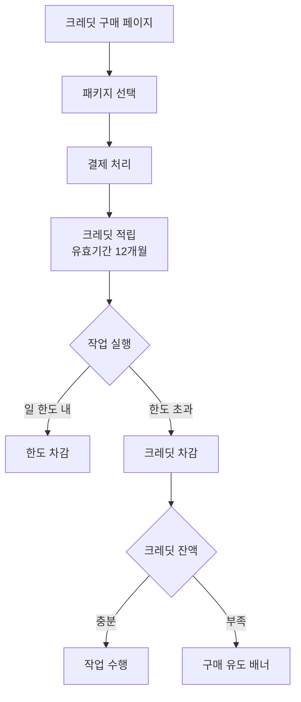

# BlogAuto V2 사용자 그레이드 및 요금제 계획서

> **버전**: v1.2.0 | **작성일**: 2026-04-05
> **관련 문서**: queue_worker_system_plan.md (큐/워커 시스템)
> **목표**: SaaS 그레이드별 요금제, 크레딧 시스템, 블로그 교체 정책 정의

---

## 1. SaaS 그레이드별 요금제 설계

### 1.0 중앙 서버 부재 시 기본 동작 (Standalone Mode)

**현재 상태**: 중앙 라이선스 서버 미구축. 그레이드 체계는 설계만 완료, 실제 과금/제한 적용 불가.

**초기 배포 정책**: **Pro 그레이드 무제한 모드로 기본 동작**

#### 1.0.1 Standalone Mode 동작 규칙

```
┌─────────────────────────────────────────────────────────┐
│ BlogAuto 설치 시 기본 설정                               │
├─────────────────────────────────────────────────────────┤
│                                                         │
│  license_mode: "standalone"                             │
│  grade: "pro"                                           │
│                                                         │
│  적용 제한:                                              │
│    - 블로그 수: 제한 없음 (500개 이상 가능)              │
│    - 일 생성량: 제한 없음                                │
│    - 일 발행량: 제한 없음                                │
│    - 블로그 교체: 무제한                                 │
│    - 모든 기능 잠금 해제                                 │
│                                                         │
│  워커 설정:                                              │
│    - Pro 그레이드 워커 수 적용 (총 20개)                 │
│      · generation: 4 전용 + Flex                        │
│      · publish: 3 전용 + Flex                           │
│      · image: 2 전용 + Flex                             │
│      · utility: 1 전용 + Flex                           │
│      · flex: 10개 (공유 풀)                             │
│                                                         │
└─────────────────────────────────────────────────────────┘
```

#### 1.0.2 환경 변수 기반 제어

`.env` 파일에서 설정:

```bash
# 라이선스 모드
LICENSE_MODE=standalone            # standalone | licensed

# 기본 그레이드 (standalone 모드일 때만 적용)
DEFAULT_GRADE=pro                  # free | lite | basic | standard | pro

# 사용자 서버 사양 기반 워커 수 오버라이드 (선택)
WORKER_GENERATION_FIXED=4
WORKER_PUBLISH_FIXED=3
WORKER_IMAGE_FIXED=2
WORKER_UTILITY_FIXED=1
WORKER_FLEX_POOL=10
```

#### 1.0.3 중앙 서버 연동 전환 방법

향후 중앙 라이선스 서버 구축 완료 시:

**Step 1: 라이선스 모드 변경**
```bash
# .env 수정
LICENSE_MODE=licensed
LICENSE_SERVER_URL=https://license.blogauto.com
LICENSE_API_KEY=<발급받은 키>
```

**Step 2: BlogAuto 재시작**
```bash
docker-compose restart app
```

**Step 3: 라이선스 검증 및 그레이드 자동 적용**
- 앱 시작 시 LicenseService가 중앙 서버에 검증 요청
- 응답에 따라 사용자 그레이드/한도 적용
- 기존 데이터(블로그/글 등)는 그대로 유지
- 블로그 수가 상위 한도 초과 시 경고만 표시 (삭제 강제 안 함)

#### 1.0.4 초과 상태 처리 (Over-quota State)

**상황**: Standalone 모드에서 Pro 무제한으로 운영 → 라이선스 모드 전환 시 블로그 수 초과 가능

**처리 방식**:
```
블로그 수 초과 시:
  - 기존 블로그: 발행/재발행 계속 가능 (데이터 유지)
  - 신규 블로그 등록: 차단
  - UI 경고 표시: "블로그 수가 Pro 한도(500개)를 초과합니다"
  - 해결 방법:
    a) 상위 그레이드 업그레이드 (필요 시)
    b) 초과 블로그 비활성화/삭제
    c) 현재 상태 유지 (기능 제한 수용)

일 생성/발행 초과 시:
  - 당일 한도 소진 시 중단
  - 다음 날 리셋
  - 사용자에게 그레이드 한도 안내
```

#### 1.0.5 Standalone 모드의 전략적 의미

**초기 단계 (현재 ~ 중앙 서버 구축 전)**:
- 개인 테스트/베타 사용자에게 무료 Pro 기능 제공
- 피드백 수집 및 기능 안정화
- 유료화 시 사용자 전환 기반 확보

**중앙 서버 구축 후**:
- 기존 Standalone 사용자는 그대로 유지 가능 (grandfather 정책)
- 신규 사용자부터 정식 그레이드 체계 적용
- 기존 사용자에게 유료 전환 유도 (선택적)

**보안/과금 고려사항**:
- Standalone 모드는 **불법 복제/우회 사용 가능**
- 중앙 서버 연동 전까지는 라이선스 강제 불가
- 라이선스 서버 구축 시 "원격 비활성화" 기능 포함 필요
- 배포 시 SECRET_KEY 기반 설치 고유 ID 생성하여 추적 준비

### 1.1 배포 아키텍처 전제

BlogAuto v2는 **분산 서버 아키텍처**를 채택한다. 각 사용자는 자신의 Oracle Cloud 서버(또는 동급 VPS)에 BlogAuto 인스턴스를 독립 설치하여 운영하며, 본사는 라이선스/과금/원격 제어 기능만 중앙 제공한다.

- **사용자 서버 사양 기준**: Oracle Free Tier (4 vCPU / 24GB RAM / 200GB 디스크) 또는 동급
- **본사 중앙 서버**: 라이선스 검증, 원격 설정 배포, 사용량 집계, 과금 처리
- **워커 실행 위치**: 사용자 서버 내부 Docker Compose 스택
- **데이터베이스**: 사용자 서버 내 PostgreSQL (사용자 데이터 격리 보장)

이 구조 하에서 그레이드는 "사용자 서버에서 실행 가능한 워커 수 + 일일 생성/발행 한도 + 블로그 등록 한도"로 정의된다.

### 1.2 5단계 그레이드 체계 (최종 확정)

```
┌──────────┬──────────┬──────────────┬──────────────┬──────────┐
│ 그레이드  │ 블로그 수 │ 일 생성량     │ 일 발행량     │ 월 과금   │
├──────────┼──────────┼──────────────┼──────────────┼──────────┤
│ Free     │   1개    │ 체험 크레딧   │ 체험 크레딧   │  ₩0      │
│ Lite     │   5개    │   20건       │   20건       │  ₩15,000 │
│ Basic    │  20개    │   60건       │   60건       │  ₩29,000 │
│ Standard │ 100개    │  300건       │  300건       │  ₩99,000 │
│ Pro      │ 500개    │ 1,500건      │ 1,500건      │ ₩299,000 │
└──────────┴──────────┴──────────────┴──────────────┴──────────┘
```

**그레이드 설계 근거**:
- **Free**: 체험/평가용. 일회성 크레딧 100개 지급 (재지급 없음). 블로그 1개 등록, 유효기간 30일
- **Lite**: 개인 블로거용. 5개 블로그 운영 가능한 실사용 진입점
- **Basic**: 개인 전문가/소규모 운영자용. 블로그 20개, 일 60건 (기존 10개 → 20개로 확대)
- **Standard**: 중형 블로그 네트워크 운영자용. 100개 블로그, 일 300건으로 본격 자동화
- **Pro**: 대형 블로그 네트워크/에이전시용. 500개 블로그, 일 1,500건

Basic 블로그 수를 10 → 20으로 상향한 이유: Lite(5개)와 Standard(100개) 사이 격차가 과도하여 전환 저항이 컸음. 20개로 완충 구간 확장. 블로그당 일 3건(60÷20)의 자연스러운 상한선은 유지.

**Free 그레이드 체험 크레딧 구조**:
- 가입 시 100 크레딧 일회성 지급 (재지급/추가 구매 불가)
- 체험 가능량 (조합형 소모):
  - 글 생성만 사용: 약 33건 (3 크레딧 × 33 = 99 크레딧)
  - 발행만 사용: 100건 (1 크레딧 × 100)
  - 혼합: 예) 생성 20건 + 발행 40건 = 60+40 = 100 크레딧
- 유효기간: 지급 후 30일 (미사용 시 만료, 연장 불가)
- 소진/만료 시: Lite 이상 유료 그레이드로만 업그레이드 가능 (크레딧 추가 구매 불가)

### 1.3 그레이드별 워커 수 설계

분산 서버 구조이므로 "사용자 서버 내 워커 수"를 그레이드별로 제한한다. 각 그레이드의 일일 처리량을 24시간 내 여유 있게 소화하도록 산정.

| 그레이드 | generation | publish | image | utility | **총 워커** | Flex Worker | 메모리 사용량 (추정) |
|---------|-----------|---------|-------|---------|-----------|-------------|------------------|
| **Free** | 1 (fixed) | 1 (fixed) | 1 (fixed) | 1 (fixed) | **4** | 비활성 | ~1.5GB |
| **Lite** | 2 (fixed) | 1 (fixed) | 1 (fixed) | 1 (fixed) | **5** | 비활성 | ~2GB |
| **Basic** | 3 | 2 | 1 | 1 | **7** | 활성 (소폭) | ~3GB |
| **Standard** | 5~8 | 3~5 | 2 | 2 | **12~17** | 활성 (전면) | ~6GB |
| **Pro** | 8~12 | 5~8 | 2~3 | 2 | **17~25** | 활성 (전면) | ~10GB |

**워커 수 산정 공식**:
- 글 생성 1건 평균 60초 소요 가정 → generation worker 1개의 일일 처리량 ≈ 1,440건
- 실제 AI Rate Limit과 오류 재시도 고려 시 실효 처리량은 30-40% 수준
- 일일 목표 건수 × 1.5 (여유) ÷ (1 워커당 실효 처리량) = 필요 워커 수

**Free/Lite 설계 근거**:
- Free: 체험 크레딧 소진까지 단일 워커로 충분 (일 최대 33건 생성, 5분 내 처리). 블로그 1개이므로 락 경합 없음
- Lite: 일 20건, 5개 블로그 병렬 처리를 위해 generation 2개 최소 필요
- 두 그레이드 모두 **Flex Worker 비활성**으로 리소스 절감 (저사양 서버 호환)

**Basic 설계 근거**:
- 일 60건, 20개 블로그. 블로그 단위 락 경합을 분산하기 위해 generation 3개 필요
- 20개 블로그 병렬 발행 대응을 위해 publish 2개 상시 운영
- Flex Worker 소폭 활성화로 피크 시간대 대응

**Standard/Pro 설계 근거**:
- Standard 일 300건, 100개 블로그 → 5-8 generation + 3-5 publish 필요
- Pro 일 1,500건, 500개 블로그 → 기존 계획 유지 (8-12 + 5-8)
- 둘 다 Flex Worker 전면 활성화로 시간대별 자동 스케일링

### 1.4 그레이드별 최대 동시 처리 능력

| 그레이드 | 동시 생성 | 동시 발행 | 동시 이미지 | 블로그당 일일 최대 |
|---------|---------|---------|----------|----------------|
| Free | 1 | 1 | 1 | 크레딧 한도 |
| Lite | 2 | 1 | 1 | 4건 |
| Basic | 3 | 2 | 1 | 3건 |
| Standard | 8 | 5 | 2 | 3건 |
| Pro | 12 | 8 | 3 | 3건 |

### 1.5 그레이드별 기능 차별화

| 기능 | Free | Lite | Basic | Standard | Pro |
|------|------|------|-------|---------|-----|
| 블로그 등록 수 | 1 | 5 | 20 | 100 | 500 |
| 일일 생성/발행 | 크레딧 | 20/20 | 60/60 | 300/300 | 1,500/1,500 |
| 체험 크레딧 | 100 (1회성) | - | - | - | - |
| 크레딧 구매 | 불가 | 가능 | 가능 | 가능 | 가능 |
| AI 프로바이더 | OpenAI만 | OpenAI/Anthropic | 전체 | 전체 | 전체 |
| 이미지 생성 | 템플릿만 | 템플릿만 | 템플릿+DALL-E | 전체 | 전체 |
| 플로우 자동화 | 1개 | 3개 | 10개 | 무제한 | 무제한 |
| 내부링크 자동화 | X | X | O | O | O |
| SEO 메타 자동화 | X | O | O | O | O |
| Flex Worker | X | X | 소폭 | 전면 | 전면 |
| 우선순위 큐 사용 | NORMAL | NORMAL | NORMAL/HIGH | 전체 | 전체 |
| 블로그 교체 | 30일 이내만 | 30일 후 월 1회 | 30일 후 월 3회 | 무제한 | 무제한 |
| 블로그 추가 등록 | 불가 | 불가 | 불가 | 불가 | 불가 |
| Flower 모니터링 | X | X | O | O | O |
| 원격 지원 | X | 이메일 | 이메일 | 우선 | 전담 |
| API 접근 | X | X | 읽기 | 읽기/쓰기 | 전체 |

### 1.6 Free 그레이드 전략

**체험 크레딧 방식의 마케팅 효과**:

1. **실사용 진입 장벽 완화**: 100 크레딧으로 글 생성 25~33건 가능 → 제품 가치 체감에 충분
2. **유료 전환 유도 심리 압박**:
   - 30일 유효기간: 사용자가 빠르게 기능 탐색 및 워크플로우 정착
   - 일회성 지급: "재충전 없음" 명시로 소진 시점에 전환 결정 강제
   - 크레딧 추가 구매 불가: Lite 업그레이드(₩15,000/월)가 유일한 연장 경로
3. **자원 낭비 차단**: 기존 "매일 5건 영구 제공" 대비 서버 리소스 예측 가능
4. **꼼수 방지**: 블로그 교체 30일 이내 1회만 허용 → 다계정 크레딧 파밍 저지

**예상 전환율 (시나리오)**:
- 가입 후 30일 이내 50% 이상 크레딧 소진 예상
- 소진자 중 Lite 전환율 목표: 15~25% (업계 평균 Free→Paid 전환율 3~5% 대비 높음)
- 높은 전환율 근거: BYOK 구조로 AI 비용을 이미 부담한 사용자는 툴 비용 내성이 큼

**크레딧 소진 시점 UX**:
- 잔여 크레딧 20% 이하일 때 배너 알림
- 만료 7일 전, 1일 전 이메일 알림
- 소진/만료 시: Lite 업그레이드 랜딩 페이지로 자동 유도

---

## 2. 유사 프로그램 요금제 벤치마킹

### 2.1 조사 대상 및 요금 체계

| 프로그램 | 최저 플랜 | 중간 플랜 | 상위 플랜 | 과금 기준 |
|---------|---------|---------|---------|---------|
| **Jasper AI** | Creator $39/월 (₩52,000) | Pro $69/월 (₩92,000) | Business 맞춤형 | 사용자 좌석 기반, 단어 무제한 |
| **Copy.ai** | Free (2,000 단어/월) | Pro $49/월 (₩65,000) | Team $249/월 (₩332,000) | 단어 수 → 무제한 전환 |
| **SurferSEO** | Essential $99/월 (₩132,000) | Scale $219/월 (₩292,000) | Enterprise 맞춤형 | 월 생성 글 수 기반 (30/100/무제한) |
| **AutoBlogging.ai** | Starter $19/월 (₩25,000) | Standard $99/월 (₩132,000) | Premium $249/월 (₩332,000) | 월 크레딧(글 수) 기반 |
| **ManageWP** | Free (무제한 사이트) | Standard $2/사이트/월 | Premium $75/사이트/월 | 사이트당 과금 |
| **MainWP** | Free (자체 호스팅) | Pro $29/월 | Agency 맞춤형 | 기능 기반 |

**환율 가정**: USD 1 = ₩1,333

### 2.2 BlogAuto vs 경쟁 서비스 비교

#### 일 생성량 기준 단위당 비용 비교 (월 기준)

| 프로그램 | 플랜 | 월 생성 가능 | 월 비용 | 글당 단가 |
|---------|-----|------------|--------|---------|
| AutoBlogging.ai Standard | 300 글 | ₩132,000 | ₩440 |
| AutoBlogging.ai Premium | 1,000 글 | ₩332,000 | ₩332 |
| SurferSEO Scale | 100 글 | ₩292,000 | ₩2,920 |
| **BlogAuto Basic** | **1,800 글** (60×30일) | **₩29,000** | **₩16** |
| **BlogAuto Standard** | **9,000 글** (300×30일) | **₩99,000** | **₩11** |
| **BlogAuto Pro** | **45,000 글** (1,500×30일) | **₩299,000** | **₩7** |

**비교 해석**: BlogAuto는 글당 단가에서 압도적 우위. AI API 비용을 사용자가 직접 부담하는 구조(BYOK)이기 때문. 다만 BlogAuto는 AI API 키를 사용자가 직접 준비해야 하므로, 총 비용은 월 과금 + AI API 실사용 요금의 합이 됨.

#### 블로그 수 기준 비교

| 프로그램 | 블로그/사이트 관리 수 | 월 비용 |
|---------|------------------|--------|
| ManageWP Standard | 10 사이트 | ₩26,600 (사이트당 ₩2,660) |
| MainWP Pro | 무제한 | ₩38,600 |
| **BlogAuto Basic** | **20 블로그** | **₩29,000 (블로그당 ₩1,450)** |
| **BlogAuto Standard** | **100 블로그** | **₩99,000 (블로그당 ₩990)** |
| **BlogAuto Pro** | **500 블로그** | **₩299,000 (블로그당 ₩598)** |

### 2.3 BlogAuto 장단점 분석

#### 장점 (경쟁력)

1. **글 생성 단가 최저**: AutoBlogging.ai 대비 1/10~1/40 수준 (BYOK 구조)
2. **블로그 단위 풀 스택 자동화**: 경쟁사는 글 생성 OR 사이트 관리 중 하나만 담당. BlogAuto는 생성 + 발행 + 재발행 + SEO를 통합
3. **대규모 블로그 네트워크 친화적**: Pro 플랜 500 블로그 지원은 경쟁사에 없음
4. **분산 서버 구조**: 데이터 주권 보장, AI API 키 유출 리스크 없음
5. **Free 체험 크레딧의 실용성**: 100 크레딧으로 글 25~33건 생성 가능. AutoBlogging.ai Free(10 크레딧 ≈ 10글) 대비 3배, Copy.ai Free(2,000 단어 ≈ 4~5글) 대비 5배 이상 체험 가능
6. **크레딧 종량 과금 유연성**: 경쟁사 대부분은 월정액 고정 한도(초과 시 업그레이드 강제). BlogAuto는 일 한도 + 크레딧 병행 구조로 피크 대응 가능

#### 단점 (약점)

1. **초기 설정 복잡도**: 사용자가 서버 구축해야 함 (ManageWP/Jasper는 즉시 사용)
2. **AI API 키 별도 준비**: BYOK 구조로 가격은 저렴하나 사용자가 OpenAI 계정 등 별도 관리
3. **브랜드 인지도 부재**: 신생 서비스로 Jasper/Copy.ai 대비 신뢰도 구축 필요
4. **지원 품질**: 경쟁사는 전담 CSM/채팅 지원 제공. BlogAuto는 Pro만 전담 지원
5. **템플릿 다양성**: Jasper 90+ 템플릿, Copy.ai 90+ 템플릿 대비 BlogAuto는 프롬프트 설정 중심

#### 차별화 포인트

1. **BYOK + 분산 서버 = 데이터 주권 + 원가 경쟁력**: B2B 니즈가 큰 마케팅 에이전시/언론사 타깃
2. **발행 자동화 통합**: 글 생성에서 끝나는 경쟁사와 달리 WordPress/Blogger 발행까지 자동화
3. **블로그 단위 분산 락**: 대량 블로그 운영 시 중복 발행/생성 없는 안정성
4. **GP(Growth Profile) 기반 지능형 스케줄링**: 블로그 성장 단계별 차별화 자동화 (경쟁사 없음)

---

## 3. 추가 요금 옵션 및 정책 (최종 확정)

### 3.1 크레딧 시스템 (증량 옵션 단독)

BlogAuto v2는 증량 옵션으로 **크레딧 시스템을 단일 채택**한다. 기존 검토 대상이었던 "건당 종량제", "구간별 패키지", "월정액 % 부스트"는 전부 폐기하고 크레딧 하나로 통일하여 UI/과금 복잡도를 최소화한다.

#### 3.1.1 크레딧 가격 구조 (수량 할인)

| 패키지 | 크레딧 | 가격 | 건당 단가 | 할인율 |
|--------|--------|------|---------|--------|
| Starter  |   500 크레딧 |  ₩10,000 | ₩20.0 | 0% (기준가) |
| Standard | 1,200 크레딧 |  ₩20,000 | ₩16.7 | 17% 할인 |
| Plus     | 3,000 크레딧 |  ₩45,000 | ₩15.0 | 25% 할인 |
| Bulk     | 7,000 크레딧 |  ₩90,000 | ₩12.9 | 36% 할인 |

- **유효기간**: 구매 후 **12개월** (체험 크레딧은 30일, 구분 관리)
- **적용 대상**: Lite 이상 유료 그레이드 (Free는 체험 크레딧만 가능)
- **최소 구매**: Starter(₩10,000) 단위

#### 3.1.2 작업당 크레딧 소모표

| 작업 유형 | 크레딧 | 비고 |
|----------|-------|------|
| 글 생성 (AI 생성)        | 3 | 토큰 사용량 무관 고정 |
| 글 발행                  | 1 | WordPress/Blogger 공통 |
| 재발행                   | 1 | 기존 글 재발행 |
| AI 이미지 생성 (DALL-E)   | 2 | 이미지 1장당 |
| 템플릿 이미지 생성       | 0 | 무료 (Pillow 로컬 생성) |

**환산 예시**:
- Starter 500 크레딧 = 글 생성 166건 OR 발행 500건 OR AI 이미지 250장
- Plus 3,000 크레딧 = 글 생성 1,000건 OR 발행 3,000건
- 일반 워크플로우 (생성 + 이미지 + 발행 = 6 크레딧) 기준:
  - Starter: 약 83 사이클
  - Plus: 약 500 사이클

#### 3.1.3 크레딧 vs 일 한도 우선순위 규칙

사용자는 **두 가지 모드** 중 선택 가능:

**모드 A: 일 한도 우선 (기본값)**
```
1. 일 한도 내 작업 → 한도 차감 (무료)
2. 일 한도 초과 작업 → 크레딧 자동 차감
3. 크레딧 없음 → 작업 거부 (다음날 한도 리셋 대기)
```

**모드 B: 크레딧 우선 (수동 전환)**
```
1. 크레딧 보유 시 → 일 한도 무시하고 크레딧 차감
2. 크레딧 소진 시 → 일 한도 내에서 작업 계속
3. 대용량 배치 작업 시 유용 (캠페인 기간 등)
```

- 모드 전환은 사용자 설정 페이지에서 언제든 변경 가능
- 한도와 크레딧은 **독립적으로 관리**되며 상호 전환 불가

#### 3.1.4 크레딧 구매/사용 플로우



#### 3.1.5 크레딧 잔액 관리 UI 컨셉

- **대시보드 위젯**: 잔여 크레딧 + 만료 예정일 + 이번달 소모량 차트
- **실시간 알림**:
  - 잔액 20% 이하: 배너 알림
  - 잔액 5% 이하: 구매 유도 팝업
  - 만료 30일 전: 이메일 발송
  - 만료 7일 전: 재알림
- **소모 이력 로그**: 작업 단위 크레딧 사용 내역 (필터/검색 지원)

#### 3.1.6 크레딧 환불/만료 정책

**환불**:
- 구매 후 7일 이내 + 미사용 크레딧 100% 환불
- 일부 사용 시 잔여분 비례 환불 (단, 할인 패키지는 기준가 ₩20 적용하여 환산)
- 30일 경과 시 환불 불가

**만료**:
- 12개월 경과 시 자동 소멸 (연장 불가)
- 만료 30일/7일/1일 전 이메일 알림
- 만료 직전 "할인 재충전" 프로모션 제공 (유지율 제고)

---

### 3.2 블로그 교체 정책 (최종 확정)

#### 3.2.1 기본 원칙: 가입 후 30일 유예 + 그레이드별 차등

```
모든 그레이드: 가입 후 30일 이내 자유 교체 (실수 구제용, 무제한)

30일 경과 후:
┌──────────┬──────────────┬──────────────────┐
│ 그레이드  │ 월 교체 횟수  │ 비고             │
├──────────┼──────────────┼──────────────────┤
│ Free     │ 교체 불가     │ 체험 1개 고정     │
│ Lite     │ 월 1회        │ 매월 1일 리셋     │
│ Basic    │ 월 3회        │ 매월 1일 리셋     │
│ Standard │ 제한 없음     │ -                │
│ Pro      │ 제한 없음     │ -                │
└──────────┴──────────────┴──────────────────┘
```

#### 3.2.2 정책 설계 근거

**30일 유예 기간**:
- 신규 사용자 실수(잘못된 URL/계정 입력) 구제
- 제품 탐색 기간 동안 블로그 선택 자유도 보장
- 이탈률 감소 효과 (기존 "교체 불가"는 초기 이탈 주요 원인)

**그레이드별 차등**:
- Free: 체험용 1회성 블로그 → 교체 불가 정책 유지 (크레딧 파밍 방지)
- Lite/Basic: 월 리셋 방식으로 장기 사용자 친화적
- Standard/Pro: 제한 없음 (대량 블로그 운영자 대상)

**꼼수 방지 장치**:
- 교체 시 신규 블로그 데이터 수집 비용 사용자 부담 (크레딧 차감 검토)
- 동일 블로그로 반복 교체 (A↔B 순환) 자동 탐지

#### 3.2.3 교체 카운터 운영

- **월간 리셋**: 매월 1일 0시 (KST) 카운터 초기화
- **교체 이력 로그**: 언제 어떤 블로그로 교체했는지 전체 기록
- **예고 알림**: 교체 한도 80% 도달 시 알림

---

### 3.3 블로그 추가 등록 (전면 폐지)

#### 3.3.1 결정: 모든 그레이드에서 블로그 추가 등록 불가

**기존 검토안 (Option A/B/C) 모두 폐기**.

**폐지 사유**:

1. **가격 구조 단순화**: 그레이드별 블로그 수 고정 → 사용자 혼란 제거
2. **업그레이드 유도 극대화**: 추가 요금 옵션이 업그레이드 동기를 희석
3. **그레이드 간 완충 구간 확보 완료**: Basic 20개로 상향 + 교체 자유도 확대로 하이브리드 옵션 불필요
4. **시스템 부하 예측 가능성**: 워커 설계(11.3) 기준 일관성 유지
5. **운영 복잡도 감소**: 블로그 단가표 관리 불필요

#### 3.3.2 확장 필요 시 대응 경로

```
블로그 초과 필요
      │
      ▼
┌──────────────────────────────┐
│ 현재 그레이드 한도 초과?      │
└──────────────────────────────┘
      │
      ▼
┌──────────────────────────────┐
│ 옵션 1: 상위 그레이드 업그레이드│ ← 권장
│ 옵션 2: 기존 블로그 교체 활용  │
│ 옵션 3: 크레딧 구매로 생산성↑  │
└──────────────────────────────┘
```

---

### 3.4 그레이드 전환 시나리오

각 그레이드에서 상위 업그레이드가 발생하는 전형적 시점:

#### Free → Lite 전환 시점

**트리거**:
- 체험 크레딧 100개 소진 (가입 후 평균 7~15일)
- 30일 유효기간 만료 임박
- 2개 이상 블로그 관리 필요성 대두

**전환 유도 메시지**:
- "체험 크레딧이 20% 남았어요. Lite로 업그레이드하면 매일 20건 자동화가 시작됩니다."
- "₩15,000/월 = 하루 ₩500. 크레딧 ₩10,000과 비교해 ₩5,000만 더 내면 5배 더 많이 사용"

#### Lite → Basic 전환 시점

**트리거**:
- 운영 블로그 5개 한도 도달 + 신규 블로그 니즈
- 일 20건 한도로 부족 (캠페인/시즌 이슈)
- 내부링크/DALL-E 이미지 기능 필요

**전환 유도 메시지**:
- "블로그 5개 한도 도달. Basic으로 업그레이드하면 20개까지 관리 가능"
- "Basic은 일 60건 + DALL-E 이미지 + 내부링크 자동화 포함 (Lite 대비 +₩14,000)"

#### Basic → Standard 전환 시점

**트리거**:
- 블로그 20개 한도 도달 (전문 블로거 → 에이전시 전환 시점)
- 일 60건으로는 100+ 블로그 운영 불가능
- 플로우 자동화 10개 한도 초과
- API 쓰기 권한 필요

**전환 유도 메시지**:
- "Basic 블로그 한도 80% 도달. Standard는 블로그 100개, 일 300건, API 쓰기 권한까지 제공"
- "블로그 21개 운영 시 Basic 불가. Standard 전환으로 5배 용량 확보 (+₩70,000)"

#### Standard → Pro 전환 시점

**트리거**:
- 블로그 100개 한도 도달 (대형 네트워크/미디어 전환)
- 일 300건 한도 초과 (대량 콘텐츠 퍼블리셔)
- 전담 지원 필요성 대두

**전환 유도 메시지**:
- "Standard 블로그 한도 도달. Pro는 500개 블로그 + 일 1,500건 + 전담 지원"
- "에이전시 요금 협의 가능 (영업 문의)"

#### 전환율 최적화 전략

| 시점 | 전환 유도 방법 |
|------|-------------|
| 한도 80% 도달 | 대시보드 배너 알림 |
| 한도 95% 도달 | 업그레이드 팝업 + 할인 쿠폰 |
| 한도 100% 도달 | 작업 실행 시 업그레이드 CTA |
| 한도 초과 지속 | 1:1 세일즈 컨택 (Standard 이상) |

---


## 부록 C: 변경 이력 (Change Log)

### v1.2.0 (2026-04-05) - Standalone Mode 추가

**섹션 11.0 신규 추가: 중앙 서버 부재 시 기본 동작**:
- 현재 중앙 라이선스 서버 미구축 상태 명시
- **초기 배포 정책**: Pro 그레이드 무제한 모드로 기본 동작
- 환경 변수 기반 제어 (`LICENSE_MODE=standalone`, `DEFAULT_GRADE=pro`)
- 중앙 서버 연동 전환 방법 3단계 절차 명시
- 초과 상태 처리 정책 (over-quota 상태 그레이스 처리)
- Standalone 모드의 전략적 의미 (초기 사용자 확보 → grandfather 정책)
- 보안/과금 고려사항 (설치 고유 ID 기반 추적 준비)

**버전 업 배경**:
- 중앙 라이선스 서버 구축 전 단계에서 테스트/베타 사용자 확보 필요
- 유료화 전 피드백 수집 및 기능 안정화 필요
- 배포 시 즉시 모든 기능 사용 가능하도록 기본값 설정

### v1.1.0 (2026-03-30) - 요금제/크레딧 시스템 최종 확정

**섹션 11 (SaaS 그레이드별 요금제) 변경 사항**:
- Basic 그레이드: 블로그 10개 → **20개**, 일 30건 → **60건** (Lite-Standard 완충 구간 확장)
- Free 그레이드: 매일 5건 영구 제공 → **체험 크레딧 100개 일회성 지급** (유효기간 30일)
- Free 전략: 재지급 없음, 크레딧 추가 구매 불가, Lite 업그레이드 유도 구조
- 워커 수 조정: Basic generation 2~3 → **3**, publish 1~2 → **2** (일 60건 처리 대응)
- 11.6 섹션 신규: Free 그레이드 전략 및 예상 전환율 추가

**섹션 12 (벤치마킹) 변경 사항**:
- BlogAuto Basic 재계산: 월 900글 ₩32/글 → **월 1,800글 ₩16/글**
- 블로그당 단가: ₩2,900 → **₩1,450**
- 차별화 포인트 추가: 크레딧 종량 과금 유연성 (경쟁사 부재 기능)
- Free 체험 크레딧 경쟁력 분석 (AutoBlogging.ai 3배, Copy.ai 5배)

**섹션 13 (추가 요금 옵션) 전면 재작성**:
- **13.1**: 건당 종량제/구간 패키지/월정액 부스트 3옵션 → **크레딧 시스템 단일화**
  - 4단계 수량 할인 패키지 (Starter ₩10,000 ~ Bulk ₩90,000, 최대 36% 할인)
  - 작업당 크레딧 소모표 정립 (생성 3, 발행 1, AI 이미지 2, 템플릿 0)
  - 일 한도 우선/크레딧 우선 2가지 모드 도입
  - 유효기간 12개월, 환불/만료 정책 상세화
- **13.2**: 블로그 교체 정책 최종 확정
  - 모든 그레이드 가입 후 30일 유예 (실수 구제)
  - 30일 후: Free 불가, Lite 월 1회, Basic 월 3회, Standard/Pro 무제한
- **13.3**: 블로그 추가 등록 옵션 **전면 폐지** (모든 그레이드)
- **13.4**: 그레이드 전환 시나리오 신규 추가 (Free→Lite→Basic→Standard→Pro)

### v1.0.0 (2026-03-30) - 초안 작성

- 큐/워커 시스템 도입 초기 계획서 작성
- 섹션 1~10: 현황 분석, 벤치마킹, 목표 아키텍처, 마이그레이션 단계
- 섹션 11~13: 초기 SaaS 요금제 설계 (이후 v1.1.0에서 전면 재작성)
