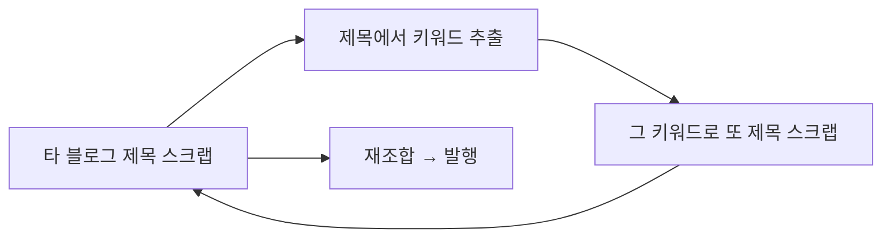
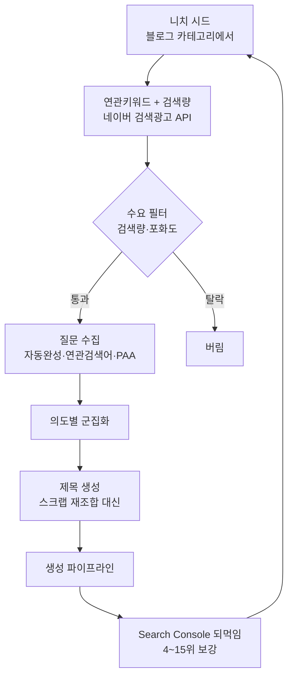

# 키워드·제목 수집 방식 재설계 (제안)

> 2026-08-31 · 조사 및 제안 · **수정 미진행**
> 관련: `docs/plans/search_visibility_all_blogs.md`, `min_length_generation.md`

## 1. 지금 무슨 일이 일어나고 있나 — 실측

### 제목은 전부 남의 블로그에서 온다

정식제목 3,230건이 **전부** `source='transfer'`(임시제목 승격)다.
임시제목 105,004건의 출처를 보면 이렇다.

```
prizeking.tistory.com      397
purifymoon.tistory.com     394
travfotos.tistory.com      386
gourmetvie.com             383
father5.tistory.com        373
...
```

전부 개인 티스토리·워드프레스다. 그 글들이 이미 AI 양산물일 가능성이
높고, 그렇다면 **AI 양산물을 재조합해 다시 AI 양산물을 만드는 셈**이다.

### 키워드도 결국 같은 곳에서 온다

| 소스 | 건수 | 최근 30일 |
|---|---|---|
| `extracted`(수집한 제목에서 추출) | 5,601 | 1,059 |
| `google_trends` | 735 | 126 |
| `naver_datalab` | **0** | 0 |
| `naver_ads` | **0** | 0 |

수집 모듈 설정에는 데이터랩·검색광고 토글이 있지만 **저장된 키워드가
하나도 없다.** 실질적으로 이런 고리가 돈다.



바깥에서 들어오는 신호가 구글 트렌드뿐이고, 그마저 전체의 12%다.

### 검색량을 잴 자리가 없다

`seed_keywords` 테이블 컬럼:

```
id, keyword, category_id, source_type, is_active,
last_used_at, use_count, priority, topic_id, subtopic_id, matched_keyword_id
```

**검색량·경쟁도 컬럼이 없다.** `naver_ads_service` 는 이미
`/keywordstool` 을 호출해 `monthlyPcQcCnt` 를 파싱하고,
`_save_keyword(keyword, source, search_volume, competition)` 는 인자까지
받는데 — 저장하지 않고 버린다.

즉 **"이 키워드를 사람들이 실제로 검색하는가"를 한 번도 묻지 않는다.**

### 데이터랩 시드가 고정돼 있다

```python
base_keywords = ["뉴스", "이슈", "트렌드", "인기", "화제"]
```

블로그 니치와 무관한 고정값이다. 취업/자격증 블로그에도 "뉴스"로 조회한다.

## 2. 다른 도구들은 어떻게 하나 (조사)

### 국내 — 검색량과 포화도를 먼저 잰다

블랙키위·키워드마스터 같은 국내 도구는 공통적으로 **검색량 ÷ 발행 문서수**
를 핵심 지표로 쓴다. 키워드마스터는 네이버 검색량(PC/모바일), 블로그
포스트 수, 경쟁 비율, 상위 노출 순위를 한 화면에 보여주고, 블랙키위는
검색량 대비 발행량으로 **포화도**를 계산해 낮은 것부터 고르게 한다.

핵심은 "무슨 말이 있나"가 아니라 **"수요는 있는데 공급이 적은 자리가
어디인가"** 를 찾는 것이다. 지금 블로그오토에는 이 축이 없다.

### 국내 — 실제 입력을 그대로 쓴다

네이버 자동완성과 연관검색어는 사용자가 실제로 친 말을 반영해서 어떤
키워드 도구보다 현실적이라는 평가다. 지식iN 질문도 같은 성격이다 —
사람이 직접 쓴 고민이라 롱테일 질문형 제목의 원천이 된다.

### 해외 — 질문에서 시작한다

Google Autocomplete · People Also Ask · Related Searches 세 가지를
시드 키워드 하나로 뽑아내는 것이 표준 도구 구성이다(kwrds.ai,
AlsoAsked, keywordspeopleuse 등). 2026 기준 조언은 한결같다 —
대화형 AI 검색이 늘면서 사용자가 **두 단어가 아니라 질문**을 던지므로,
질문 형태를 그대로 콘텐츠 축으로 삼으라는 것이다.

### 해외 — 자기 데이터로 되먹인다

Search Console 의 쿼리 데이터에서 **순위 4~15위(striking distance)**
를 찾아 우선 보강하는 방식이 표준이다. 2026 자료들은 여기에 하나를
덧붙인다 — AI 개요는 상위 3위 밖에서도 인용하므로, 4~15위는 "AI 인용
후보" 이기도 하다.

### 해외 — 묶어서 관리한다

키워드를 낱개로 두지 않고 **의미 유사도 + SERP 중복**으로 군집화한 뒤
군집당 글 하나를 배정한다. 같은 의도의 키워드로 여러 글을 쓰면 서로
잡아먹기 때문이다.

## 3. 블로그오토에 맞는 제안

### 방향 — 스크랩을 끊는 게 아니라 순서를 뒤집는다

지금: **제목을 먼저 줍고** 거기서 키워드를 뽑는다.
제안: **수요를 먼저 재고** 거기서 제목을 만든다.



스크랩은 **보조**로 남긴다. 경쟁 글이 무엇을 다루는지 아는 것은 참조
자료로서 가치가 있다. 다만 그것이 제목의 **유일한 원천**이면 안 된다.

### 단계별 제안

| 순위 | 항목 | 비용 | 효과 |
|---|---|---|---|
| 1 | 검색량·경쟁도를 저장한다 | 매우 낮음 | 즉시 |
| 2 | 니치 시드로 연관키워드를 받는다 | 낮음 | 큼 |
| 3 | 수요 필터를 건다 | 낮음 | 큼 |
| 4 | 질문형 제목을 직접 만든다 | 중간 | 큼 |
| 5 | 의도 군집화 | 중간 | 중간 |
| 6 | Search Console 되먹임 | 중간 | **지금은 무의미** |

#### 1. 검색량·경쟁도를 저장한다

`seed_keywords` 에 `search_volume`, `competition`, `doc_count`,
`measured_at` 을 더한다. `naver_ads_service` 는 이미 값을 받아오고
`_save_keyword` 는 인자까지 받으므로, **버리지 않고 넣기만 하면 된다.**

이것이 없으면 그 뒤 모든 판단이 불가능하다. 가장 싸고 가장 먼저다.

#### 2. 니치 시드로 연관키워드를 받는다

고정 시드(`뉴스·이슈·트렌드`)를 **블로그의 활성 카테고리**로 바꾼다.
취업인포마스터라면 `자격증·직업 정보·취업 정보` 가 시드가 된다.

네이버 검색광고 `/keywordstool` 은 시드 5개까지 받아 연관키워드와
월간 검색량(PC/모바일)을 함께 준다. 공식 API 이고 무료다.

이것만으로 "취업/자격증 최근 30일 유입 0건" 문제가 풀린다. 지금은
남이 그 주제로 글을 써 줘야만 우리 재고가 늘어난다.

#### 3. 수요 필터를 건다

국내 도구들이 쓰는 기준을 그대로 쓴다.

```
채택 = 월간 검색량 ≥ 하한  AND  검색량 ÷ 발행문서수 ≥ 하한
```

지금은 필터가 **금칙어뿐**이라 "아무도 안 찾는 말"과 "이미 포화된 말"이
그대로 통과한다. 라이프인포에서 걷어낸 「대한주택관리사협회 채용정보」
류가 여기서 걸린다.

문서수는 네이버 검색 API(블로그 문서수)로 잰다. 이미 `naver_webdoc`
수집이 있으므로 호출 경로는 있다.

#### 4. 질문형 제목을 직접 만든다 — 핵심 전환

자동완성·연관검색어·지식iN 질문을 모아 **제목 후보로 그대로 쓴다.**

```
현재: 「순천 메가박스 상영시간표 보기」   ← 남의 티스토리 제목 재조합
제안: 「전기기사 실기 몇 번 만에 붙나요」 ← 실제 검색·질문
```

- 자동완성: 네이버·구글 모두 비공식 경로다. 호출 간격을 두고
  robots 를 존중해야 한다.
- 지식iN: 질문 제목이 곧 롱테일이다. 다만 **답을 베끼면 안 된다** —
  질문만 쓰고 답은 우리가 만든다.
- People Also Ask: 구글 SERP 파싱이라 같은 주의가 필요하다.

이 축이 들어오면 재조합 품질 문제(원 제목이 나쁘면 결과도 나쁨)가
근본적으로 사라진다. **원본이 남의 글이 아니라 사람들의 질문이 된다.**

#### 5. 의도 군집화

수집한 키워드를 의미 유사도로 묶고 군집당 글 하나를 배정한다.
블로그오토에는 이미 유사도 그룹핑(`similarity_grouping_mixin`)이 있어
재활용할 수 있다.

효과가 하나 더 있다 — **형제 사이트 중복**이 구조적으로 줄어든다.
지금은 12개 블로그가 같은 제목 풀을 두고 경쟁한다.

#### 6. Search Console 되먹임 — 지금은 보류

순위 4~15위를 보강하는 방식은 표준이지만, **지금 우리 블로그들은 색인이
0건**이다. 노출 데이터가 없으니 되먹일 것이 없다. 색인이 회복된 뒤에
붙여야 의미가 있다.

## 4. 정직하게 덧붙임

- **자동완성·PAA·지식iN 은 공식 API 가 아니다.** 차단당할 수 있고,
  과도한 호출은 상대 서비스에 부담이다. 호출 간격·일일 상한을 두고,
  막히면 조용히 물러나도록 설계해야 한다. 이걸 유일한 축으로 삼으면
  안 되는 이유이기도 하다.
- **네이버 검색광고 API 는 일일 호출 제한이 있다.** 니치가 12개면
  하루에 다 돌리지 못할 수 있어 블로그별 순환이 필요하다.
- **검색량이 높다고 좋은 키워드가 아니다.** 포화도와 함께 봐야 하고,
  애드센스 승인용 블로그에는 "확인 불가한 정보" 유형을 별도로 걸러야
  한다(현재 유입 1·2위가 매장·시설 정보와 고객센터·연락처다).
- 4번(질문형 제목)은 효과가 가장 크지만 손이 가장 많이 간다. 1~3번을
  먼저 하면 그것만으로도 "취업/자격증 유입 0건" 같은 문제는 풀린다.

## 참고

- [키워드마스터](https://whereispost.com/keyword) · [블랙키위 사용법](https://kidnapper.co.kr/guide/블랙키위-사용법/) · [두 도구 비교](https://nananews.co.kr/키워드마스터-사용방법과-장단점-및-블랙키위-비교/)
- [네이버 검색광고 API 공식 문서](https://github.com/naver/searchad-apidoc) · [keywordstool 사용법](https://workingwithpython.com/naverkeywordplannerapi/)
- [네이버 자동완성·연관검색어 활용](https://placewizard.kr/guide/naver-autocomplete-keyword-mining.php)
- [네이버 데이터랩 가이드](https://www.ascentkorea.com/naver-datalab-guide/)
- [Autocomplete·PAA·Related Searches 수집 도구](https://github.com/chukhraiartur/seo-keyword-research-tool)
- [Keyword Research in 2026](https://optiseon.com/blog/keyword-research-2026-google-and-ai-search/)
- [Striking Distance Keywords 2026](https://llmfy.ai/blog/striking-distance-keywords)
- [키워드 군집화 자동화 2026](https://aeoinsider.com/automation/automating-keyword-research-and-clustering-the-complete-2026-workflow/)
- [롱테일 키워드와 지식iN](https://www.ascentkorea.com/what-is-long-tail-keywords/)
