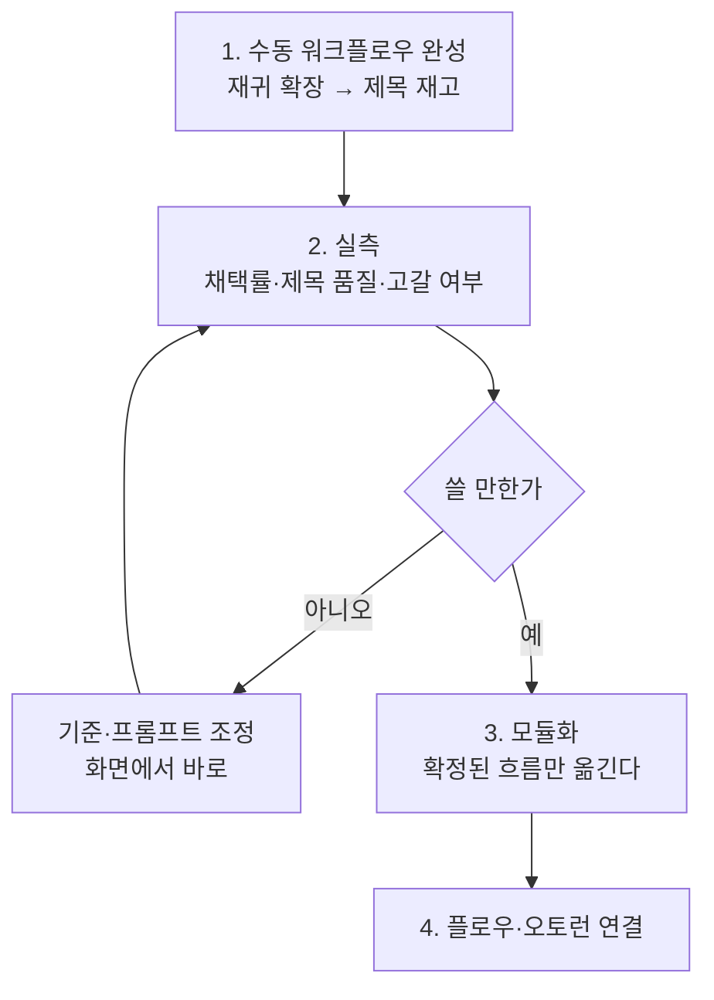

# 키워드 파이프라인 모듈화 — 타당성 검토

> 2026-08-31 · 지적: "현재는 수동 워크플로우이고 자동 동작이 정리되지 않았다.
> 자동화하려면 모듈로 동작해야 하는데 지금 방식은 모듈이 아니라 블로그오토
> 기본 시스템과 거리가 있다."
> 결론 먼저: **지적이 맞다. 다만 순서는 수동 완성 → 모듈화가 옳다.**

## 1. 지금 무엇이 빠져 있나

`keyword_lab` 은 화면에서 버튼을 눌러야만 도는 **독립 기능**이다.
블로그오토의 자동화는 전부 이 경로를 탄다.

`keyword_lab` 은 이 그림 **바깥**에 있다. 그래서 지금은:

- 플로우에 붙일 수 없다
- 오토런이 잡을 수 없다
- 성장 프로파일이 주기를 정해 주지 않는다
- 동작 로그·재고 판단에 잡히지 않는다

## 2. 모듈 하나를 더하려면 무엇이 필요한가 — 전례로 측정

가장 최근에 추가된 모듈 타입은 `bulk_collect` 다. 이 코드가
**34개 파일**에 흩어져 있다.

| 층 | 필요한 것 |
|---|---|
| 데이터 | `module_types` 행 추가 · 진행상태 테이블 |
| 스키마 | `schemas/module.py` 타입 등록 |
| 실행 | 스케줄러 `action_type` 분기 · 실행 함수 |
| 주기 | 성장 프로파일 연동 또는 자체 `schedule` 설정 |
| 태스크 | Celery 큐·태스크 등록 |
| 화면 | 모듈 폼 · 목록 아이콘/라벨/정렬 · 플로우 선택 탭 |
| 로그 | 동작 로그 메시지 빌더 |

즉 **모듈화는 작은 일이 아니다.** 지금 `keyword_lab` 은 서비스 3개 ·
라우터 1개 · 화면 1개다.

## 3. 그래도 모듈화가 맞는 이유

| 모듈로 하면 | 지금 방식 |
|---|---|
| 블로그마다 다른 주기·설정 | 전역 하나 |
| 성장 프로파일이 속도 조절 | 없음 |
| 오토런 화면에서 상태 확인 | 없음 |
| 동작 로그에 성공·실패 기록 | 없음 |
| 재고 부족 시 자동 보충 | 사람이 눌러야 함 |

특히 **재고 자동 보충**이 핵심이다. 지금 생성 모듈은
`min_inventory` 로 재고를 보지만, 재고가 마르면 그냥 건너뛴다.
키워드·제목 생산이 모듈이면 **재고가 마르기 전에 스스로 채운다.**

## 4. 그런데 왜 지금 하면 안 되는가

**아직 무엇을 자동화할지 모른다.**

계획서(`keyword_pipeline_rework.md`)의 2단계 재귀 확장은 **가설**이다.
회차를 거듭하면 키워드가 니치에서 멀어지거나 검색량이 떨어져 채택률이
무너질 수 있다. 3단계 제목 품질도 만들어 봐야 안다.

검증되지 않은 흐름을 34개 파일에 심으면:

- 되돌리기가 어렵다 — 모듈 타입은 DB 행이라 플로우가 물고 있으면 못 지운다
- 무엇이 원인인지 가릴 수 없다 — 운영 중인 12개 블로그와 섞인다
- 파라미터를 바꿀 때마다 배포가 필요하다 — 지금은 화면에서 바로 바꾼다

**수동 단계는 실험 장치다.** 버튼을 눌러 결과를 보고 기준을 조정하는
과정이 아직 필요하다.

## 5. 그래서 제안하는 순서

### 1단계에서 반드시 갖춰 둘 것 — 모듈화를 쉽게 만드는 설계

수동으로 만들되 **나중에 모듈이 될 것을 알고** 만든다.

| 항목 | 지금 해 둘 것 |
|---|---|
| 실행 단위 | 화면이 아니라 **서비스 함수**가 한 회차를 온전히 수행 |
| 입력 | `blog_id` + `settings` dict 로만 받는다(모듈 settings 와 같은 모양) |
| 출력 | `{success, saved, errors}` — 다른 실행기와 같은 형태 |
| 상태 | 진행 상황을 DB 에 남긴다(중단·재개 가능) |
| 화면 | 그 서비스 함수를 부르기만 한다 |

이렇게 두면 모듈화는 **껍데기만 씌우는 일**이 된다 — 스케줄러 분기와
폼 UI 를 더하면 되고, 로직은 그대로다.

지금 `KeywordLabService.collect()` / `measure()` 는 이미 이 모양에
가깝다. `settings` 를 인자로 받도록만 다듬으면 된다.

### 2단계 실측에서 볼 것

| 지표 | 판단 기준 |
|---|---|
| 회차별 채택률 | 3회차까지 유지되는가 (떨어지면 재귀가 무의미) |
| 니치 이탈률 | 채택 키워드가 원래 니치를 벗어나는 비율 |
| 제목 재고 증가 | 키워드 1개당 제목 3개 이상 확보되는가 |
| 제목 품질 | 기존 재조합 제목과 사람이 비교 |

**이 숫자들이 나와야 모듈로 옮길지 판단할 수 있다.**

## 6. 모듈화 시 예상 작업 (참고용)

지금 정하는 것이 아니라 **규모 감을 위한 것**이다.

| 항목 | 내용 |
|---|---|
| 모듈 타입 | `keyword` 하나로 묶는다(수집·확장·제목 생성을 단계 설정으로) |
| 주기 | 성장 프로파일 대신 **재고 기반 트리거**가 맞다 — 재고가 하한 아래로 내려가면 돈다 |
| 대상 | 블로그별. 시드는 그 블로그의 활성 카테고리 |
| 화면 | 모듈 폼에 수식어·기준·제목 개수 |
| 되돌리기 | 모듈을 끄면 기존 수집이 그대로 돈다 |

**주기를 성장 프로파일에 매지 않는 것**이 중요하다. 성장 프로파일은
"얼마나 자주 발행할까" 를 정하는데, 키워드 생산은 "재고가 부족한가" 로
돌아야 한다. 축이 다르다.

## 7. 결론

| 질문 | 답 |
|---|---|
| 지금 방식이 블로그오토 기본 시스템과 거리가 있나 | **그렇다.** 플로우·오토런·프로파일 어디에도 안 붙는다 |
| 모듈로 자동화가 가능한가 | **가능하다.** 전례(`bulk_collect`)가 있다 |
| 지금 해야 하나 | **아니다.** 흐름이 검증되기 전에 34개 파일에 심으면 되돌리기 어렵다 |
| 그럼 무엇을 하나 | 수동 워크플로우를 **모듈화하기 쉬운 모양으로** 완성하고 실측한다 |

## 8. 정직하게 덧붙임

- "수동으로 먼저" 가 시간을 버는 것은 아니다. 모듈화를 나중에 하면
  화면과 모듈 폼을 **두 번** 만들게 된다. 그 비용을 감수하는 이유는
  검증되지 않은 흐름을 운영 시스템에 넣는 위험이 더 크다고 보기 때문이다.
- 5절의 "껍데기만 씌우면 된다" 는 **설계를 그렇게 지켰을 때** 성립한다.
  지키지 못하면 모듈화가 재작성이 된다. 1단계에서 이 점을 놓치지 않는
  것이 이 계획의 전제다.
- 재고 기반 트리거는 지금 스케줄러에 없는 방식이다. 모듈화 시점에
  스케줄러를 손봐야 할 수 있다 — 규모를 지금 단정하지 않는다.
