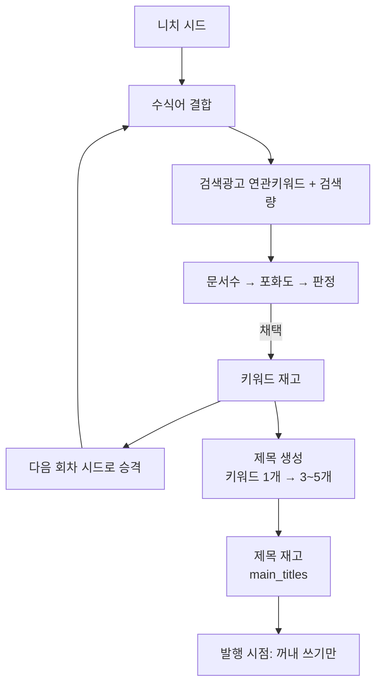
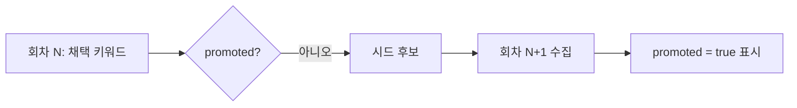
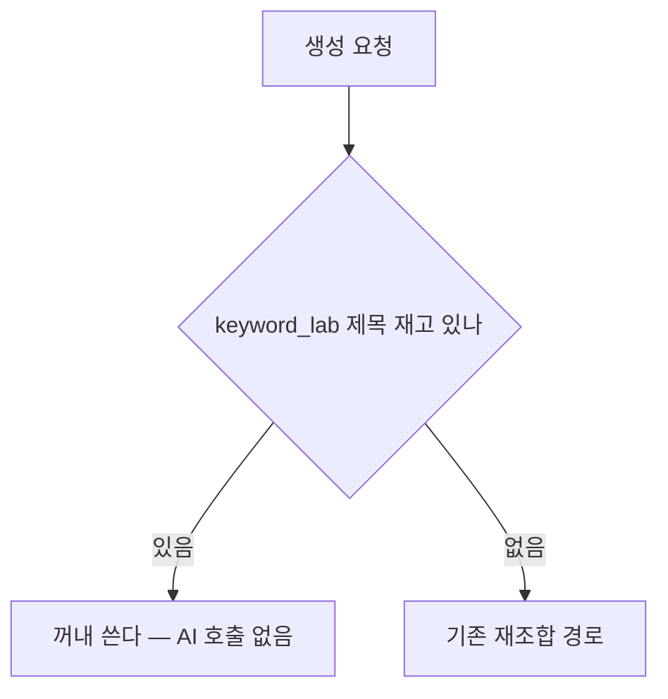

# 키워드·제목 파이프라인 개편 작업 계획서

> 2026-08-31 작성 · 상태: **승인 대기**
> 근거: `docs/plans/keyword_strategy_review.md` (검토), `keyword_collection_redesign.md` (조사)
> 순서도(작성 예정): `docs/flowcharts/keyword_recursion.md`, `title_inventory.md`

## 이 계획이 푸는 문제

| 문제 | 지금 | 근거 |
|---|---|---|
| 소재 고갈 | 블로그 카테고리가 시드라 매번 같은 결과 | 취업/자격증 재고 133개를 4개 블로그가 공유 |
| 생성 실패·지연 | 발행 시점에 제목을 만들어 실패하면 회차를 건너뜀 | 수작남 3회 연속 실패 |
| 잘못된 중복 기준 | 니치를 겹치지 않게 하려 함 | 이미 25개 서브토픽이 중복. 정책상 문제는 문서 중복 |
| 쓸모 없는 니치 분류 | 분류표 커버리지 18% | 「물류창고」→'음식 효능' 오분류 |

## 전체 그림



**핵심 두 가지**: 채택 키워드를 시드로 되먹여 고갈을 막고, 제목을 미리
만들어 발행 시점에서 AI 호출을 없앤다.

---

## 1단계 — 니치 분류 정리 ✅ 완료

폴백 제거는 이미 반영했다(`046c451`). 남은 것:

| 항목 | 내용 |
|---|---|
| 화면 | 니치 열은 유지하되 기본 정렬에서 빼고, 미분류를 그대로 노출 |
| 문서 | "분류표를 넓히기 전까지 참고용" 임을 화면에 명시 |

**하지 않을 것**: 미분류를 AI 로 분류하는 것. 호출 비용이 들고 기존
분류 체계와 어긋날 여지가 있다. 분류표를 넓힌 뒤 판단한다.

---

## 2단계 — 키워드 재귀 확장 (소재 고갈)

### 2-1. 수식어 결합

시드 하나로 후보를 여러 개 만든다. **API 호출을 늘리지 않는다** —
검색광고는 한 번에 5개를 받으므로 결합한 것들을 묶어 보낸다.

```
요리레시피 → 요리레시피, 요리레시피방법, 요리레시피추천,
             초보요리레시피, 요리레시피후기        (1회 호출)
```

수식어 목록은 설정으로 둔다(화면에서 수정 가능). 기본값 예시:
`방법 · 추천 · 후기 · 비교 · 초보 · 가격 · 순위 · 종류`

> 공백은 붙여 쓴다 — 네이버가 공백 든 키워드를 거부한다(400, 11001).

### 2-2. 채택 키워드를 다음 회차 시드로



- 이미 시드로 쓴 키워드는 `promoted` 로 표시해 다시 뽑지 않는다.
- 회차당 시드 수 상한을 둔다(기본 10개 = API 2회). **한 번에 다
  돌리지 않는다** — 검색광고 일일 호출 제한이 있다.

### 2-3. 화면

「확장 수집」 버튼 하나를 더한다. 누르면 채택 키워드 중 아직 시드로
쓰지 않은 것을 골라 2-1·2-2 를 수행한다.

### 파일

| 파일 | 작업 |
|---|---|
| `services/keyword_lab/expander.py` | 신규 — 수식어 결합·시드 선정 |
| `services/keyword_lab/service.py` | `expand()` 추가 |
| `routers/keyword_lab.py` | `POST /expand` |
| `static/js/keyword_lab/app.js` | 확장 수집 버튼·수식어 설정 |
| `tests/unit/test_keyword_expander.py` | 신규 |

### 검증

- 같은 시드로 두 번 돌렸을 때 **두 번째는 다른 키워드**가 나오는가
- `promoted` 표시가 되어 같은 시드가 반복되지 않는가
- 수식어를 붙여도 네이버가 400 을 내지 않는가(공백 처리)

---

## 3단계 — 제목 재고화 (생성 실패·지연)

### 3-1. 키워드 → 제목 생성

채택 키워드 1개에서 제목 3~5개를 만들어 `main_titles` 에 넣는다.
**기존 재고 구조를 그대로 쓴다** — `status='available'`,
`topic_id`/`subtopic_id`, `min_inventory` 체크가 모두 그대로 동작한다.

```
전기기사 실기
  → 전기기사 실기 몇 번 만에 붙나요
  → 전기기사 실기 준비 기간과 비용 정리
  → 전기기사 실기 과제별 채점 기준
```

- `source='keyword_lab'` 로 표시해 기존 `transfer` 와 구분한다.
  성과 비교가 가능해야 한다.
- 중복 검사는 기존 `title_dedup` 을 재사용한다.

### 3-2. 발행 시점에서 AI 를 부르지 않는다

지금은 발행할 때 `title_recombiner` 가 AI 를 부른다. 제목 재고가
있으면 **그대로 쓴다**. 재고가 비었을 때만 기존 경로로 물러난다.



**기존 경로를 지우지 않는다.** 재고가 비면 지금처럼 동작해야 한다.

### 3-3. 언제 만드나

수집 모듈이 도는 자리에서 함께 돌린다. 발행과 분리돼 있으므로
한가한 시간에 몰아 만들 수 있다.

### 파일

| 파일 | 작업 |
|---|---|
| `services/keyword_lab/title_maker.py` | 신규 — 키워드 → 제목 N개 |
| `services/keyword_lab/service.py` | `make_titles()` 추가 |
| `routers/keyword_lab.py` | `POST /make-titles` |
| `services/generation/generator.py` | 재고 우선, 없으면 기존 경로 |
| `tests/unit/test_title_maker.py` | 신규 |

### 검증

- 제목 재고가 있을 때 **AI 호출이 0회**인가
- 재고가 비면 기존 경로로 물러나는가 (**회귀 금지**)
- 만든 제목이 중복 검사를 통과하는가
- `min_inventory` 가 새 제목을 세는가

---

## 4단계 — 중복 기준 전환

### 4-1. 니치 중복 제한 해제

지금 코드에 니치 중복을 강제로 막는 곳은 없다. **운영 관행**이었다.
문서로 기준을 바꾸고, 화면에서 오해를 부르는 문구를 정리한다.

### 4-2. 문서 중복 배제는 강화

`exclude_sibling_titles` 는 기본 켜짐을 유지하고, 승인 준비 블로그의
`false` 설정을 재검토한다(슈마즈·레시피노트·인포노트가 false).

> 형제 판정은 같은 모듈에 붙은 블로그 + 같은 등록 도메인이다.
> blogspot 은 공용 접미사로 처리돼 블로거끼리는 형제가 아니다.
> **같은 제목이 여러 블로거 사이트에 올라갈 수 있다** — 이 구멍을
> 메울지 판단이 필요하다.

### 4-3. 각도(관점) 차별화

프롬프트 모듈에 `angle` 설정을 더한다. 같은 키워드라도 블로그마다
다른 관점으로 쓰게 한다.

```
A 사이트 — 합격 후기 관점
B 사이트 — 준비 기간·비용 관점
C 사이트 — 채점 기준 관점
```

지시문은 분량 지시문과 같은 방식으로 주입한다
(`length_directive.py` 패턴 재사용).

### 파일

| 파일 | 작업 |
|---|---|
| `services/generation/angle_directive.py` | 신규 |
| `services/generation/content_generator_helper.py` | 지시문 주입 |
| `static/js/modules/prompt-form-template-sections.js` | 관점 입력 UI |
| `services/generation/sibling_blogs.py` | 블로거 간 형제 판정 검토 |

### 검증

- 같은 키워드·다른 관점으로 만든 글이 **실제로 다른가** (사람이 비교)
- 형제 배제가 여전히 동작하는가

---

## 순서와 이유

| 순위 | 단계 | 왜 이 순서인가 |
|---|---|---|
| 1 | 니치 정리 ✅ | 틀린 데이터를 먼저 멈춘다 |
| 2 | 키워드 재귀 확장 | 재고가 없으면 뒤 단계가 무의미 |
| 3 | 제목 재고화 | 재고가 쌓인 뒤에야 만들 것이 있다 |
| 4 | 중복 기준 전환 | 앞 단계로 소재가 늘어난 뒤 판단 |

**2단계와 3단계 사이에 실측을 한다.** 재귀 확장으로 실제 후보가 얼마나
늘었는지 보고, 목표에 못 미치면 3단계 전에 보완한다.

## 하지 않을 것

- **미분류 키워드를 AI 로 분류** — 비용 대비 이득이 불확실하다.
- **자동완성·PAA 수집** — 비공식 경로다. 재귀 확장으로 부족할 때
  다시 논의한다.
- **기존 수집 경로 제거** — 성과가 확인되기 전까지 둘 다 돌린다.
  `source` 로 구분해 비교한다.

## 위험과 대응

| 위험 | 대응 |
|---|---|
| 검색광고 일일 호출 한도 | 회차당 시드 상한(기본 10개=2회). 블로그별 순환 |
| 수식어 결합이 무의미한 말을 만듦 | 검색량 하한이 걸러낸다. 결합 전후 채택률을 비교 |
| AI 제목이 뻔해짐 | 관점 지시문(4단계)과 함께 봐야 판단 가능 |
| 제목 재고가 기존 재고와 섞여 비교 불가 | `source='keyword_lab'` 로 분리 |
| 재귀가 니치를 벗어남 | 채택 키워드의 분류를 확인해 벗어나면 시드에서 제외 |

## 되돌리기

각 단계는 **기존 경로를 지우지 않는다.** 3단계의 제목 재고가 비면
지금과 똑같이 동작한다. 문제가 생기면 `keyword_lab` 제목을 지우는
것만으로 원상 복구된다.

## 정직하게 덧붙임

- 2단계의 "재귀하면 고갈이 풀린다" 는 **가설이다.** 회차를 거듭하면
  키워드가 니치에서 멀어지거나 검색량이 낮아져 채택률이 떨어질 수 있다.
  2단계 후 실측이 필요한 이유다.
- 3단계의 제목 품질은 프롬프트에 달려 있다. 지금 재조합 제목보다
  나은지는 만들어 보고 비교해야 안다.
- 4단계의 관점 차별화가 실제로 다른 글을 만드는지는 **검증 전이다.**
  같은 모델이 비슷하게 쓸 수 있다.
