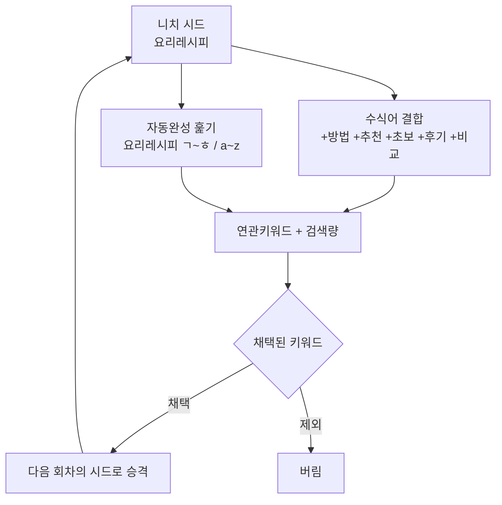
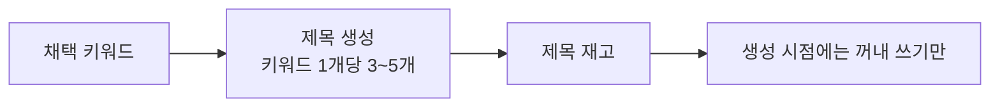

# 키워드 관리 방식 재검토 — 소재 고갈·제목 생성·니치 중복

> 2026-08-31 · 사용자 지적에 대한 검토
> 관련: `keyword_collection_redesign.md`, `search_visibility_all_blogs.md`

## 0. 먼저 인정할 것 — 니치 분류는 제 설계가 틀렸다

「물류창고」와 「프랑스디저트」가 둘 다 `음식 효능` 으로 붙었다.
매칭 실패 시 **시드 카테고리를 물려주는 폴백** 때문이다.

```
음식 효능 200건 / 미분류 6건
```

분류표(896개 키워드)로 붙는 비율은 **18%** 다. 나머지 82%가 전부 시드
카테고리를 뒤집어썼다. 틀린 분류는 미분류보다 나쁘다 — 폴백을 없앴다.

니치 열은 남기되 **미분류를 그대로 보여준다.** 미분류 목록은 그 자체로
"분류표에 무엇이 빠져 있는지" 를 알려준다.

## 1. 소재 고갈 — 지적이 맞다

### 지금 방식의 한계

블로그 카테고리를 시드로 쓰면 **매번 같은 시드**다. 레시피노트는 언제
돌려도 `음식효능·요리레시피·조리법·손질…` 6개다. 연관키워드도 대체로
같은 것이 돌아온다.

실측: 카테고리별 제목 재고와 그 니치를 쓰는 블로그 수.

| 토픽 | 사용가능 제목 | 이 토픽 블로그 수 |
|---|---|---|
| 생활 정보 | 1,868 | 6 |
| 금융/대출 | 1,076 | 5 |
| 여행/관광 | 450 | 4 |
| 음식/레시피 | 355 | 4 |
| 취업/자격증 | 133 | 4 |
| AI/인공지능 | 60 | 2 |

취업/자격증은 133개를 4개 블로그가 나눠 쓴다. **유한하다.**

### 해결책 — 시드를 늘리는 것이 아니라 시드를 재귀시킨다

업계 표준은 **알파벳 수프(Alphabet Soup)** 와 **재귀 확장**이다.



핵심은 **채택된 키워드를 다음 회차의 시드로 되먹이는 것**이다. 시드가
1개에서 시작해도 회차를 거듭하며 가지를 친다. 같은 시드로 다시 돌려도
같은 결과가 나오는 지금 구조와 근본적으로 다르다.

수식어 결합은 검색광고 API 를 더 부르지 않고도 후보를 늘린다 —
`요리레시피` 하나로 `요리레시피 방법`·`요리레시피 추천`·`초보 요리레시피`
를 만들어 한 번에 5개씩 조회한다.

### 이미 쓴 것을 다시 뽑지 않게

`keyword_candidates` 에 `promoted` 컬럼을 넣어 뒀다. 승격된 키워드는
다음 회차 시드 후보에서 빼고, 이미 글을 쓴 키워드는 재고에서 제외한다.

## 2. 제목 생성 — AI 로 만드는 것이 맞다. 다만 지금 구조로는 위험하다

### 왜 AI 생성인가

지금은 남의 티스토리 제목을 재조합한다. 원본이 나쁘면 결과도 나쁘다.
키워드에서 제목을 만들면 원본이 **사람들의 실제 검색어**가 된다.

### 지적한 위험이 실재한다

> "다수의 블로그에 글을 자동으로 작성할 때 시간이 많이 소요되거나
> 소재를 제대로 추출하지 못하면 글을 생성하지 못하고 건너뛸 가능성"

맞다. 생성 시점에 제목을 만들면 AI 호출이 한 번 더 붙고, 실패하면
그 회차를 통째로 건너뛴다. **지금도 품질 게이트 미달로 3회 재시도 후
버리는 일이 있었다**(수작남).

### 해결책 — 제목은 미리, 넉넉히 만들어 재고로 쌓는다



- **생성 파이프라인과 분리한다.** 발행 시점에 AI 를 부르지 않는다.
  꺼내 쓰기만 하므로 시간도 실패도 늘지 않는다.
- 키워드 1개에서 제목 3~5개를 뽑으면 **재고가 3~5배**가 된다.
  취업/자격증 133개 → 400~600개.
- 제목 생성은 한가한 시간에 몰아서 돌린다. 지금 수집 모듈이 하는 일과
  같은 자리다.

이 구조는 **기존 재고 개념을 그대로 쓴다.** `min_inventory` 체크도
그대로 동작한다.

## 3. 니치 중복 — 지적이 맞다. 기준을 바꿔야 한다

### 실측: 이미 중복돼 있다

| 토픽 | 블로그 수 | 블로그 |
|---|---|---|
| 생활 정보 | 6 | 군타·굿팁꿀팁·꿀팁대백과사전·수작남·인생꿀팁·잡학다식 |
| 취업/자격증 | 4 | 군타·굿팁꿀팁·인생꿀팁·취업인포마스터 |
| 여행/관광 | 4 | 군타·굿팁꿀팁·꿀팁대백과사전·라이프인포 |
| 음식/레시피 | 4 | 꿀팁대백과사전·레시피노트·수작남·인생꿀팁 |

**같은 서브토픽을 두 개 이상 블로그가 쓰는 경우가 25건**이다.
"니치를 겹치지 않게" 는 이미 지켜지지 않고 있고, 12개 블로그에
겹치지 않는 니치를 배정하는 것은 카테고리 수를 봐도 불가능하다.

### 그럼 무엇이 문제인가 — 니치가 아니라 **문서**다

구글 정책 문서와 2026년 자료들이 일관되게 말하는 바는 이렇다.

- **제재 대상은 "AI로 썼는가" 가 아니라 "순위 조작을 노린 대량 생산이고
  사용자에게 가치가 없는가" 다.** 생산 방식은 무관하다.
- 실제로 제재를 받은 패턴은 *하루 50~500편을 키워드 군집에 뿌리고,
  사람 검토 없고, 사실 깊이가 없고, 1차 경험이 없는* 사이트다.
- 금지되는 것은 **거의 같은 페이지를 대량으로 찍어 키워드를 도배하는
  것**(doorway)이다.

즉 **니치가 겹치는 것 자체는 문제가 아니다.** 같은 주제를 다루더라도
글이 서로 다르고 각자 가치가 있으면 된다.

### 다만 하나는 진짜 위험하다 — 같은 제목의 교차 게재

앞선 진단에서 doooit082 계열 4개 사이트에 **105종 제목이 중복 게재**된
것을 확인했다. 이것은 니치 중복이 아니라 **문서 중복**이고, 정확히
금지 대상이다. 색인이 무너진 직접 원인으로 본다.

국내 자료도 같은 말을 한다 — 같은 블로그에서 비슷한 키워드로 여러 글을
쓰면 유사 문서로 판단되어 노출이 제한된다.

### 기준을 이렇게 바꾸는 것을 제안한다

| 지금 | 제안 |
|---|---|
| 블로그별 니치를 겹치지 않게 배정 | **니치 중복 허용** |
| 형제 배제 = 같은 제목 안 쓰기 | 유지 — 오히려 강화 |
| — | **같은 키워드는 사이트마다 다른 각도로** |

각도를 다르게 한다는 것은 구체적으로 이런 뜻이다.

```
키워드: 전기기사 실기
  A 사이트 — 합격 후기 관점 ("몇 번 만에 붙나")
  B 사이트 — 준비 기간·비용 관점
  C 사이트 — 실기 과제별 채점 기준 관점
```

블로그오토에는 이미 프롬프트 모듈이 블로그마다 따로 있다. **각도를
프롬프트 모듈의 설정으로 두면** 같은 키워드를 써도 다른 글이 나온다.

## 4. 그래서 키워드 관리 방식은 효율적인가

**부분적으로 그렇다.** 정리하면 이렇다.

| 요소 | 판단 |
|---|---|
| 검색량·문서수로 포화도 산출 | ⭕ 유효. 지금 수집에 없던 축이다 |
| 니치 자동 분류 | ❌ 분류표가 얇아(18%) 지금은 쓸모가 적다 |
| 블로그 카테고리를 시드로 | △ 첫 회차만 유효. 재귀 확장이 없으면 고갈 |
| 니치 중복 회피 | ❌ 이미 불가능하고, 정책상 필요하지도 않다 |

**포화도 판정은 남기고, 니치 분류와 중복 회피는 접는 것이 맞다고 본다.**
그 자리에 재귀 확장과 제목 재고를 넣는 것이 실제 문제(소재 고갈,
생성 실패)를 푼다.

## 5. 권장 순서

| 순위 | 항목 | 이유 |
|---|---|---|
| 1 | 니치 분류 폴백 제거 (완료) | 틀린 분류가 미분류보다 나쁘다 |
| 2 | 수식어 결합 + 채택 키워드 재귀 | 소재 고갈의 직접 해법 |
| 3 | 제목 재고화 (키워드 1개 → 제목 3~5개) | 생성 시점 실패·지연 제거 |
| 4 | 니치 중복 제한 해제, 각도 차별화로 전환 | 정책상 니치는 문제가 아니다 |
| 5 | 니치 자동 분류 | 분류표를 넓힌 뒤에 판단 |

## 6. 정직하게 덧붙임

- **각도 차별화가 실제로 다른 글을 만드는지는 검증이 필요하다.**
  프롬프트에 관점을 넣어도 같은 모델이 비슷하게 쓸 수 있다. 적용 후
  실제 결과물을 비교해 봐야 안다.
- **자동완성 훑기는 비공식 경로다.** 호출 간격·일일 상한이 필요하고,
  막히면 물러나야 한다. 유일한 축으로 삼으면 안 된다.
- 이 문서의 정책 해석은 공개 자료에 근거한 것이고 구글의 실제 판단을
  보장하지 않는다. 다만 **니치 중복보다 문서 중복이 위험하다**는 점은
  우리 데이터(105종 교차 게재, 색인 0건)로도 뒷받침된다.

## 참고

- [Google 스팸 정책 — Scaled Content Abuse](https://bulkbase.ai/seo/understanding-googles-scaled-content-abuse-policy) · [2026 정책·집행 가이드](https://bulkbase.ai/seo/scaled-content-abuse-googles-policy-enforcement-how-to-stay-compliant-in-2026) · [3월 업데이트 분석](https://www.digitalapplied.com/blog/scaled-content-abuse-google-march-update-ai-pages-decimated)
- [AI 콘텐츠가 아니라 저품질이 제재 대상](https://www.pravinkumar.co/blog/google-ai-content-penalty-myth-what-actually-matters-2026)
- [Alphabet Soup 키워드 확장법](https://answersocrates.com/blog/the-alphabet-soup-method/) · [단계별 가이드](https://marvlus.ai/newsletter/alphabet-soup-keyword-research/)
- [키워드 카니벌라이제이션과 각도 차별화](https://yoast.com/keyword-cannibalization/) · [Search Engine Land 가이드](https://searchengineland.com/guide/keyword-cannibalization)
- [토픽 권위와 단일 니치](https://seoscore.tools/blog/topical-authority/)
- [네이버 롱테일·유사문서 주의](https://sigmine.ai/blog/naver-blog-seo-strategy-202605-2) · [키워드마스터 활용](https://locaposting.com/blog/naver-seo-checklist)
