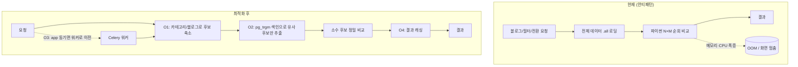

# 메모리 과부하 통합 최적화 설계

> **작성일**: 2026-05-29
> **목적**: 데이터 증가(정식제목 20만, 하루 생성/발행 각 300~500건) 시 메모리 과부하를 일으키는 지점들을 전수 파악하고, 공통 패턴으로 묶어 한꺼번에 최적화한다. 무료 티어(소형 인스턴스) 분할 운영을 견딜 수 있는 구조를 목표로 한다.
> **상태**: 설계 단계 (수정 미진행)

---

## 1. 배경

- A1.Flex 4 OCPU/24GB capacity 확보가 어려워 소형 인스턴스(2/12 ×2 또는 1/6 ×4) 분할 운영을 검토 중.
- 소형 인스턴스로 내려갈수록 메모리 여유가 줄어, 현재의 "전부 불러와서 훑는" 작업들이 OOM·지연을 유발.
- 현재 코드는 "동작 구현" 단계로, 데이터 규모 증가에 대한 최적화가 안 된 상태.

## 2. 근본 원인 — 하나의 공통 패턴

모든 과부하 지점이 **같은 안티패턴**을 공유한다:

> **"비교/검사 대상을 전부 메모리에 올린 뒤(`.scalars().all()`), 파이썬에서 하나씩 순회하며 매칭/검사한다"**

- 데이터가 N개일 때 단순 순회는 O(N), 매칭은 O(N×M)으로 **데이터 증가에 제곱으로 악화**.
- 인스턴스 메모리를 키워도 N×M 폭증은 한계에 부딪힘 → **알고리즘·구조 개선이 근본 해결**.

대조적으로 **단순 목록 조회는 페이지네이션(page/size)** 이 적용되어 안전하다. 문제는 "조회"가 아니라 "비교·검사·전환" 연산이다.

---

## 3. 과부하 지점 전수 (점검 결과)

| # | 지점 | 코드 위치 | 패턴 | 실행 위치 | 위험도 |
|---|---|---|---|---|---|
| 1 | 블로그 매칭 | `similarity_matcher_service.py:98,175,179` | 발행글 N × 정식제목 M Jaccard | app 동기 (`blogs.py`) | 🔴 |
| 2 | 자동 매칭 | `auto_match_service.py:94,154,184` | 발행글 × 정식제목 유사도 | app 동기 (`blogs.py`) | 🔴 |
| 3 | 필터 적용 | `filter_apply_service.py:122` | 전체 제목 `.all()` + 정규식 검사 | app 동기 (`data_filters.py`) | 🔴 |
| 4 | 정식제목 전환 | `title_transfer_service.py:56,61,68` | 중복체크 위해 기존 정식제목 전체 로딩 + 유사도 | app 동기(`data_titles`,`title_transfer`) + 워커(`flow_scheduler`) | 🔴 |
| 5 | 수집 필터 | `bulk_title_collector_service.py:586,636` | 필터 × 제목 이중 순회 | 워커 (수집) | 🔴 |
| 6 | 카테고리 매칭 | `category_matcher_service.py:86-97,200,279` | 주제→하위→키워드 트리 중첩 순회 | app 동기(`data_titles`,`data_keywords`) | 🟡 |
| 7 | 충돌 감지 | `modules.py` `used-blog-categories` | prompt 모듈 전체 순회 + 매핑 수집 | app 동기 | 🟡 (인덱스 038로 일부 개선) |

### 실행 위치 요약
- **app 동기**(화면 멈춤 유발): 1, 2, 3, 4(수동), 6, 7
- **워커**(app과 격리 가능): 4(자동), 5

### 안전 지점 (참고)
- 5개 탭 목록 조회·검색: 페이지네이션 적용 🟢
- 생성/발행 재고 조회(`inventory_trigger`, `inventory_manager`): 카테고리 필터(`in_`)로 후보 축소 적용 🟢

---

## 4. 3개 계열로 묶기

지점들은 코드/패턴을 공유하므로 **계열 단위로 묶어 한 번에** 수정하면 효율적이다.

| 계열 | 포함 지점 | 공유 코드 | 비고 |
|---|---|---|---|
| **A. 유사도 매칭** | 1 블로그매칭, 2 자동매칭, 4 정식전환 | `SimilarityService` (공통) | 4는 수동·자동 같은 코드 → 한 번 고치면 양쪽 적용 |
| **B. 필터** | 3 필터적용, 5 수집필터 | 필터 평가 로직 | 정규식 × 제목 전수 |
| **C. 카테고리/모듈 순회** | 6 카테고리매칭, 7 충돌감지 | 트리/매핑 순회 | 규모 작으면 후순위 |

---

## 5. 최적화 전략 (4가지)

| # | 전략 | 내용 | 적용 대상 |
|---|---|---|---|
| **O1** | **범위 축소** | 카테고리·블로그로 DB 레벨에서 후보를 좁힌 뒤 비교. `.all()` 전체 로딩 제거 | 전 계열 |
| **O2** | **색인 기반 후보 추출** | PostgreSQL `pg_trgm`(트라이그램) 또는 토큰 역색인으로 "닮을 가능성 있는 후보"만 DB가 추려냄. 전수 Jaccard 제거 | 계열 A, B |
| **O3** | **비동기화** | app 동기 매칭/필터/전환을 Celery 워커로 이전. 화면(app) 블로킹 제거 | app 동기 지점(1,2,3,4수동,6) |
| **O4** | **결과 캐싱** | 블로그 선택·필터 결과를 저장해 반복 재계산 방지 | 계열 A, 7 |

### 최적화 × 지점 매핑

| 지점 | O1 범위축소 | O2 색인 | O3 비동기화 | O4 캐싱 |
|---|---|---|---|---|
| 1 블로그매칭 | ✅ | ✅ | ✅ | ✅ |
| 2 자동매칭 | ✅ | ✅ | ✅ | — |
| 3 필터적용 | ✅ | ✅(trgm) | ✅ | — |
| 4 정식전환 | ✅ | ✅ | ✅(수동) / 이미 워커(자동) | — |
| 5 수집필터 | ✅ | ✅ | 이미 워커 | — |
| 6 카테고리매칭 | ✅ | — | ✅ | ✅ |
| 7 충돌감지 | ✅ | — | — | ✅ |

> **O3(비동기화) 주의**: 자동화(4자동, 5)는 이미 워커라 불필요. app 동기 지점에만 적용.

---

## 6. 단계별 수정 로드맵

> 원칙: **알고리즘 최적화(O1/O2) 선행 → 비동기화(O3) → 캐싱(O4)**. 분할 인스턴스 배치는 최적화 이후.

### Phase 1 — 범위 축소 (O1) · 가장 효과 큼, 위험 낮음
- 모든 매칭/필터/전환에서 `.scalars().all()` 전체 로딩 제거
- 카테고리/블로그 조건을 DB 쿼리(`WHERE ... IN`)로 내려 후보만 가져옴
- 대상: 1,2,3,4,5,6 (전 지점)
- 기대: 비교 대상 수만 → 수십. 대부분의 OOM 즉시 완화.

### Phase 2 — 색인 기반 후보 추출 (O2) · 근본 해결
- `pg_trgm` 확장 활성화 + 제목 컬럼에 GIN 트라이그램 인덱스
- 전수 Jaccard 대신 DB가 유사 후보를 인덱스로 추출 → 파이썬은 소수 후보만 정밀 비교
- 대상: 계열 A(1,2,4), 계열 B(3,5)
- 기대: O(N×M) → 준선형. 20만 규모에서도 견딤.

### Phase 3 — 비동기화 (O3) · 화면 멈춤 제거
- app 동기 매칭/필터/전환을 Celery 워커로 이전
- UI는 "처리 중..." 표시 후 완료 시 결과 갱신 (폴링 또는 상태 조회)
- 대상: 1,2,3,4(수동),6
- 기대: 사용자 작업 중 app 멈춤 구조적 차단.

### Phase 4 — 캐싱 (O4) · 반복 부하 제거
- 블로그별 매칭 결과·충돌 감지 결과 캐싱(무효화 조건 정의)
- 대상: 1,6,7

### Phase 5 — 인스턴스 분할 배치 (별도 계획 연계)
- 최적화 완료 후 부하 지점이 명확해지면 인스턴스 분할
- 권장: `2/12 (DB+app) + 1/6 ×2 (워커)` 또는 `1/6 ×4`
- O3로 매칭이 워커로 이전되면 app 인스턴스를 더 작게 둘 수 있음

---

## 7. 데이터 흐름 비교 (개념도)

---

## 8. 검증·테스트 방안

| 항목 | 방법 |
|---|---|
| 정확성 회귀 | 최적화 전후 매칭 결과 동일성 비교 (같은 입력 → 같은 매칭 셋) |
| 성능 | 제목 1만/5만/20만 시드 데이터로 매칭 시간·메모리 측정 |
| 부하 격리 | 매칭 실행 중 UI 응답성(다른 페이지 로딩) 확인 |
| 자동화 영향 | 생성/발행 워커 처리량(건/시간) 회귀 없는지 |

---

## 9. 회귀 주의사항

- **매칭 결과 동일성**: O1/O2로 후보를 좁힐 때 "원래 매칭되던 항목이 누락"되지 않도록 임계값·후보 범위 신중히. trgm 후보 추출은 recall(놓침) 검증 필수.
- **공유 코드 영향**: `title_transfer_service`·`SimilarityService`는 수동·자동·스케줄러가 공유 → 수정 시 전 경로 회귀 테스트.
- **비동기화 UX 변화**: O3 적용 시 "즉시 결과" → "처리 중 후 결과"로 UX가 바뀜. 프론트 상태 표시 필요.
- **캐싱 무효화**: O4는 데이터 변경 시 캐시 무효화 누락하면 stale 결과. 무효화 트리거 명확히.
- **pg_trgm 마이그레이션**: 확장 활성화 + GIN 인덱스 생성은 alembic 마이그레이션으로. 대용량 인덱스 생성 시간 고려.

---

## 10. 우선순위 요약

| 순위 | 작업 | 효과 | 위험 |
|---|---|---|---|
| 1 | Phase 1 (범위 축소) | 즉시 OOM 완화, 전 지점 | 낮음 |
| 2 | Phase 2 (pg_trgm 색인) | 20만 규모 근본 해결 | 중 (인덱스·recall 검증) |
| 3 | Phase 3 (비동기화) | 화면 멈춤 제거 | 중 (UX 변화) |
| 4 | Phase 4 (캐싱) | 반복 부하 제거 | 낮음 |
| 5 | Phase 5 (인스턴스 분할) | 물리 격리·확장 | 별도 계획 |

---

## 11. 다음 작업

- [ ] 계열 A(유사도 매칭) Phase 1·2 상세 설계 (후보 축소 쿼리 + trgm 인덱스 스펙)
- [ ] 계열 B(필터) Phase 1·2 상세 설계
- [ ] 비동기화 대상 엔드포인트 목록 + 프론트 상태 표시 설계
- [ ] 인스턴스 분할 계획 문서와 연계 (`docs/plans/` 별도 문서)
- [ ] 시드 데이터(20만) 기반 성능 측정 환경

> 수정·구현은 사용자 지시 시 진행. 본 문서는 설계 합의용 초안.
